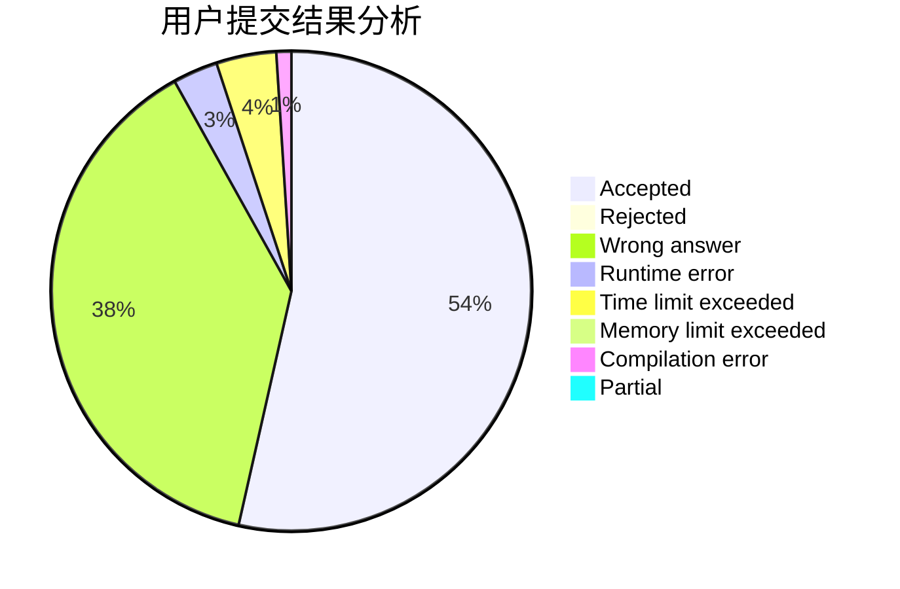
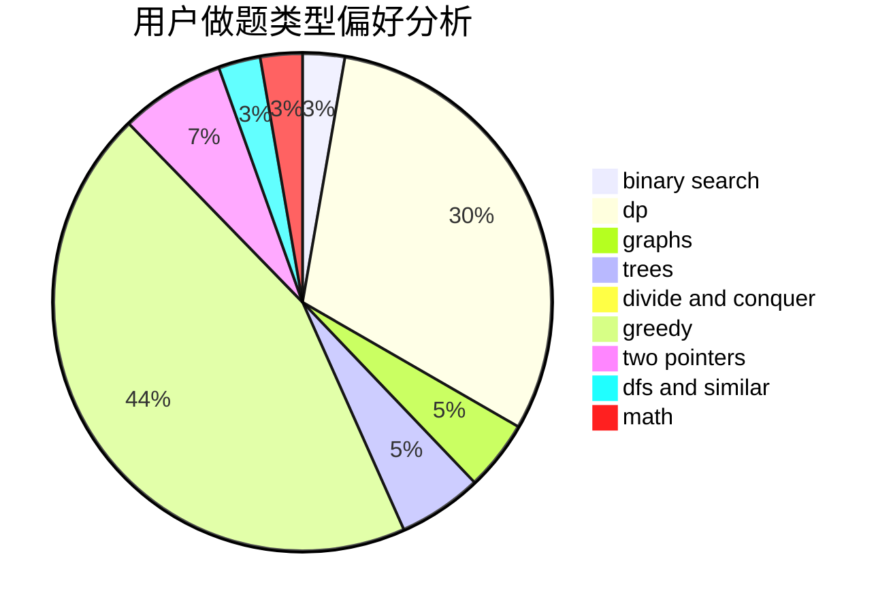

# ferrari430

<!-- tabs:start -->

#### **用户提交结果分析**

#### **用户做题类型偏好分析**

<!-- tabs:end -->
# 推荐题目
[917A](https://codeforces.com/contest/917/problem/A)
[1367C](https://codeforces.com/contest/1367/problem/C)
[1153C](https://codeforces.com/contest/1153/problem/C)
[1141D](https://codeforces.com/contest/1141/problem/D)
[219D](https://codeforces.com/contest/219/problem/D)
[1066F](https://codeforces.com/contest/1066/problem/F)
[1488B](https://codeforces.com/contest/1488/problem/B)
[1129C](https://codeforces.com/contest/1129/problem/C)
[343B](https://codeforces.com/contest/343/problem/B)
[1246F](https://codeforces.com/contest/1246/problem/F)
