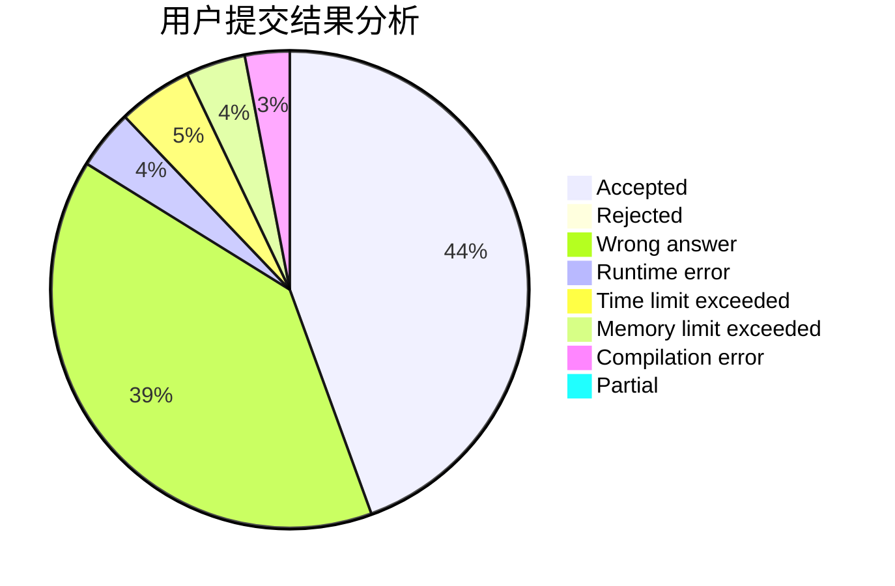
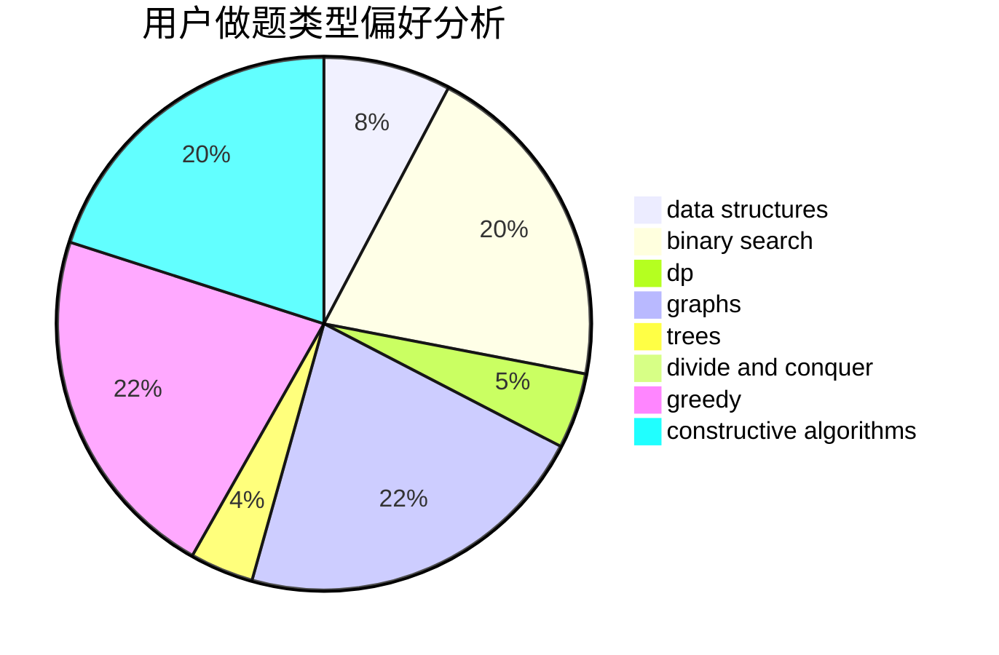

# fgfamy

<!-- tabs:start -->

#### **用户提交结果分析**

#### **用户做题类型偏好分析**

#### **用户错题知识点分析**

<!-- tabs:end -->
# 推荐题目
[817C](https://codeforces.com/contest/817/problem/C)		binary search,
                        brute force,
                        dp,
                        math		  
[925C](https://codeforces.com/contest/925/problem/C)		constructive algorithms,
                        math		  
[544B](https://codeforces.com/contest/544/problem/B)		constructive algorithms,
                        implementation		  
[840E](https://codeforces.com/contest/840/problem/E)		trees		  
[62A](https://codeforces.com/contest/62/problem/A)		greedy,
                        math		  
[426B](https://codeforces.com/contest/426/problem/B)		implementation		  
[1244E](https://codeforces.com/contest/1244/problem/E)		binary search,
                        constructive algorithms,
                        greedy,
                        sortings,
                        ternary search,
                        two pointers		  
[978B](https://codeforces.com/contest/978/problem/B)		greedy,
                        strings		  
[1284F](https://codeforces.com/contest/1284/problem/F)		data structures,
                        graph matchings,
                        graphs,
                        math,
                        trees		  
[1394C](https://codeforces.com/contest/1394/problem/C)		binary search,
                        geometry,
                        ternary search		  
