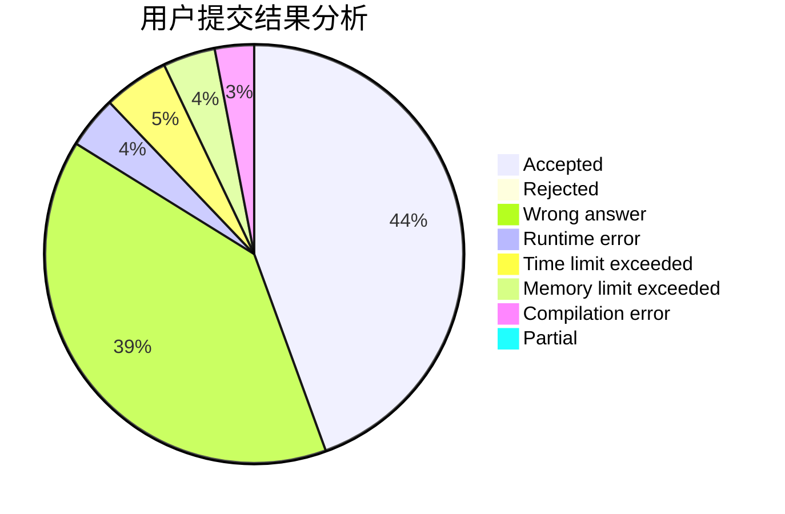
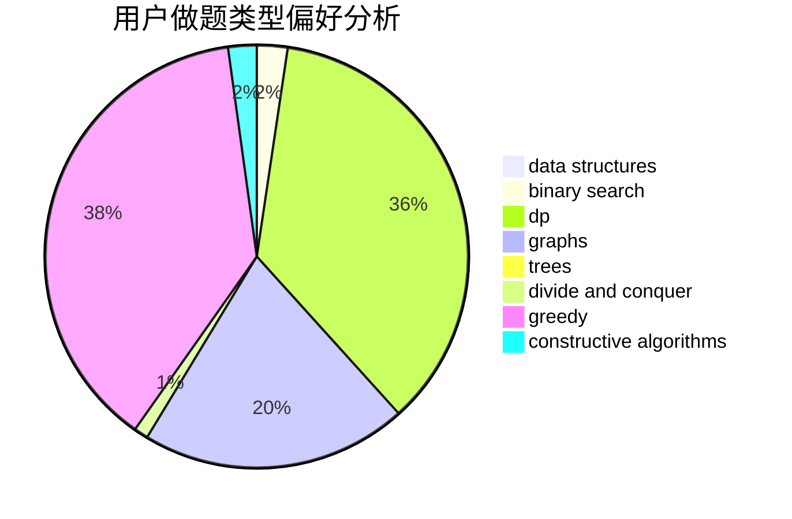

# fgfamy

<!-- tabs:start -->

#### **用户提交结果分析**

#### **用户做题类型偏好分析**

#### **用户错题知识点分析**

<!-- tabs:end -->
# 推荐题目
[837C](https://codeforces.com/contest/837/problem/C)		brute force,
                        implementation		  
[949A](https://codeforces.com/contest/949/problem/A)		greedy		  
[568C](https://codeforces.com/contest/568/problem/C)		2-sat,
                        greedy		  
[85E](https://codeforces.com/contest/85/problem/E)		binary search,
                        dsu,
                        geometry,
                        graphs,
                        sortings		  
[659F](https://codeforces.com/contest/659/problem/F)		dfs and similar,
                        dsu,
                        graphs,
                        greedy,
                        sortings		  
[449D](https://codeforces.com/contest/449/problem/D)		bitmasks,
                        combinatorics,
                        dp		  
[124A](https://codeforces.com/contest/124/problem/A)		math		  
[991F](https://codeforces.com/contest/991/problem/F)		brute force,
                        greedy,
                        implementation,
                        math		  
[1291F](https://codeforces.com/contest/1291/problem/F)		graphs,
                        interactive		  
[1402B](https://codeforces.com/contest/1402/problem/B)		*special problem,
                        geometry,
                        sortings		  
