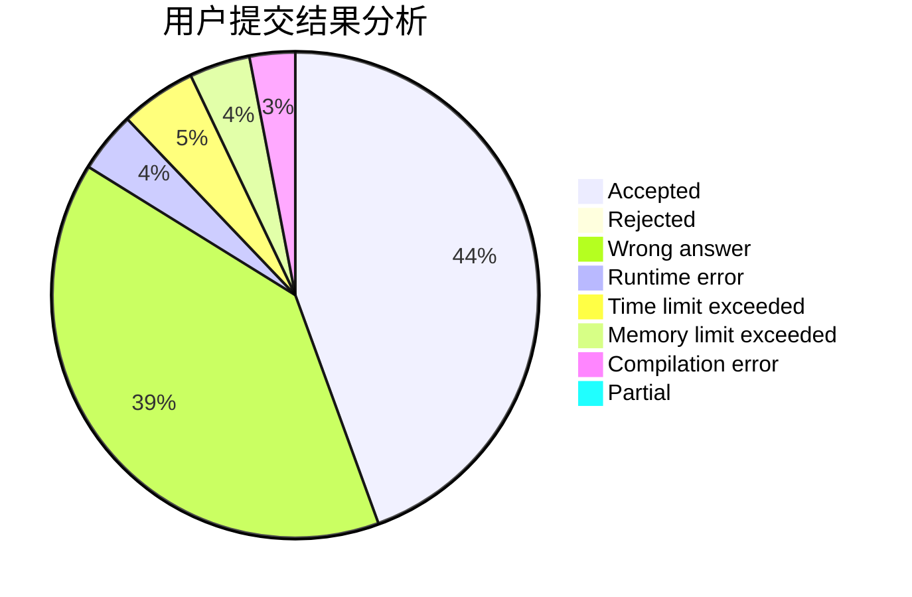
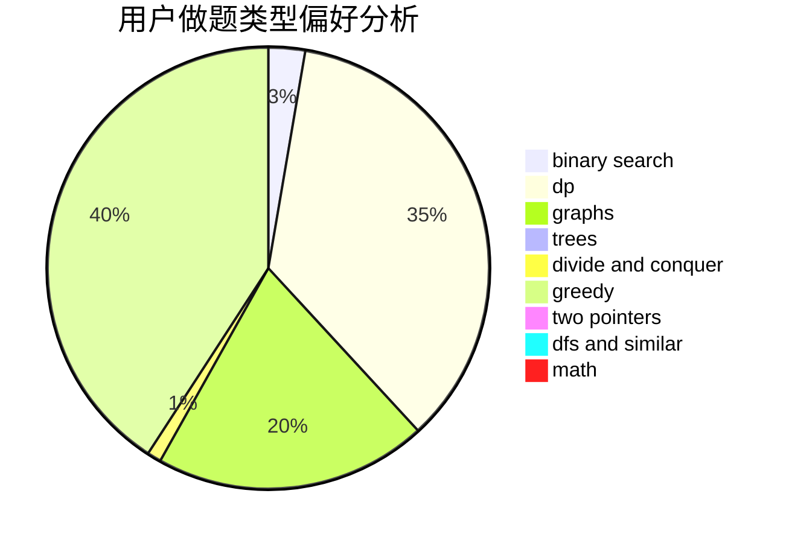

# fgfamy

<!-- tabs:start -->

#### **用户提交结果分析**

#### **用户做题类型偏好分析**

<!-- tabs:end -->
# 推荐题目
[837C](https://codeforces.com/contest/837/problem/C)
[949A](https://codeforces.com/contest/949/problem/A)
[568C](https://codeforces.com/contest/568/problem/C)
[85E](https://codeforces.com/contest/85/problem/E)
[659F](https://codeforces.com/contest/659/problem/F)
[449D](https://codeforces.com/contest/449/problem/D)
[124A](https://codeforces.com/contest/124/problem/A)
[991F](https://codeforces.com/contest/991/problem/F)
[1291F](https://codeforces.com/contest/1291/problem/F)
[1402B](https://codeforces.com/contest/1402/problem/B)
