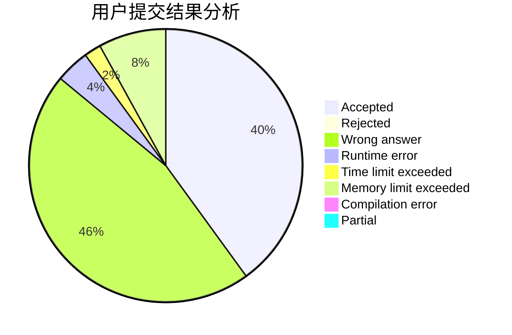
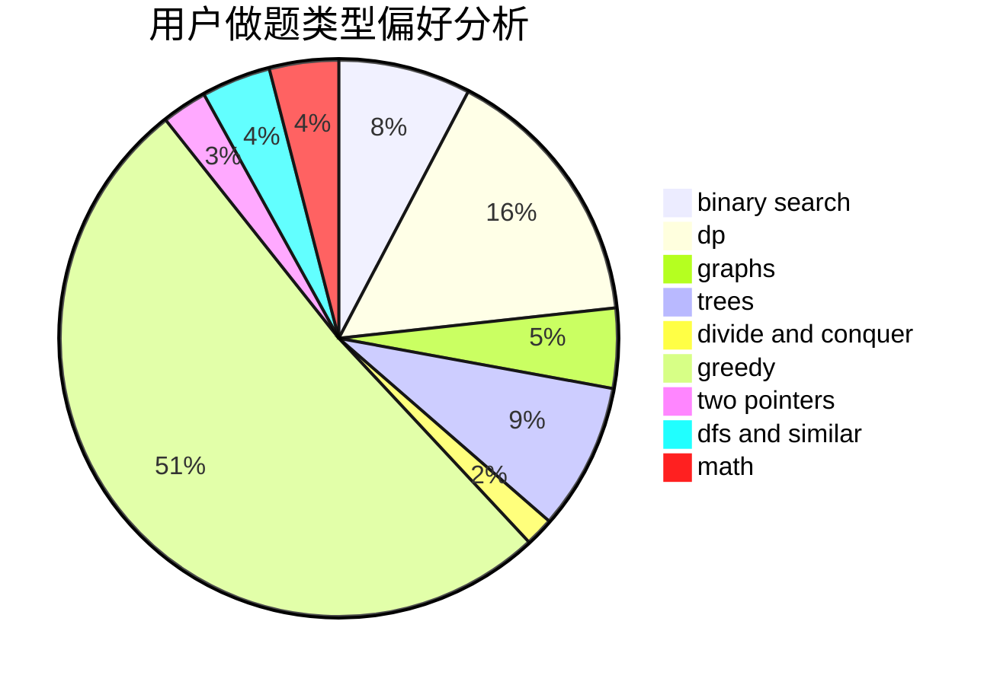

# fhqTreap

<!-- tabs:start -->

#### **用户提交结果分析**

#### **用户做题类型偏好分析**

<!-- tabs:end -->
# 推荐题目
[1492B](https://codeforces.com/contest/1492/problem/B)
[720D](https://codeforces.com/contest/720/problem/D)
[45G](https://codeforces.com/contest/45/problem/G)
[1166D](https://codeforces.com/contest/1166/problem/D)
[750F](https://codeforces.com/contest/750/problem/F)
[946B](https://codeforces.com/contest/946/problem/B)
[1180D](https://codeforces.com/contest/1180/problem/D)
[1297C](https://codeforces.com/contest/1297/problem/C)
[659E](https://codeforces.com/contest/659/problem/E)
[809C](https://codeforces.com/contest/809/problem/C)
