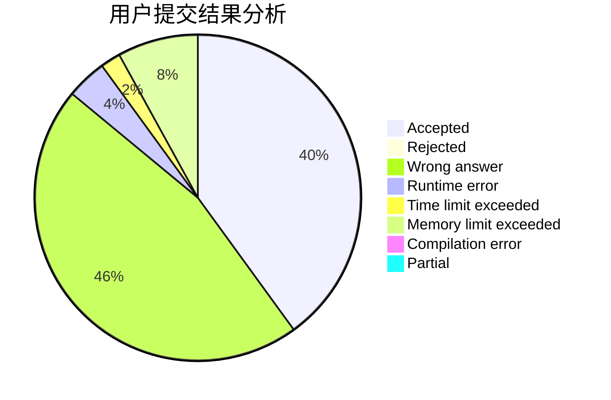
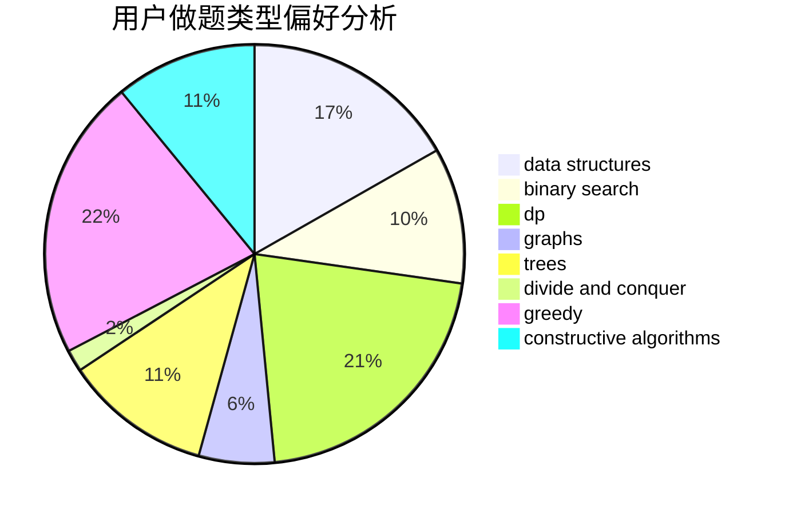
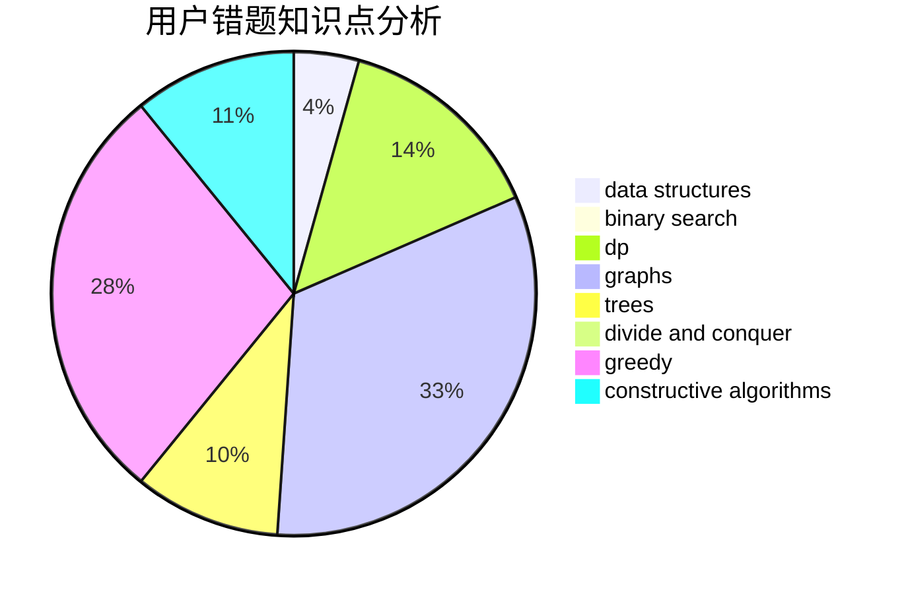

# fhqTreap

<!-- tabs:start -->

#### **用户提交结果分析**

#### **用户做题类型偏好分析**

#### **用户错题知识点分析**

<!-- tabs:end -->
# 推荐题目
[1492B](https://codeforces.com/contest/1492/problem/B)		data structures,
                        greedy,
                        math		  
[720D](https://codeforces.com/contest/720/problem/D)		data structures,
                        dp,
                        sortings		  
[45G](https://codeforces.com/contest/45/problem/G)		number theory		  
[1166D](https://codeforces.com/contest/1166/problem/D)		binary search,
                        brute force,
                        greedy,
                        math		  
[750F](https://codeforces.com/contest/750/problem/F)		constructive algorithms,
                        implementation,
                        interactive,
                        trees		  
[946B](https://codeforces.com/contest/946/problem/B)		math,
                        number theory		  
[1180D](https://codeforces.com/contest/1180/problem/D)		dsu,graphs,sortings,trees		  
[1297C](https://codeforces.com/contest/1297/problem/C)		*special problem,
                        greedy		  
[659E](https://codeforces.com/contest/659/problem/E)		data structures,
                        dfs and similar,
                        dsu,
                        graphs,
                        greedy		  
[809C](https://codeforces.com/contest/809/problem/C)		combinatorics,
                        divide and conquer,
                        dp		  
