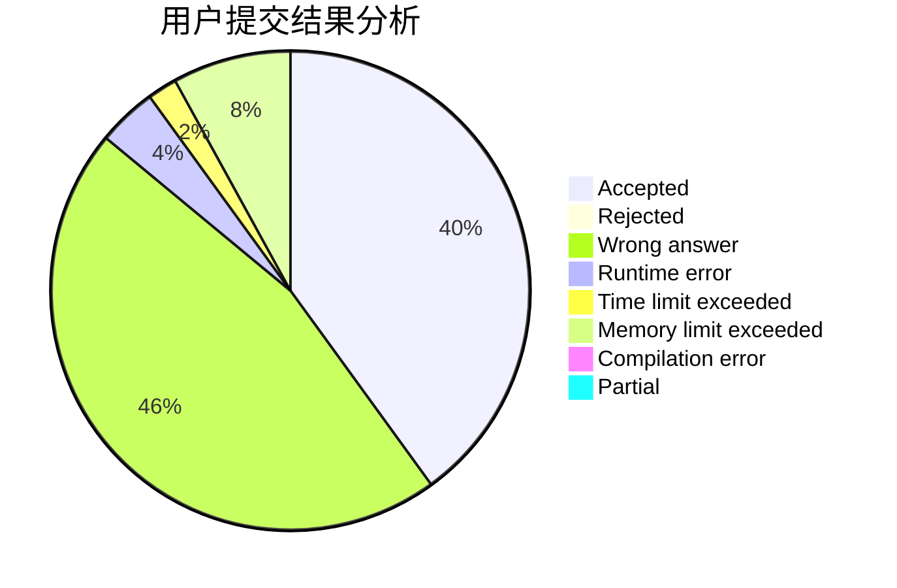
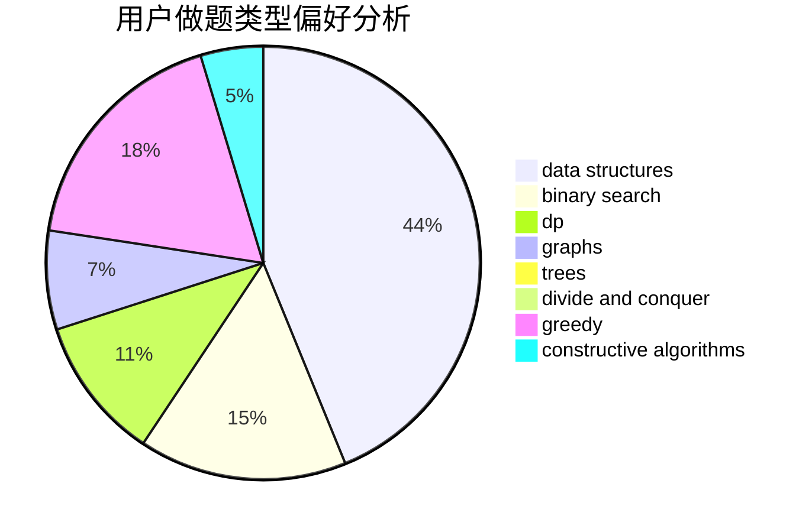
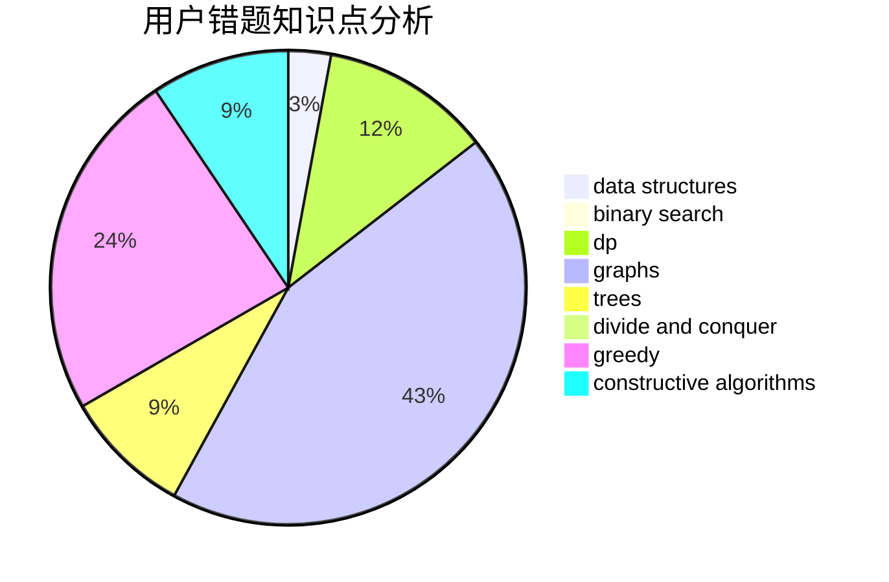

# fhqTreap

<!-- tabs:start -->

#### **用户提交结果分析**

#### **用户做题类型偏好分析**

#### **用户错题知识点分析**

<!-- tabs:end -->
# 推荐题目
[1485A](https://codeforces.com/contest/1485/problem/A)		brute force,
                        greedy,
                        math,
                        number theory		  
[702A](https://codeforces.com/contest/702/problem/A)		dp,
                        greedy,
                        implementation		  
[438B](https://codeforces.com/contest/438/problem/B)		dsu,graphs,sortings,trees		  
[1164M](https://codeforces.com/contest/1164/problem/M)		dsu,graphs,sortings,trees		  
[733A](https://codeforces.com/contest/733/problem/A)		implementation		  
[922B](https://codeforces.com/contest/922/problem/B)		brute force		  
[1178E](https://codeforces.com/contest/1178/problem/E)		brute force,
                        constructive algorithms,
                        greedy,
                        strings		  
[1290F](https://codeforces.com/contest/1290/problem/F)		dp		  
[629E](https://codeforces.com/contest/629/problem/E)		combinatorics,
                        data structures,
                        dfs and similar,
                        dp,
                        probabilities,
                        trees		  
[794B](https://codeforces.com/contest/794/problem/B)		geometry,
                        math		  
