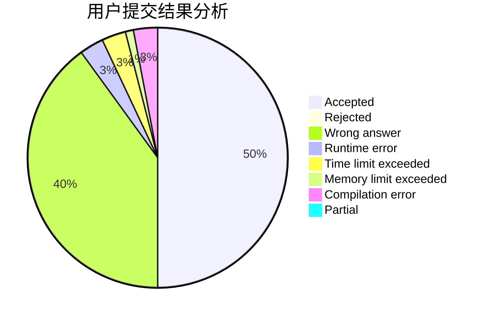
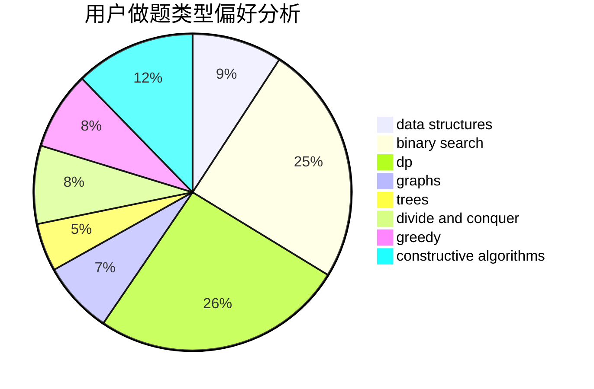
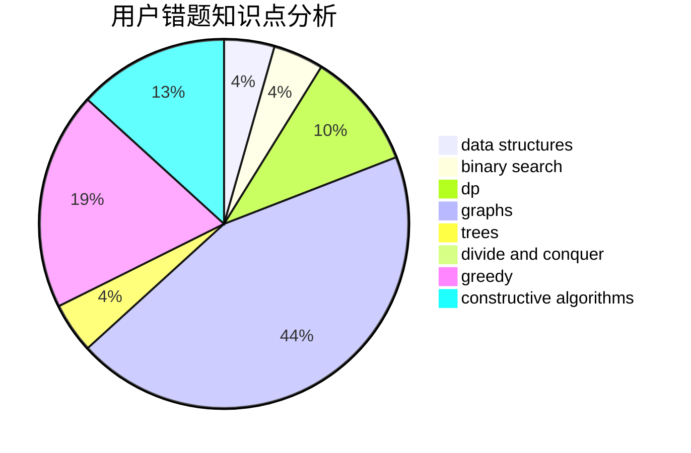

# fireflies2000

<!-- tabs:start -->

#### **用户提交结果分析**

#### **用户做题类型偏好分析**

#### **用户错题知识点分析**

<!-- tabs:end -->
# 推荐题目
[507B](https://codeforces.com/contest/507/problem/B)		geometry,
                        math		  
[1099F](https://codeforces.com/contest/1099/problem/F)		binary search,
                        data structures,
                        dfs and similar,
                        dp,
                        games,
                        trees		  
[817D](https://codeforces.com/contest/817/problem/D)		data structures,
                        divide and conquer,
                        dsu,
                        sortings		  
[700D](https://codeforces.com/contest/700/problem/D)		data structures,
                        greedy		  
[118A](https://codeforces.com/contest/118/problem/A)		implementation,
                        strings		  
[1296D](https://codeforces.com/contest/1296/problem/D)		greedy,
                        sortings		  
[507E](https://codeforces.com/contest/507/problem/E)		dfs and similar,
                        dp,
                        graphs,
                        shortest paths		  
[717E](https://codeforces.com/contest/717/problem/E)		dfs and similar		  
[1362F](https://codeforces.com/contest/1362/problem/F)		dsu,graphs,sortings,trees		  
[216C](https://codeforces.com/contest/216/problem/C)		greedy		  
