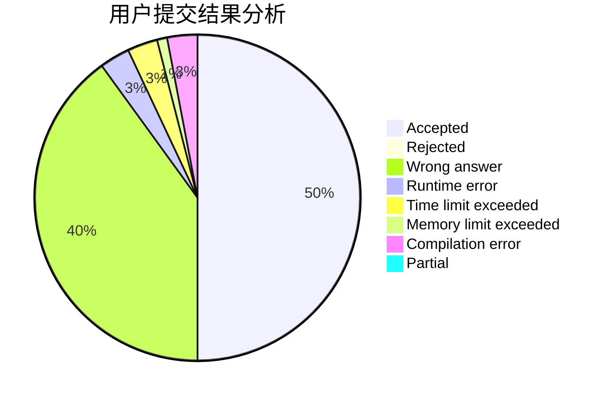
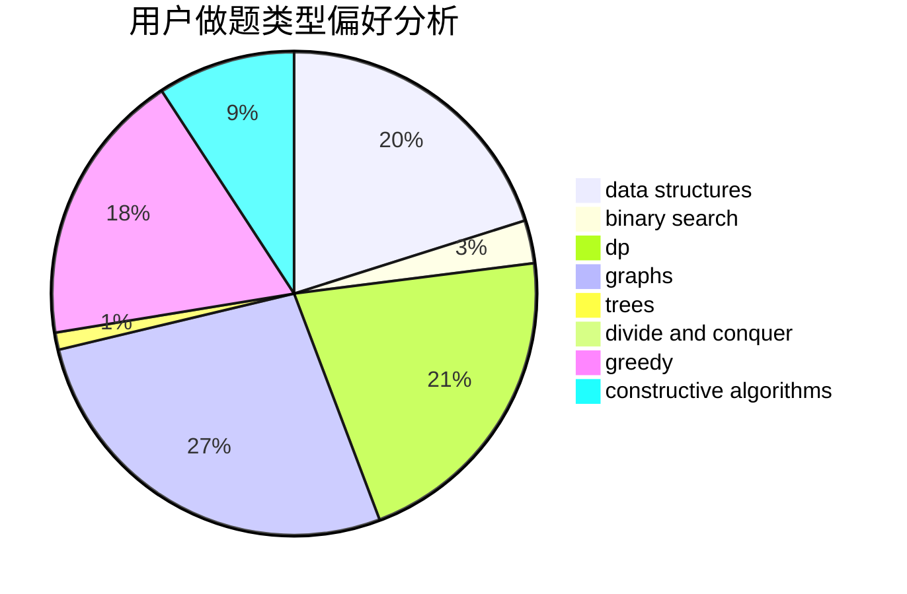
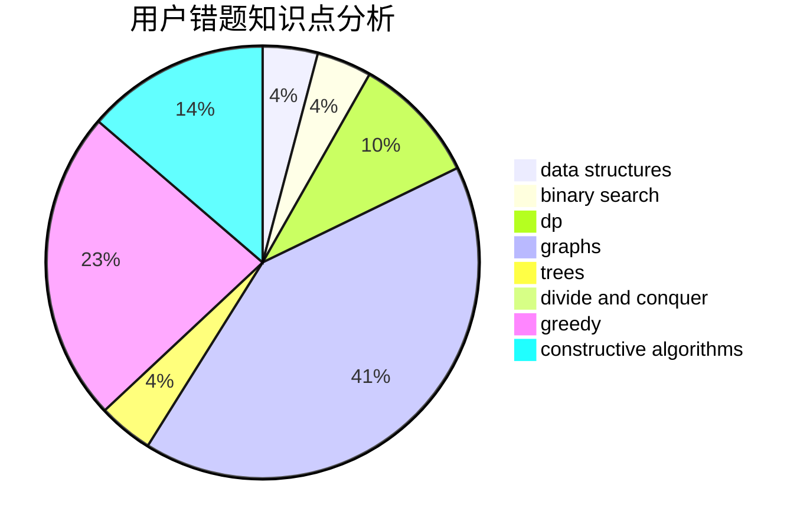

# fireflies2000

<!-- tabs:start -->

#### **用户提交结果分析**

#### **用户做题类型偏好分析**

#### **用户错题知识点分析**

<!-- tabs:end -->
# 推荐题目
[486C](https://codeforces.com/contest/486/problem/C)		brute force,
                        greedy,
                        implementation		  
[1099C](https://codeforces.com/contest/1099/problem/C)		constructive algorithms,
                        implementation		  
[802G](https://codeforces.com/contest/802/problem/G)		implementation,
                        strings		  
[676D](https://codeforces.com/contest/676/problem/D)		graphs,
                        implementation,
                        shortest paths		  
[1185F](https://codeforces.com/contest/1185/problem/F)		bitmasks,
                        brute force		  
[1290B](https://codeforces.com/contest/1290/problem/B)		binary search,
                        constructive algorithms,
                        data structures,
                        strings,
                        two pointers		  
[486E](https://codeforces.com/contest/486/problem/E)		data structures,
                        dp,
                        greedy,
                        hashing,
                        math		  
[6C](https://codeforces.com/contest/6/problem/C)		greedy,
                        two pointers		  
[1356A1](https://codeforces.com/contest/1356A/problem/1)		*special problem		  
[193B](https://codeforces.com/contest/193/problem/B)		brute force		  
