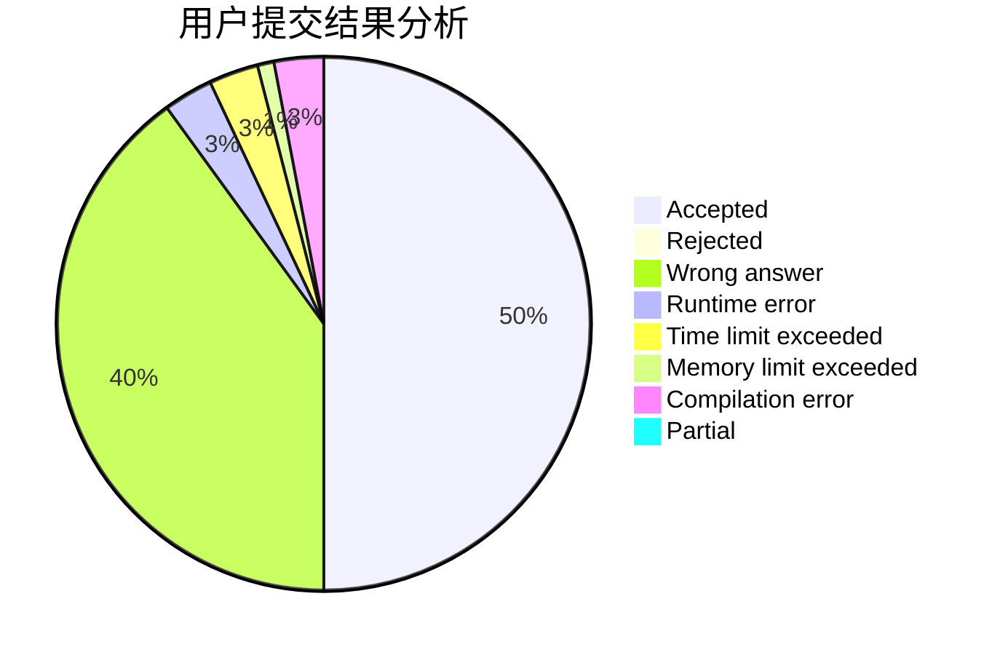
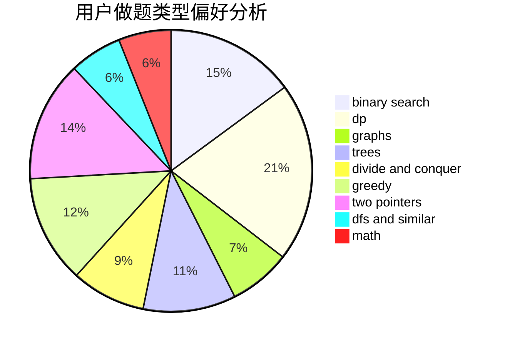

# fireflies2000

<!-- tabs:start -->

#### **用户提交结果分析**

#### **用户做题类型偏好分析**

<!-- tabs:end -->
# 推荐题目
[507B](https://codeforces.com/contest/507/problem/B)
[1099F](https://codeforces.com/contest/1099/problem/F)
[817D](https://codeforces.com/contest/817/problem/D)
[700D](https://codeforces.com/contest/700/problem/D)
[118A](https://codeforces.com/contest/118/problem/A)
[1296D](https://codeforces.com/contest/1296/problem/D)
[507E](https://codeforces.com/contest/507/problem/E)
[717E](https://codeforces.com/contest/717/problem/E)
[1362F](https://codeforces.com/contest/1362/problem/F)
[216C](https://codeforces.com/contest/216/problem/C)
