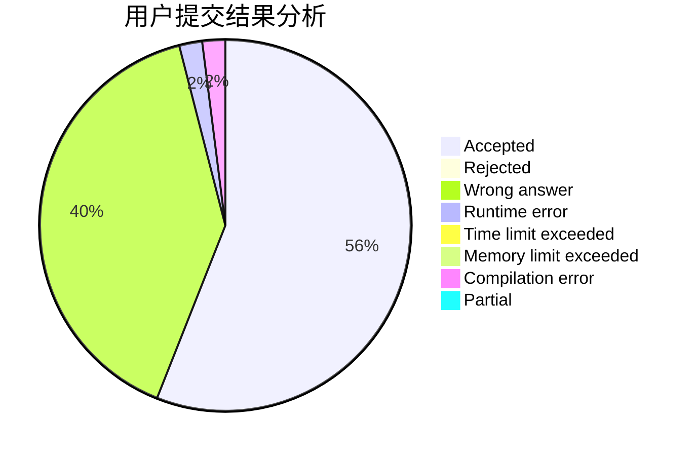
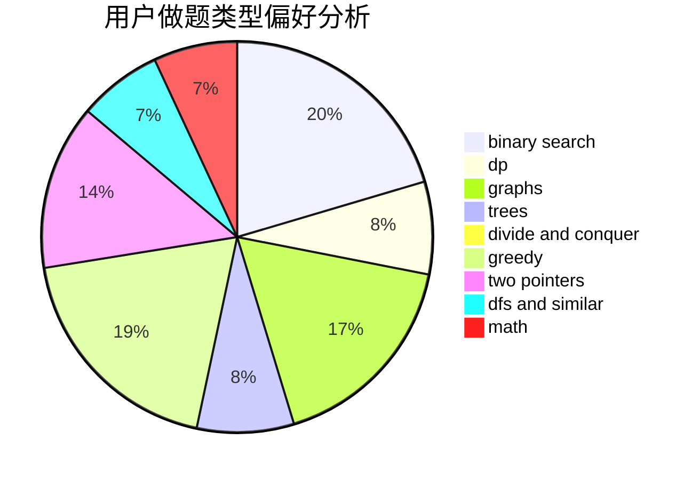

# firstdove

<!-- tabs:start -->

#### **用户提交结果分析**

#### **用户做题类型偏好分析**

<!-- tabs:end -->
# 推荐题目
[1342D](https://codeforces.com/contest/1342/problem/D)
[1070D](https://codeforces.com/contest/1070/problem/D)
[62E](https://codeforces.com/contest/62/problem/E)
[925F](https://codeforces.com/contest/925/problem/F)
[1150E](https://codeforces.com/contest/1150/problem/E)
[1138A](https://codeforces.com/contest/1138/problem/A)
[1101A](https://codeforces.com/contest/1101/problem/A)
[416E](https://codeforces.com/contest/416/problem/E)
[223C](https://codeforces.com/contest/223/problem/C)
[1453E](https://codeforces.com/contest/1453/problem/E)
