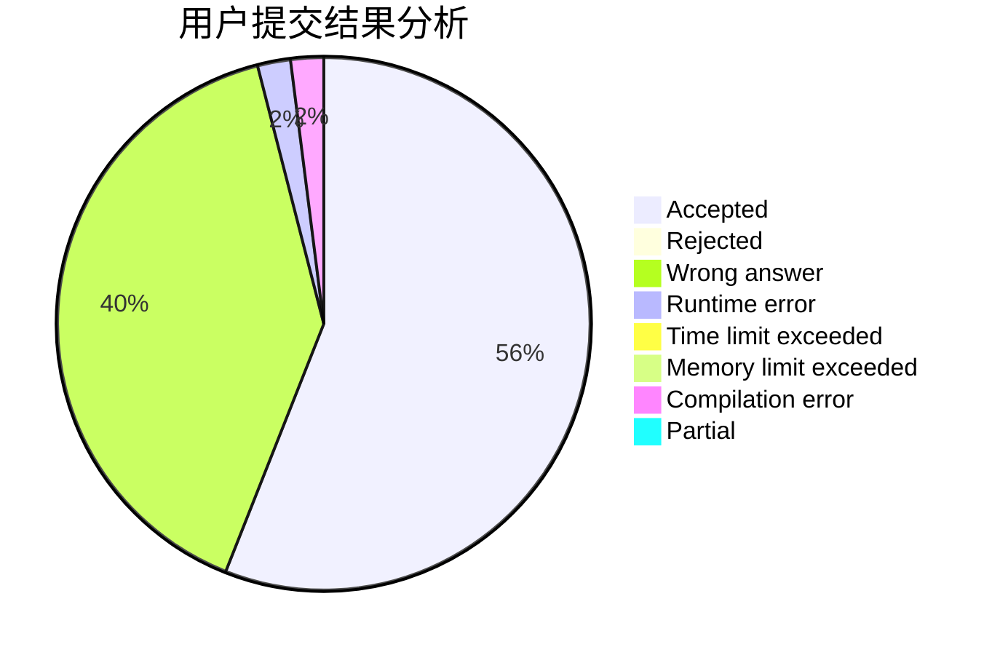
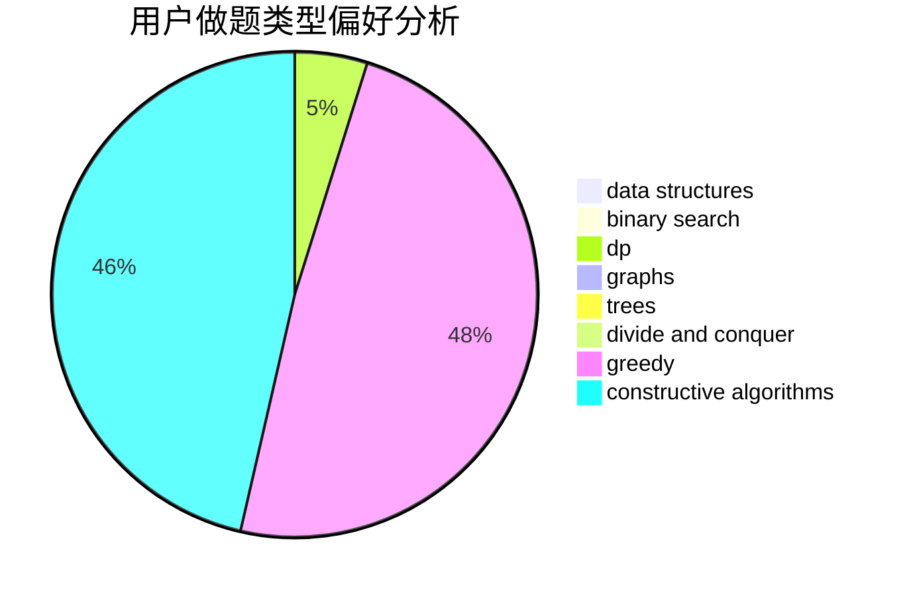
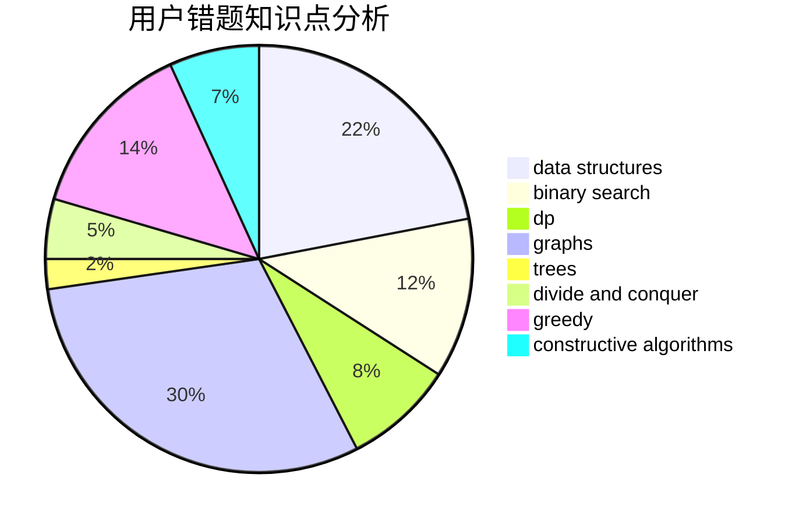

# firstdove

<!-- tabs:start -->

#### **用户提交结果分析**

#### **用户做题类型偏好分析**

#### **用户错题知识点分析**

<!-- tabs:end -->
# 推荐题目
[1335D](https://codeforces.com/contest/1335/problem/D)		constructive algorithms,
                        implementation		  
[1070A](https://codeforces.com/contest/1070/problem/A)		dp,
                        graphs,
                        number theory,
                        shortest paths		  
[610E](https://codeforces.com/contest/610/problem/E)		data structures,
                        strings		  
[911A](https://codeforces.com/contest/911/problem/A)		implementation		  
[1149B](https://codeforces.com/contest/1149/problem/B)		dp,
                        implementation,
                        strings		  
[1133F1](https://codeforces.com/contest/1133F/problem/1)		graphs		  
[1100D](https://codeforces.com/contest/1100/problem/D)		constructive algorithms,
                        games,
                        interactive		  
[387D](https://codeforces.com/contest/387/problem/D)		graph matchings		  
[19E](https://codeforces.com/contest/19/problem/E)		dfs and similar,
                        divide and conquer,
                        dsu		  
[1444A](https://codeforces.com/contest/1444/problem/A)		brute force,
                        math,
                        number theory		  
