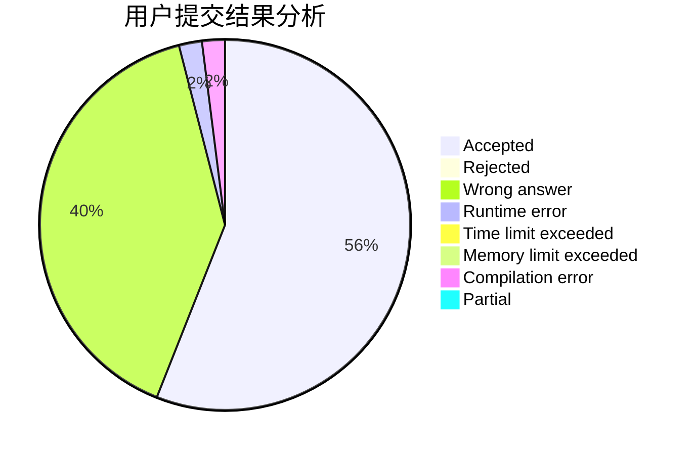
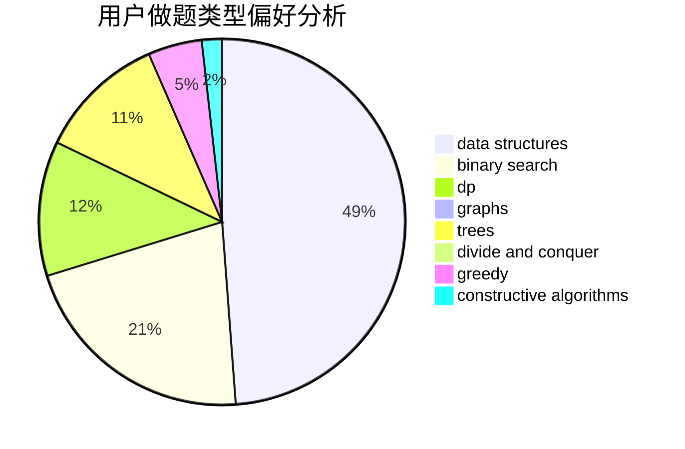
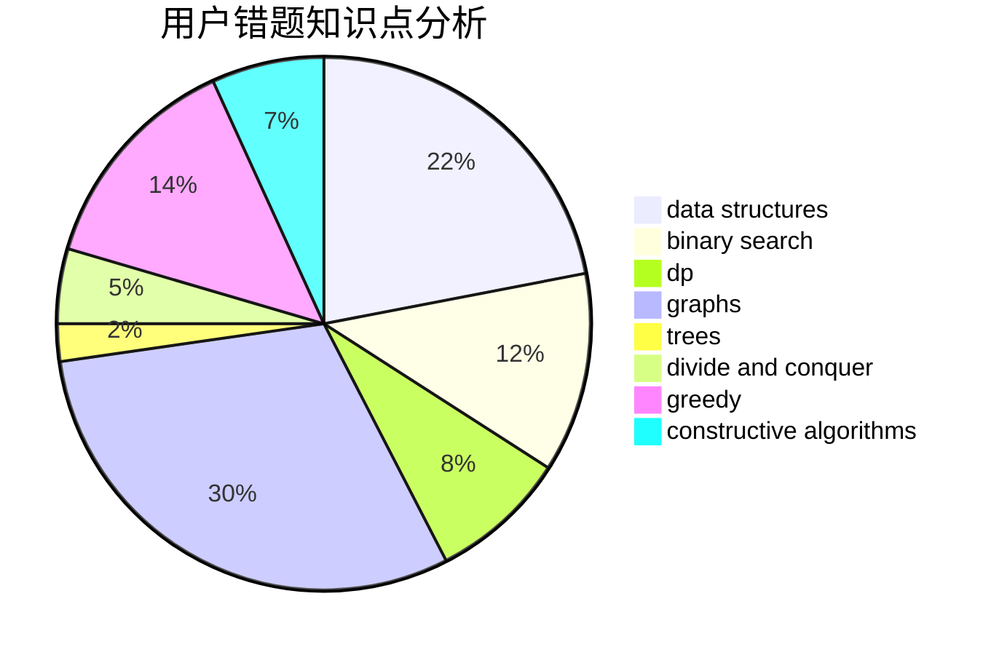

# firstdove

<!-- tabs:start -->

#### **用户提交结果分析**

#### **用户做题类型偏好分析**

#### **用户错题知识点分析**

<!-- tabs:end -->
# 推荐题目
[1342D](https://codeforces.com/contest/1342/problem/D)		binary search,
                        constructive algorithms,
                        data structures,
                        greedy,
                        sortings,
                        two pointers		  
[1070D](https://codeforces.com/contest/1070/problem/D)		greedy		  
[62E](https://codeforces.com/contest/62/problem/E)		dp,
                        flows		  
[925F](https://codeforces.com/contest/925/problem/F)		binary search,
                        flows		  
[1150E](https://codeforces.com/contest/1150/problem/E)		dsu,graphs,sortings,trees		  
[1138A](https://codeforces.com/contest/1138/problem/A)		binary search,
                        greedy,
                        implementation		  
[1101A](https://codeforces.com/contest/1101/problem/A)		math		  
[416E](https://codeforces.com/contest/416/problem/E)		dp,
                        graphs,
                        shortest paths		  
[223C](https://codeforces.com/contest/223/problem/C)		combinatorics,
                        math,
                        number theory		  
[1453E](https://codeforces.com/contest/1453/problem/E)		binary search,
                        dfs and similar,
                        dp,
                        greedy,
                        trees		  
