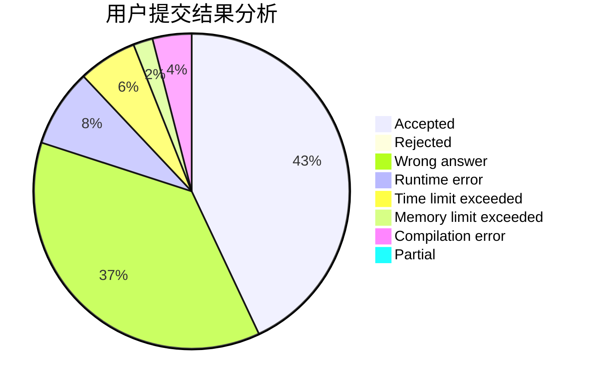
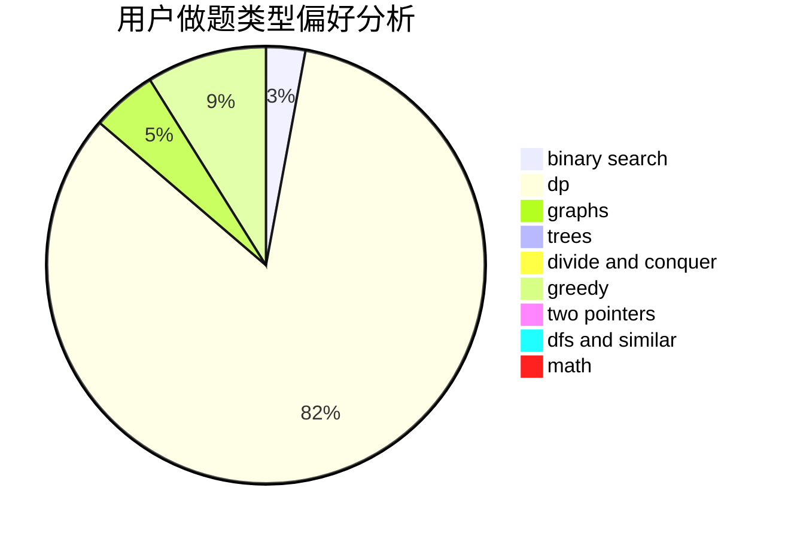

# fishcathu.

<!-- tabs:start -->

#### **用户提交结果分析**

#### **用户做题类型偏好分析**

<!-- tabs:end -->
# 推荐题目
[708E](https://codeforces.com/contest/708/problem/E)
[913H](https://codeforces.com/contest/913/problem/H)
[1030A](https://codeforces.com/contest/1030/problem/A)
[746A](https://codeforces.com/contest/746/problem/A)
[645E](https://codeforces.com/contest/645/problem/E)
[21C](https://codeforces.com/contest/21/problem/C)
[85A](https://codeforces.com/contest/85/problem/A)
[668A](https://codeforces.com/contest/668/problem/A)
[993A](https://codeforces.com/contest/993/problem/A)
[1191E](https://codeforces.com/contest/1191/problem/E)
