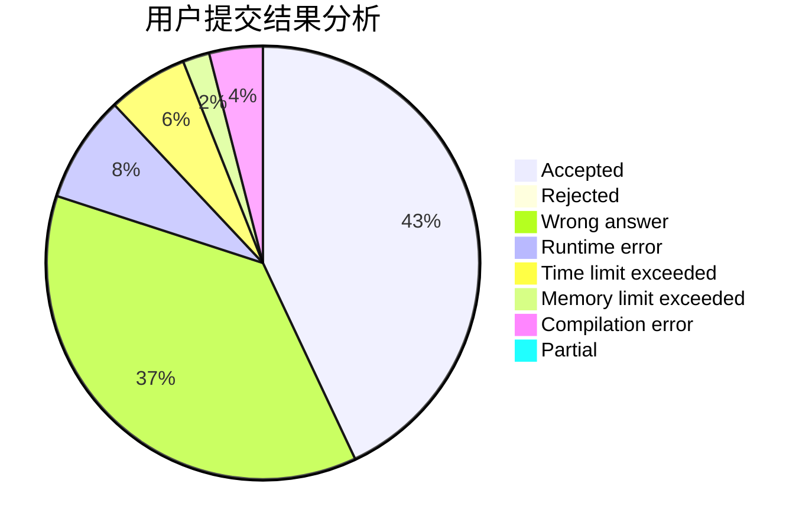
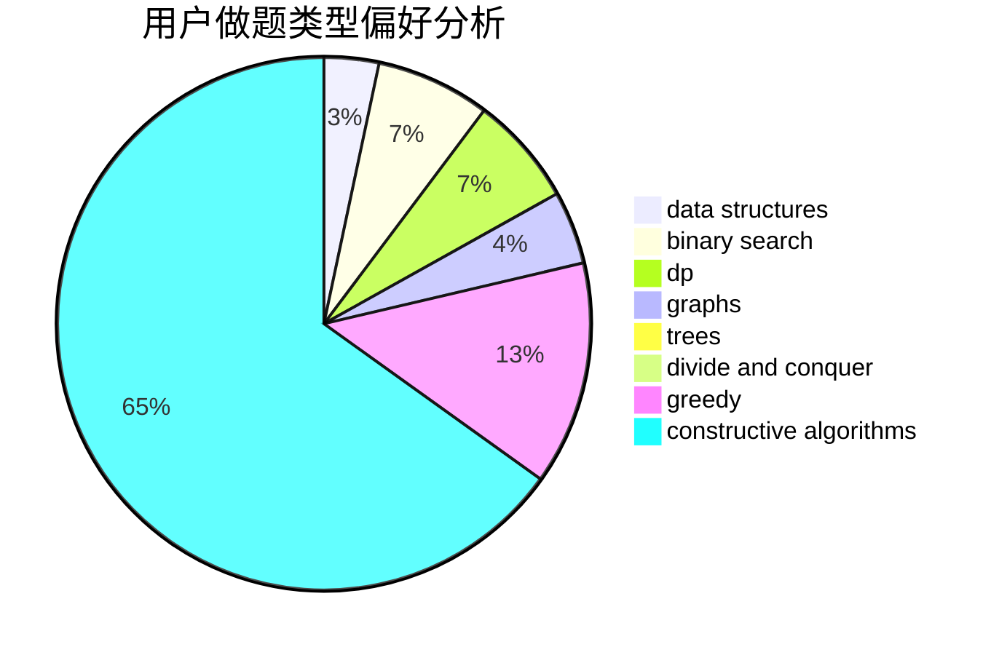
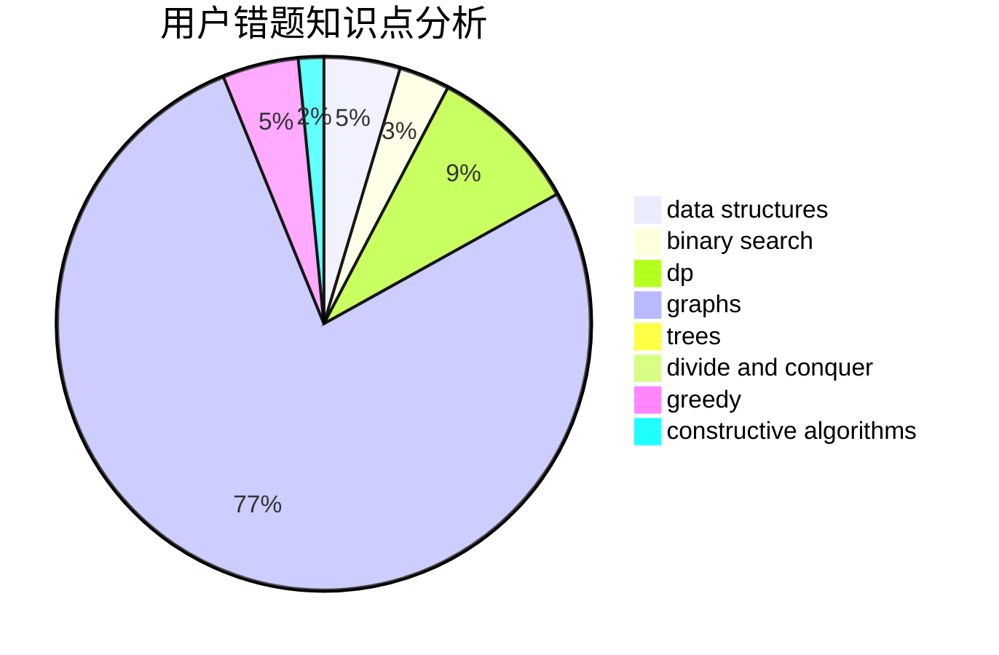

# fishcathu.

<!-- tabs:start -->

#### **用户提交结果分析**

#### **用户做题类型偏好分析**

#### **用户错题知识点分析**

<!-- tabs:end -->
# 推荐题目
[687A](https://codeforces.com/contest/687/problem/A)		dfs and similar,
                        graphs		  
[896E](https://codeforces.com/contest/896/problem/E)		data structures,
                        dsu		  
[1029F](https://codeforces.com/contest/1029/problem/F)		binary search,
                        brute force,
                        math,
                        number theory		  
[729A](https://codeforces.com/contest/729/problem/A)		implementation,
                        strings		  
[621C](https://codeforces.com/contest/621/problem/C)		combinatorics,
                        math,
                        number theory,
                        probabilities		  
[198C](https://codeforces.com/contest/198/problem/C)		binary search,
                        geometry		  
[840C](https://codeforces.com/contest/840/problem/C)		combinatorics,
                        dp		  
[637B](https://codeforces.com/contest/637/problem/B)		*special problem,
                        binary search,
                        constructive algorithms,
                        data structures,
                        sortings		  
[979A](https://codeforces.com/contest/979/problem/A)		math		  
[1188A1](https://codeforces.com/contest/1188A/problem/1)		trees		  
