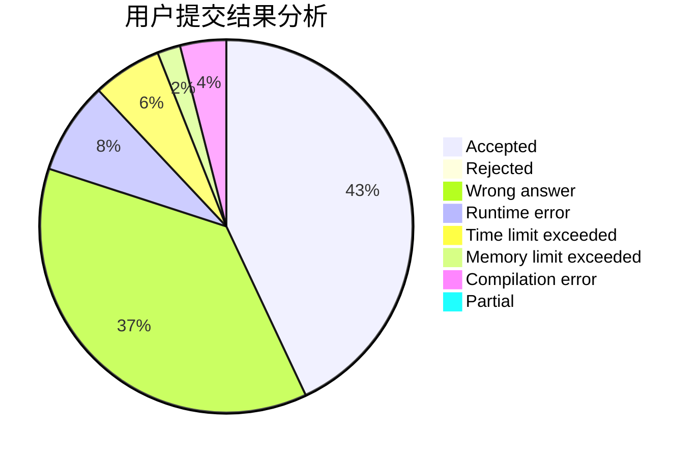
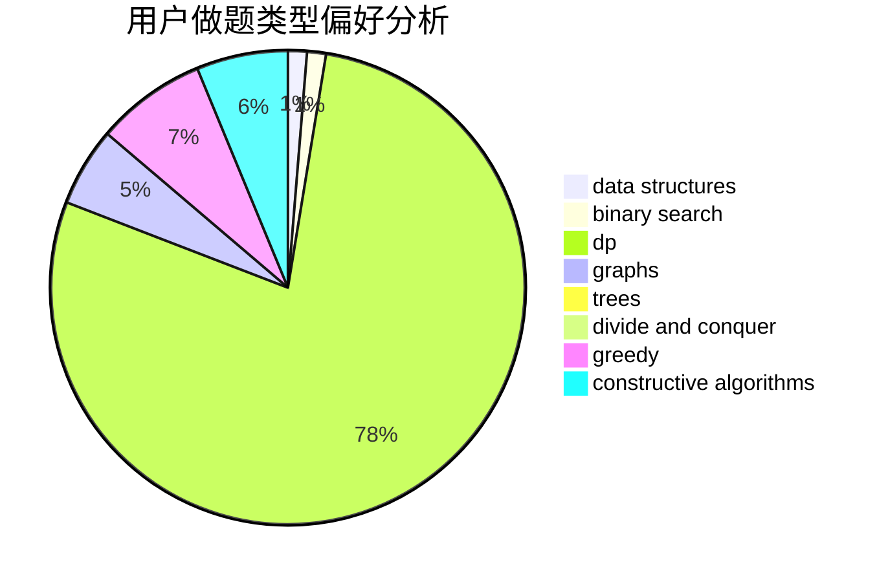
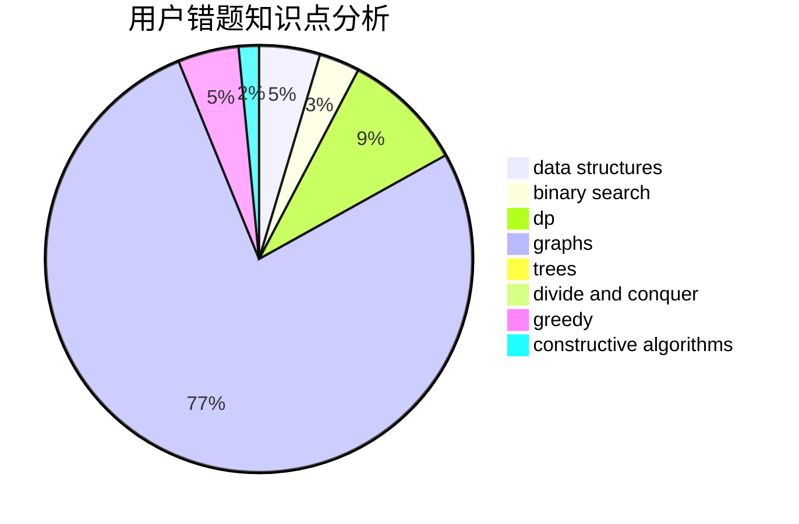

# fishcathu.

<!-- tabs:start -->

#### **用户提交结果分析**

#### **用户做题类型偏好分析**

#### **用户错题知识点分析**

<!-- tabs:end -->
# 推荐题目
[708E](https://codeforces.com/contest/708/problem/E)		dp,
                        math		  
[913H](https://codeforces.com/contest/913/problem/H)		math,
                        probabilities		  
[1030A](https://codeforces.com/contest/1030/problem/A)		implementation		  
[746A](https://codeforces.com/contest/746/problem/A)		implementation,
                        math		  
[645E](https://codeforces.com/contest/645/problem/E)		dp,
                        greedy,
                        strings		  
[21C](https://codeforces.com/contest/21/problem/C)		binary search,
                        dp,
                        sortings		  
[85A](https://codeforces.com/contest/85/problem/A)		constructive algorithms,
                        implementation		  
[668A](https://codeforces.com/contest/668/problem/A)		dsu,graphs,sortings,trees		  
[993A](https://codeforces.com/contest/993/problem/A)		geometry,
                        implementation		  
[1191E](https://codeforces.com/contest/1191/problem/E)		dsu,graphs,sortings,trees		  
