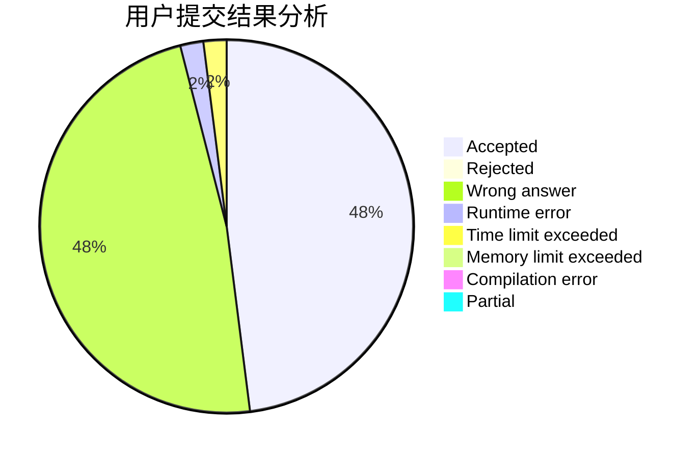
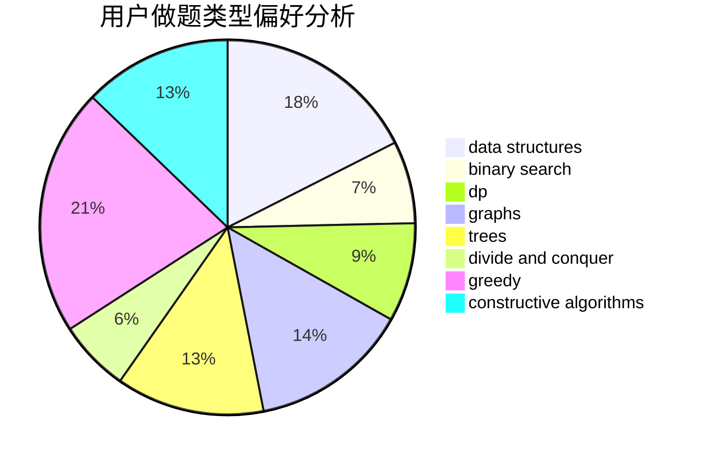
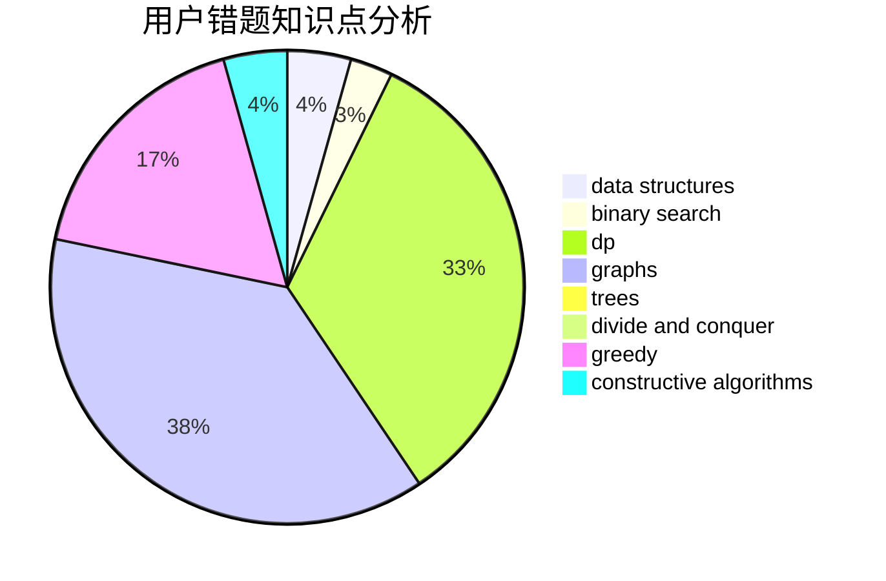

# Asurudo_Mirai

<!-- tabs:start -->

#### **用户提交结果分析**

#### **用户做题类型偏好分析**

#### **用户错题知识点分析**

<!-- tabs:end -->
# 推荐题目
[463C](https://codeforces.com/contest/463/problem/C)		greedy,
                        hashing,
                        implementation		  
[1044D](https://codeforces.com/contest/1044/problem/D)		data structures,
                        dsu		  
[1459E](https://codeforces.com/contest/1459/problem/E)		dsu,graphs,sortings,trees		  
[1082F](https://codeforces.com/contest/1082/problem/F)		dp,
                        strings,
                        trees		  
[1025G](https://codeforces.com/contest/1025/problem/G)		constructive algorithms,
                        math		  
[13781](https://codeforces.com/contest/1378/problem/1)		dsu,graphs,sortings,trees		  
[463B](https://codeforces.com/contest/463/problem/B)		brute force,
                        implementation,
                        math		  
[463A](https://codeforces.com/contest/463/problem/A)		brute force,
                        implementation		  
[463D](https://codeforces.com/contest/463/problem/D)		dfs and similar,
                        dp,
                        graphs,
                        implementation		  
[462E](https://codeforces.com/contest/462/problem/E)		dsu,graphs,sortings,trees		  
