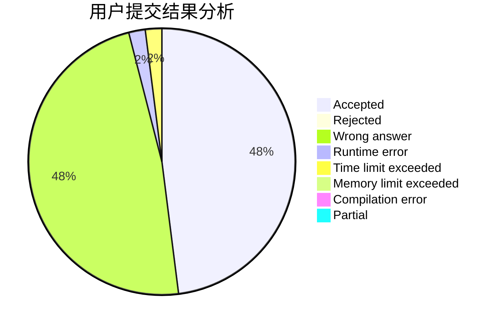
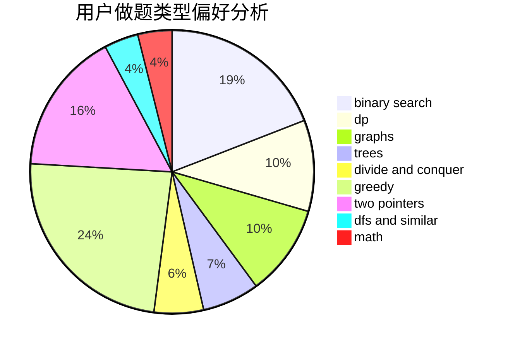

# Asurudo_Mirai

<!-- tabs:start -->

#### **用户提交结果分析**

#### **用户做题类型偏好分析**

<!-- tabs:end -->
# 推荐题目
[463C](https://codeforces.com/contest/463/problem/C)
[1044D](https://codeforces.com/contest/1044/problem/D)
[1459E](https://codeforces.com/contest/1459/problem/E)
[1082F](https://codeforces.com/contest/1082/problem/F)
[1025G](https://codeforces.com/contest/1025/problem/G)
[13781](https://codeforces.com/contest/1378/problem/1)
[463B](https://codeforces.com/contest/463/problem/B)
[463A](https://codeforces.com/contest/463/problem/A)
[463D](https://codeforces.com/contest/463/problem/D)
[462E](https://codeforces.com/contest/462/problem/E)
