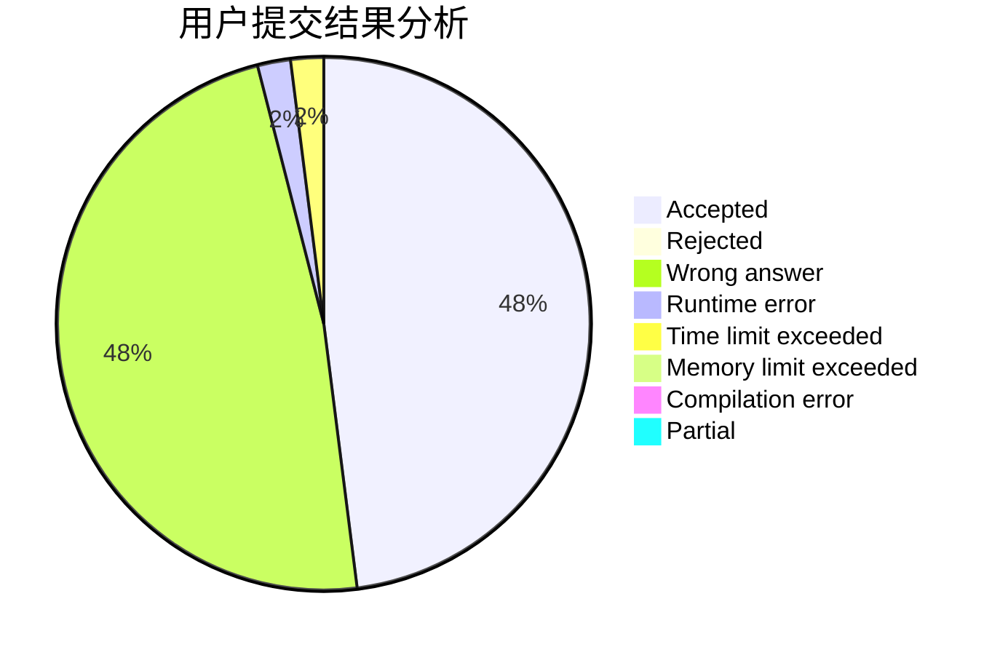
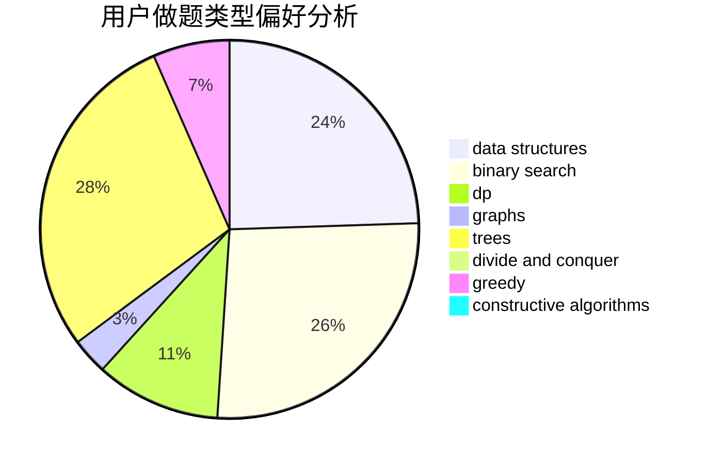
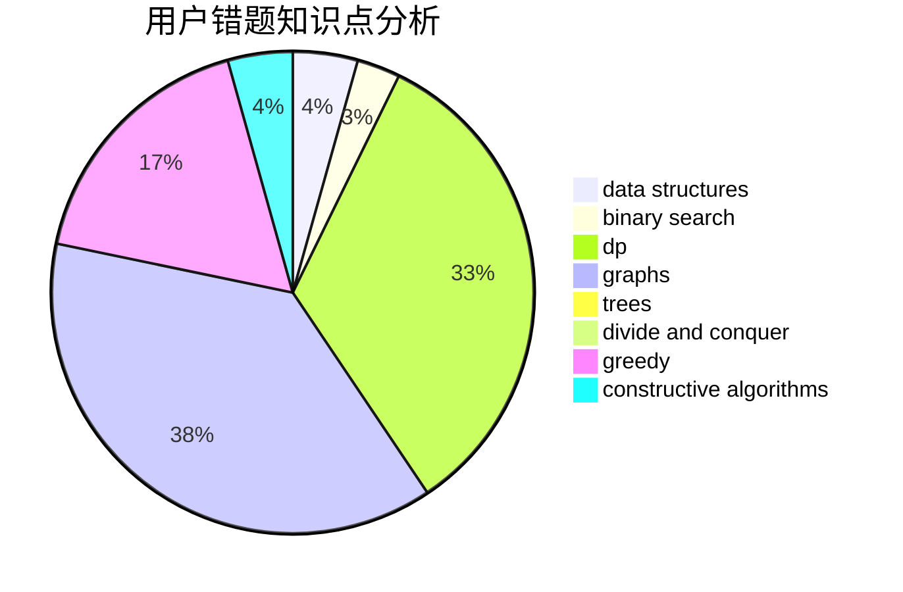

# Asurudo_Mirai

<!-- tabs:start -->

#### **用户提交结果分析**

#### **用户做题类型偏好分析**

#### **用户错题知识点分析**

<!-- tabs:end -->
# 推荐题目
[442E](https://codeforces.com/contest/442/problem/E)		geometry		  
[1043G](https://codeforces.com/contest/1043/problem/G)		data structures,
                        divide and conquer,
                        hashing,
                        string suffix structures,
                        strings		  
[1450H1](https://codeforces.com/contest/1450H/problem/1)		combinatorics,
                        fft,
                        math		  
[1082C](https://codeforces.com/contest/1082/problem/C)		greedy,
                        sortings		  
[1025D](https://codeforces.com/contest/1025/problem/D)		brute force,
                        dp,
                        math,
                        number theory,
                        trees		  
[136C](https://codeforces.com/contest/136/problem/C)		dsu,graphs,sortings,trees		  
[442D](https://codeforces.com/contest/442/problem/D)		data structures,
                        trees		  
[442C](https://codeforces.com/contest/442/problem/C)		data structures,
                        greedy		  
[443A](https://codeforces.com/contest/443/problem/A)		constructive algorithms,
                        implementation		  
[442B](https://codeforces.com/contest/442/problem/B)		greedy,
                        math,
                        probabilities		  
