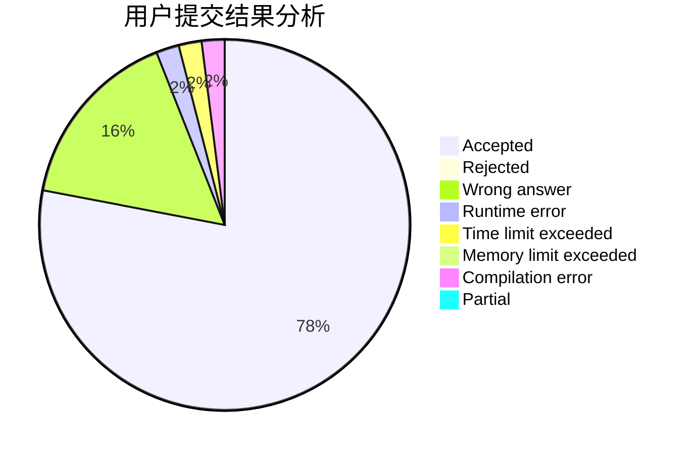
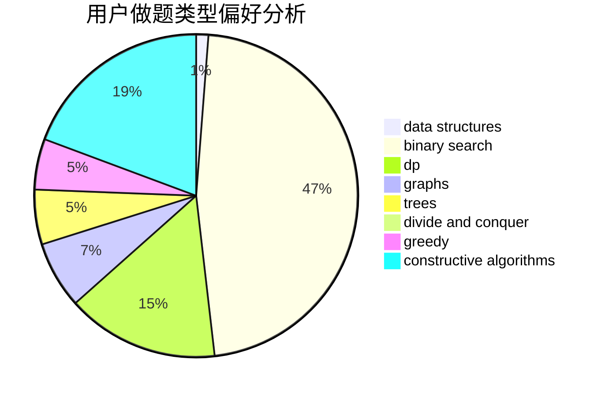
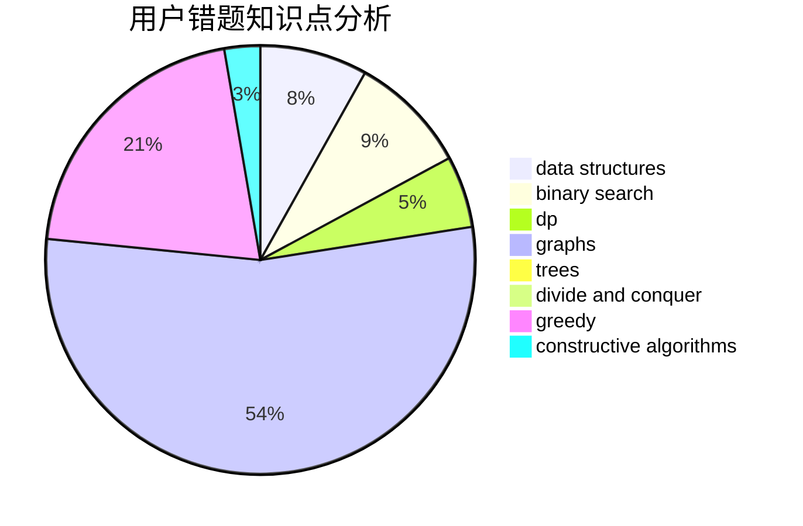

# fjtx

<!-- tabs:start -->

#### **用户提交结果分析**

#### **用户做题类型偏好分析**

#### **用户错题知识点分析**

<!-- tabs:end -->
# 推荐题目
[442B](https://codeforces.com/contest/442/problem/B)		greedy,
                        math,
                        probabilities		  
[911D](https://codeforces.com/contest/911/problem/D)		brute force,
                        math		  
[243D](https://codeforces.com/contest/243/problem/D)		data structures,
                        dp,
                        geometry,
                        two pointers		  
[809C](https://codeforces.com/contest/809/problem/C)		combinatorics,
                        divide and conquer,
                        dp		  
[708A](https://codeforces.com/contest/708/problem/A)		constructive algorithms,
                        greedy,
                        implementation,
                        strings		  
[425C](https://codeforces.com/contest/425/problem/C)		data structures,
                        dp		  
[430C](https://codeforces.com/contest/430/problem/C)		dsu,graphs,sortings,trees		  
[717E](https://codeforces.com/contest/717/problem/E)		dfs and similar		  
[1001B](https://codeforces.com/contest/1001/problem/B)		*special problem		  
[989A](https://codeforces.com/contest/989/problem/A)		implementation,
                        strings		  
