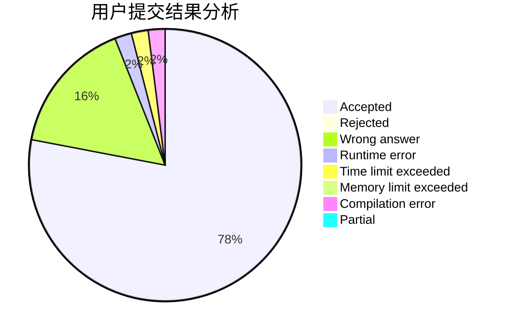
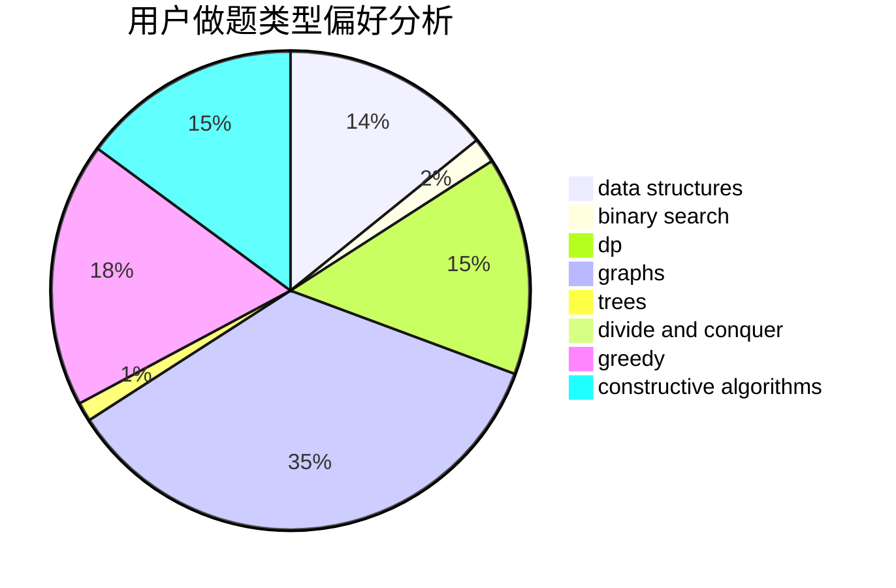
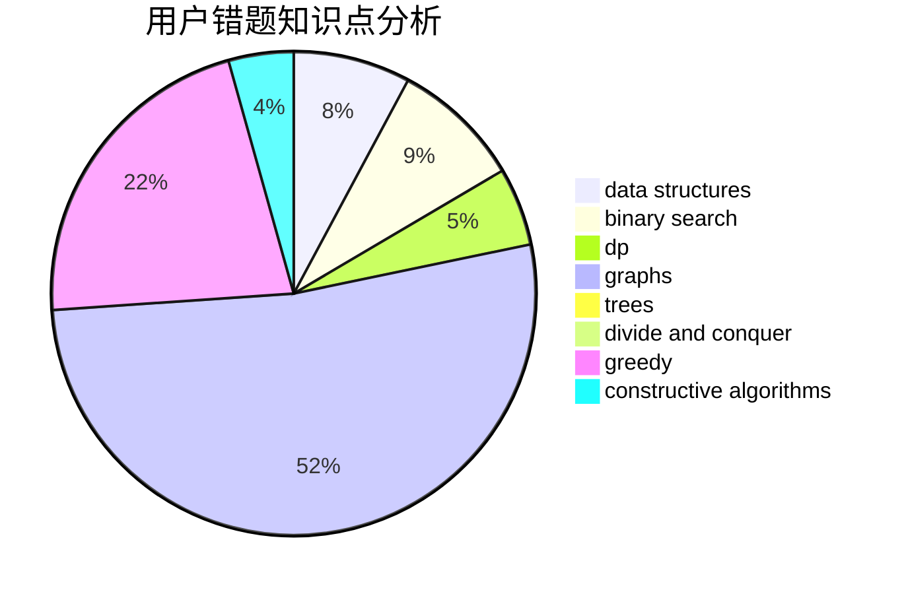

# fjtx

<!-- tabs:start -->

#### **用户提交结果分析**

#### **用户做题类型偏好分析**

#### **用户错题知识点分析**

<!-- tabs:end -->
# 推荐题目
[417C](https://codeforces.com/contest/417/problem/C)		constructive algorithms,
                        graphs,
                        implementation		  
[893D](https://codeforces.com/contest/893/problem/D)		data structures,
                        dp,
                        greedy,
                        implementation		  
[225D](https://codeforces.com/contest/225/problem/D)		bitmasks,
                        dfs and similar,
                        graphs,
                        implementation		  
[794B](https://codeforces.com/contest/794/problem/B)		geometry,
                        math		  
[686A](https://codeforces.com/contest/686/problem/A)		constructive algorithms,
                        implementation		  
[39B](https://codeforces.com/contest/39/problem/B)		greedy		  
[402C](https://codeforces.com/contest/402/problem/C)		brute force,
                        constructive algorithms,
                        graphs		  
[6C](https://codeforces.com/contest/6/problem/C)		greedy,
                        two pointers		  
[1001B](https://codeforces.com/contest/1001/problem/B)		*special problem		  
[967D](https://codeforces.com/contest/967/problem/D)		dsu,graphs,sortings,trees		  
