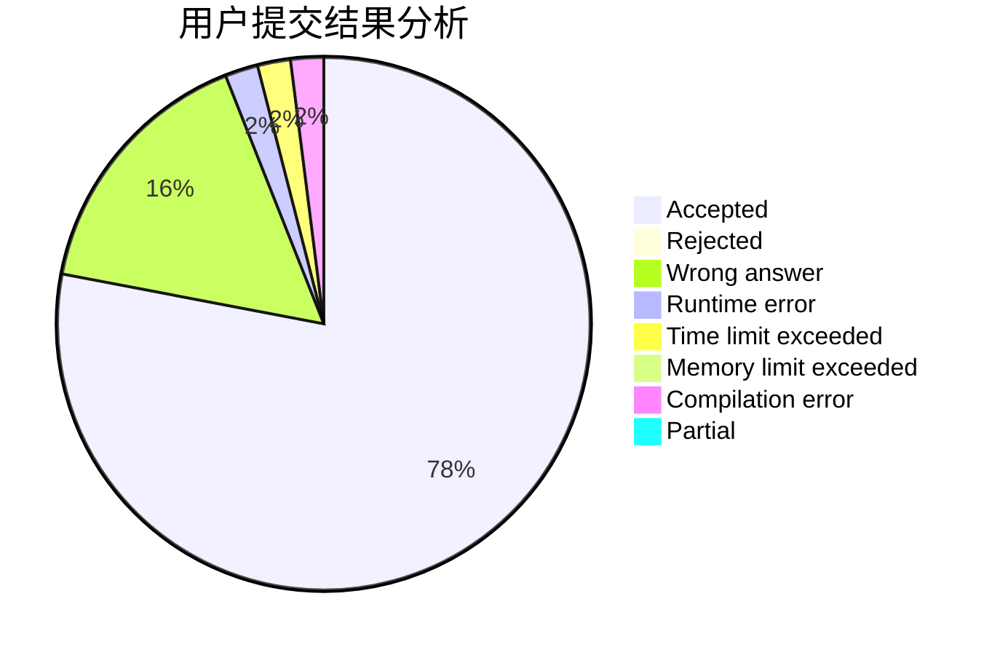
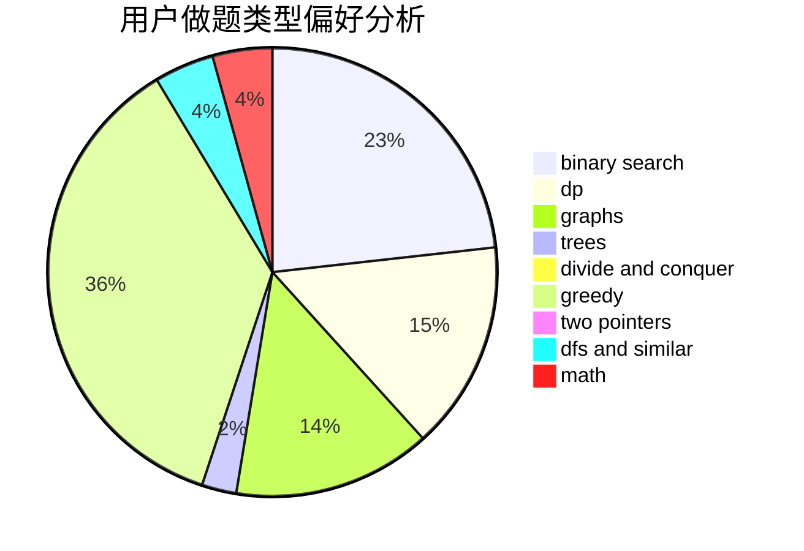

# fjtx

<!-- tabs:start -->

#### **用户提交结果分析**

#### **用户做题类型偏好分析**

<!-- tabs:end -->
# 推荐题目
[442B](https://codeforces.com/contest/442/problem/B)
[911D](https://codeforces.com/contest/911/problem/D)
[243D](https://codeforces.com/contest/243/problem/D)
[809C](https://codeforces.com/contest/809/problem/C)
[708A](https://codeforces.com/contest/708/problem/A)
[425C](https://codeforces.com/contest/425/problem/C)
[430C](https://codeforces.com/contest/430/problem/C)
[717E](https://codeforces.com/contest/717/problem/E)
[1001B](https://codeforces.com/contest/1001/problem/B)
[989A](https://codeforces.com/contest/989/problem/A)
