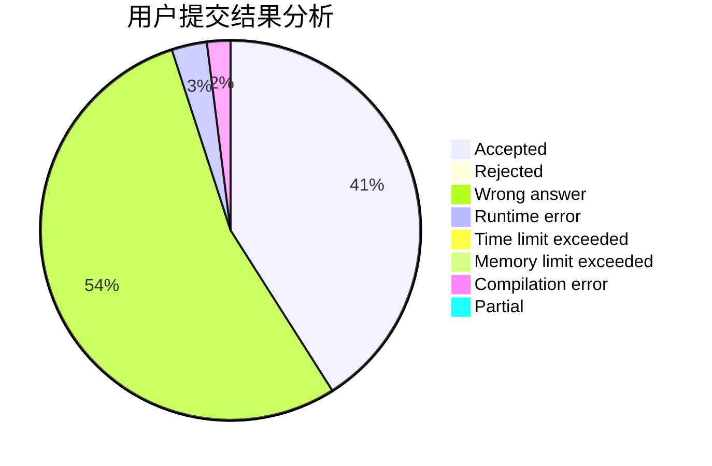
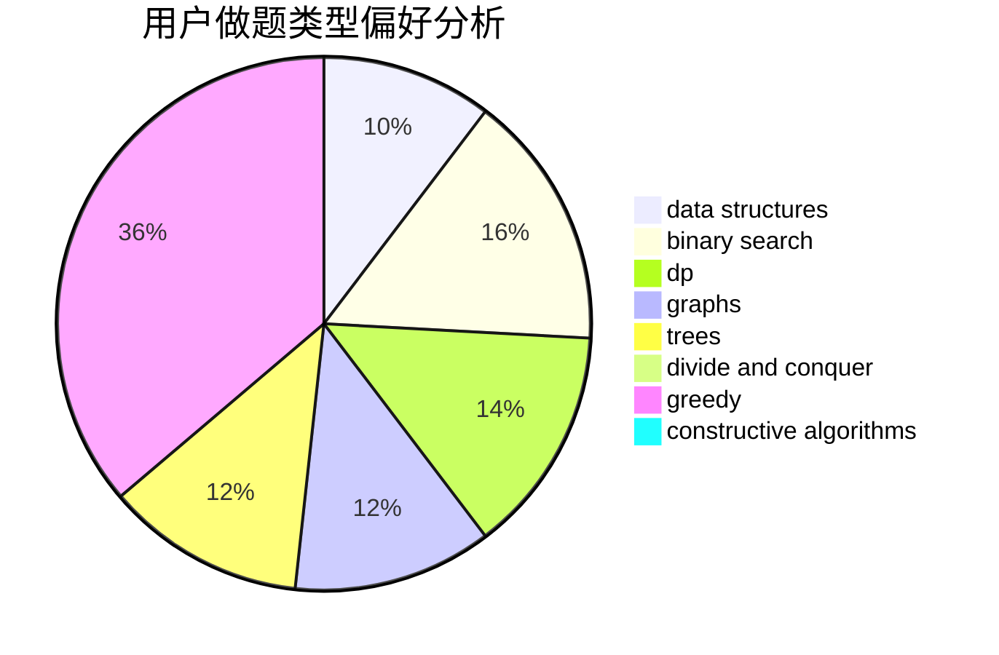
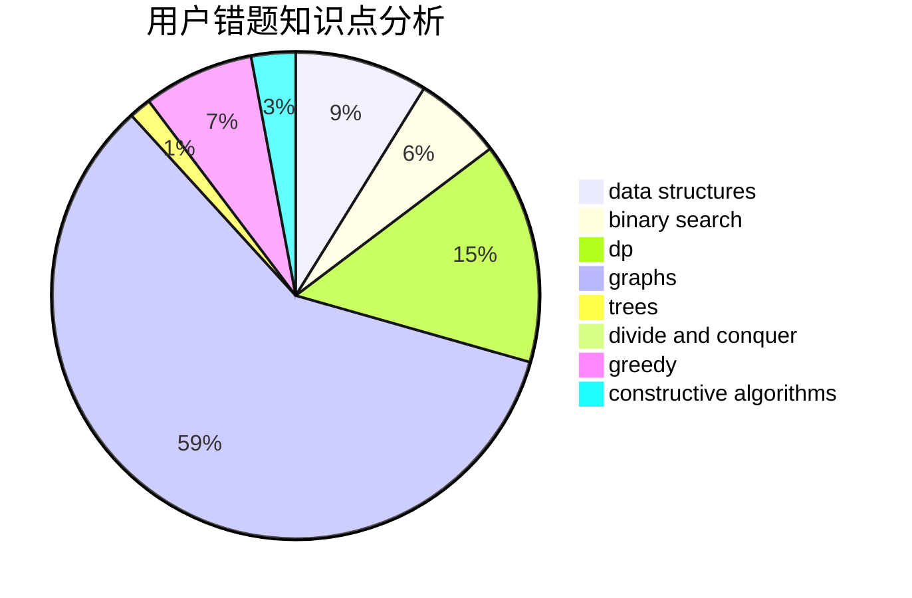

# flamingoo

<!-- tabs:start -->

#### **用户提交结果分析**

#### **用户做题类型偏好分析**

#### **用户错题知识点分析**

<!-- tabs:end -->
# 推荐题目
[284E](https://codeforces.com/contest/284/problem/E)		dsu,graphs,sortings,trees		  
[12611](https://codeforces.com/contest/1261/problem/1)		dsu,graphs,sortings,trees		  
[10021](https://codeforces.com/contest/1002/problem/1)		dsu,graphs,sortings,trees		  
[1186D](https://codeforces.com/contest/1186/problem/D)		constructive algorithms,
                        greedy,
                        math		  
[343D](https://codeforces.com/contest/343/problem/D)		data structures,
                        dfs and similar,
                        graphs,
                        trees		  
[1168B](https://codeforces.com/contest/1168/problem/B)		brute force,
                        two pointers		  
[1008B](https://codeforces.com/contest/1008/problem/B)		greedy,
                        sortings		  
[571D](https://codeforces.com/contest/571/problem/D)		binary search,
                        data structures,
                        dsu,
                        trees		  
[1490C](https://codeforces.com/contest/1490/problem/C)		binary search,
                        brute force,
                        brute force,
                        math		  
[1497B](https://codeforces.com/contest/1497/problem/B)		constructive algorithms,
                        greedy,
                        math		  
