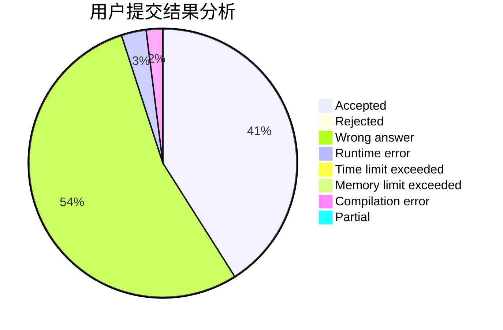
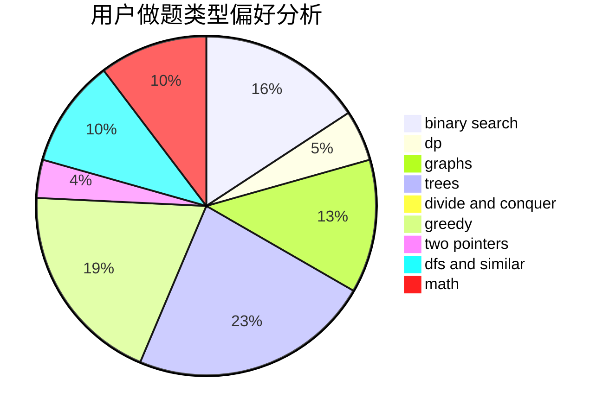

# flamingoo

<!-- tabs:start -->

#### **用户提交结果分析**

#### **用户做题类型偏好分析**

<!-- tabs:end -->
# 推荐题目
[284E](https://codeforces.com/contest/284/problem/E)
[12611](https://codeforces.com/contest/1261/problem/1)
[10021](https://codeforces.com/contest/1002/problem/1)
[1186D](https://codeforces.com/contest/1186/problem/D)
[343D](https://codeforces.com/contest/343/problem/D)
[1168B](https://codeforces.com/contest/1168/problem/B)
[1008B](https://codeforces.com/contest/1008/problem/B)
[571D](https://codeforces.com/contest/571/problem/D)
[1490C](https://codeforces.com/contest/1490/problem/C)
[1497B](https://codeforces.com/contest/1497/problem/B)
