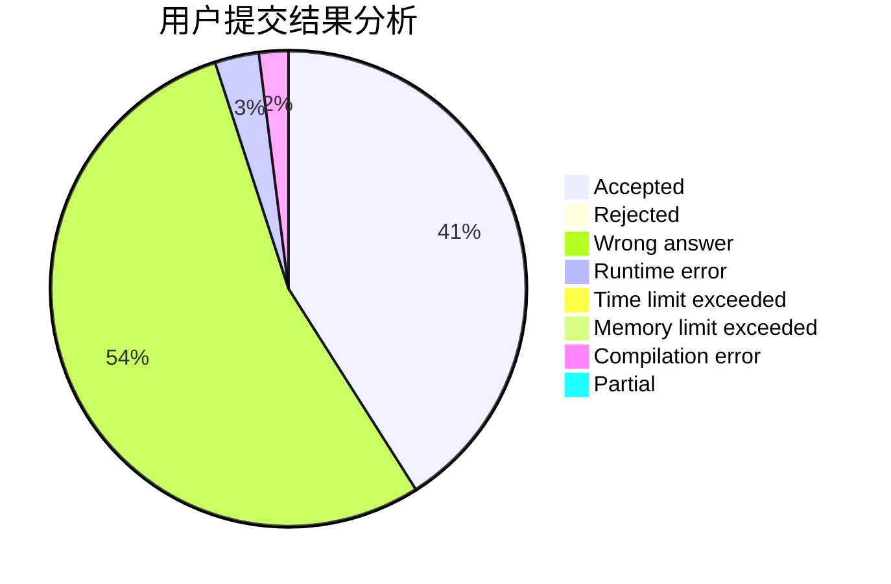
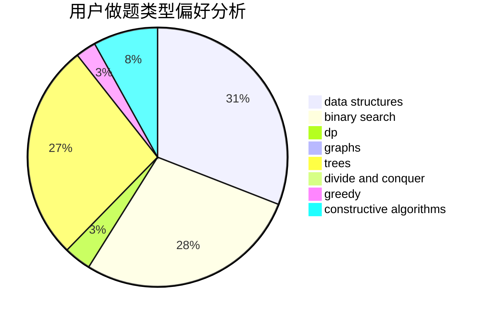
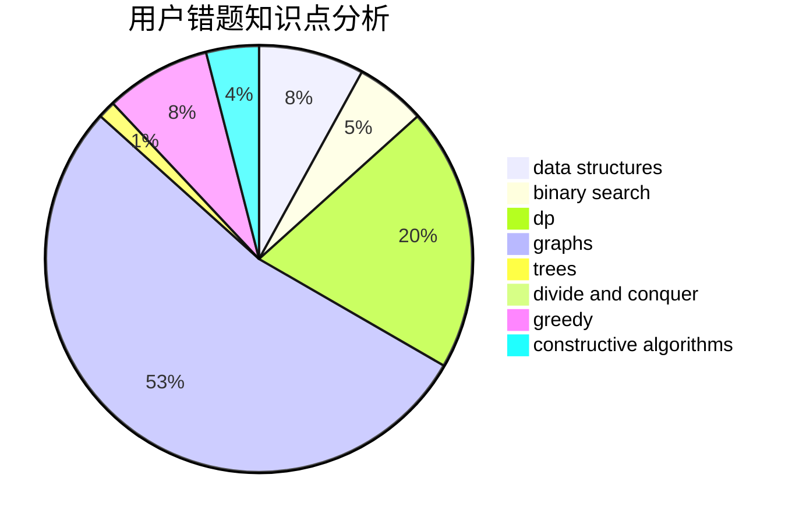

# flamingoo

<!-- tabs:start -->

#### **用户提交结果分析**

#### **用户做题类型偏好分析**

#### **用户错题知识点分析**

<!-- tabs:end -->
# 推荐题目
[269B](https://codeforces.com/contest/269/problem/B)		dp		  
[1253E](https://codeforces.com/contest/1253/problem/E)		data structures,
                        dp,
                        greedy,
                        sortings		  
[1002A1](https://codeforces.com/contest/1002A/problem/1)		nan		  
[1183F](https://codeforces.com/contest/1183/problem/F)		brute force,
                        math,
                        sortings		  
[316F2](https://codeforces.com/contest/316F/problem/2)		nan		  
[1165F1](https://codeforces.com/contest/1165F/problem/1)		binary search,
                        greedy		  
[1007D](https://codeforces.com/contest/1007/problem/D)		2-sat,
                        data structures,
                        trees		  
[547B](https://codeforces.com/contest/547/problem/B)		binary search,
                        data structures,
                        dp,
                        dsu		  
[1482E](https://codeforces.com/contest/1482/problem/E)		data structures,
                        divide and conquer,
                        dp		  
[1489D](https://codeforces.com/contest/1489/problem/D)		dsu,graphs,sortings,trees		  
