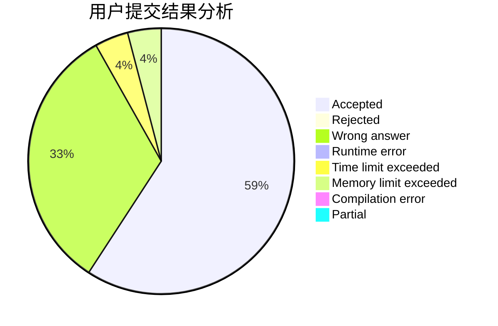
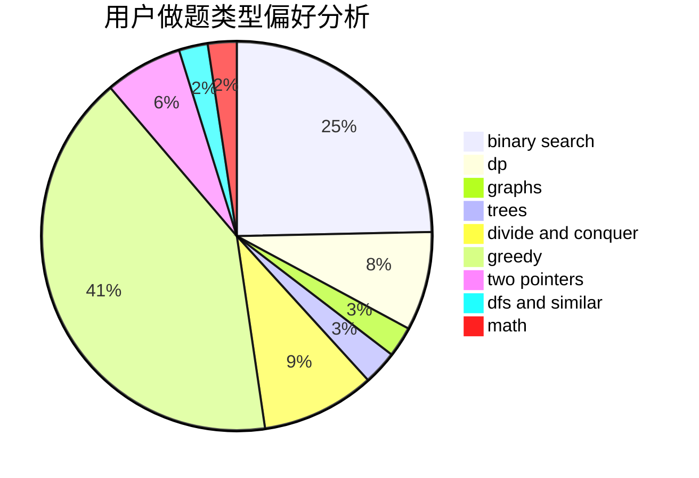

# flover_qq

<!-- tabs:start -->

#### **用户提交结果分析**

#### **用户做题类型偏好分析**

<!-- tabs:end -->
# 推荐题目
[602A](https://codeforces.com/contest/602/problem/A)
[258A](https://codeforces.com/contest/258/problem/A)
[1214C](https://codeforces.com/contest/1214/problem/C)
[232E](https://codeforces.com/contest/232/problem/E)
[851D](https://codeforces.com/contest/851/problem/D)
[698D](https://codeforces.com/contest/698/problem/D)
[1250L](https://codeforces.com/contest/1250/problem/L)
[1147E](https://codeforces.com/contest/1147/problem/E)
[696D](https://codeforces.com/contest/696/problem/D)
[1077A](https://codeforces.com/contest/1077/problem/A)
