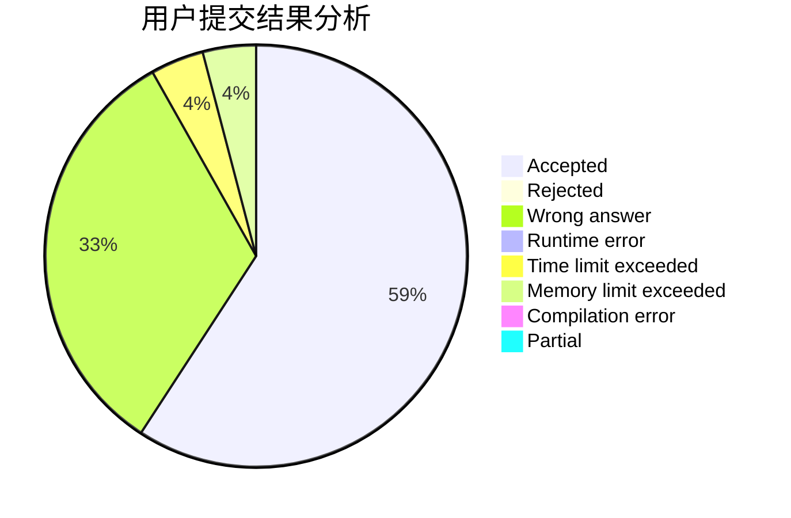
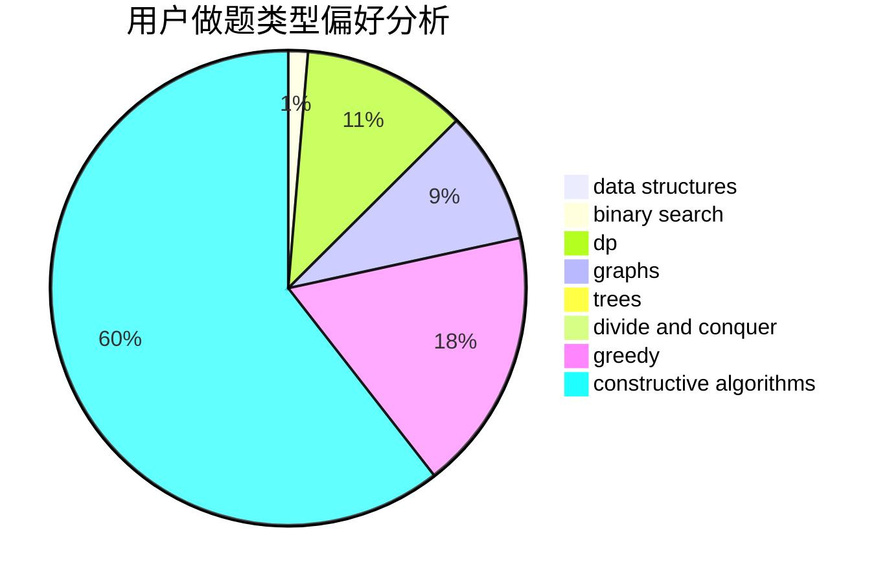
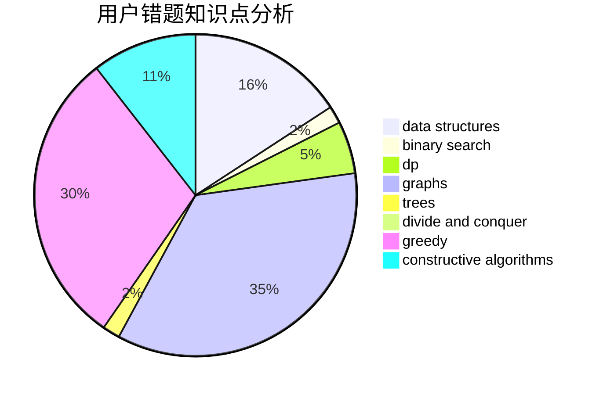

# flover_qq

<!-- tabs:start -->

#### **用户提交结果分析**

#### **用户做题类型偏好分析**

#### **用户错题知识点分析**

<!-- tabs:end -->
# 推荐题目
[581D](https://codeforces.com/contest/581/problem/D)		bitmasks,
                        brute force,
                        constructive algorithms,
                        geometry,
                        implementation,
                        math		  
[235B](https://codeforces.com/contest/235/problem/B)		dp,
                        math,
                        probabilities		  
[1208F](https://codeforces.com/contest/1208/problem/F)		bitmasks,
                        dfs and similar,
                        dp,
                        greedy		  
[213C](https://codeforces.com/contest/213/problem/C)		dp		  
[833D](https://codeforces.com/contest/833/problem/D)		data structures,
                        divide and conquer,
                        implementation,
                        trees		  
[672C](https://codeforces.com/contest/672/problem/C)		dsu,graphs,sortings,trees		  
[1246C](https://codeforces.com/contest/1246/problem/C)		dsu,graphs,sortings,trees		  
[1145D](https://codeforces.com/contest/1145/problem/D)		implementation		  
[670F](https://codeforces.com/contest/670/problem/F)		brute force,
                        constructive algorithms,
                        strings		  
[1076F](https://codeforces.com/contest/1076/problem/F)		dp,
                        greedy		  
