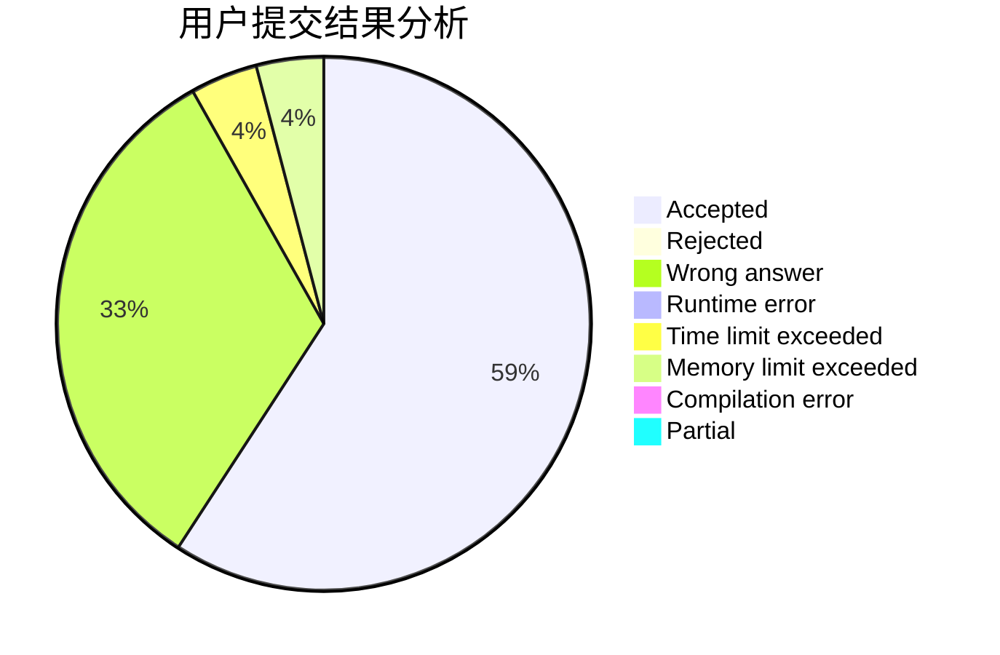
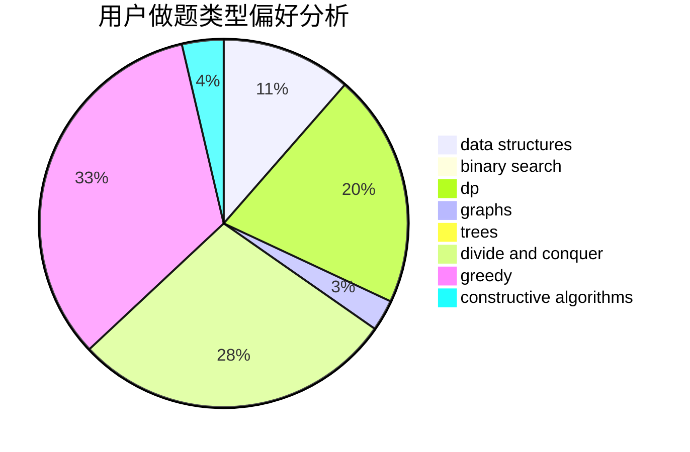
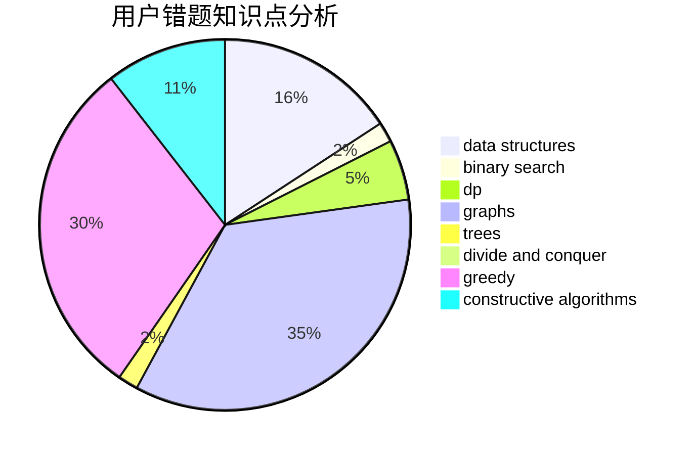

# flover_qq

<!-- tabs:start -->

#### **用户提交结果分析**

#### **用户做题类型偏好分析**

#### **用户错题知识点分析**

<!-- tabs:end -->
# 推荐题目
[602A](https://codeforces.com/contest/602/problem/A)		brute force,
                        implementation		  
[258A](https://codeforces.com/contest/258/problem/A)		greedy,
                        math		  
[1214C](https://codeforces.com/contest/1214/problem/C)		data structures,
                        greedy		  
[232E](https://codeforces.com/contest/232/problem/E)		bitmasks,
                        divide and conquer,
                        dp		  
[851D](https://codeforces.com/contest/851/problem/D)		dsu,graphs,sortings,trees		  
[698D](https://codeforces.com/contest/698/problem/D)		brute force,
                        geometry,
                        math		  
[1250L](https://codeforces.com/contest/1250/problem/L)		binary search,
                        greedy,
                        math		  
[1147E](https://codeforces.com/contest/1147/problem/E)		interactive		  
[696D](https://codeforces.com/contest/696/problem/D)		data structures,
                        dp,
                        matrices,
                        strings		  
[1077A](https://codeforces.com/contest/1077/problem/A)		math		  
