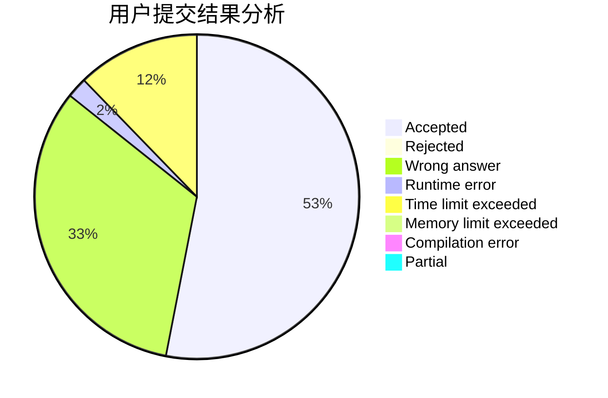
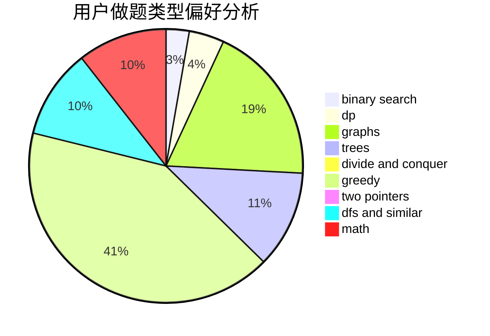

# flowerQ

<!-- tabs:start -->

#### **用户提交结果分析**

#### **用户做题类型偏好分析**

<!-- tabs:end -->
# 推荐题目
[579A](https://codeforces.com/contest/579/problem/A)
[61E](https://codeforces.com/contest/61/problem/E)
[11162](https://codeforces.com/contest/1116/problem/2)
[1396A](https://codeforces.com/contest/1396/problem/A)
[461D](https://codeforces.com/contest/461/problem/D)
[862E](https://codeforces.com/contest/862/problem/E)
[1001A](https://codeforces.com/contest/1001/problem/A)
[1005D](https://codeforces.com/contest/1005/problem/D)
[1252F](https://codeforces.com/contest/1252/problem/F)
[868A](https://codeforces.com/contest/868/problem/A)
