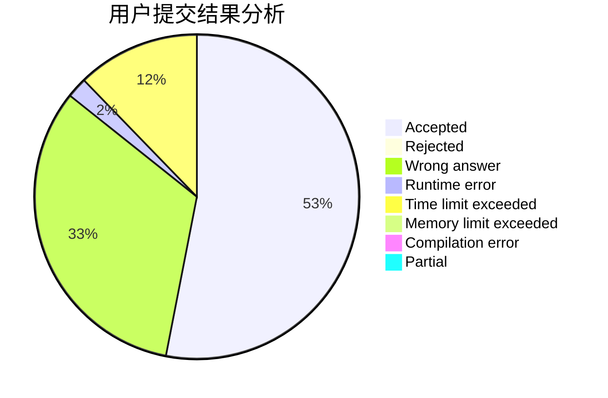
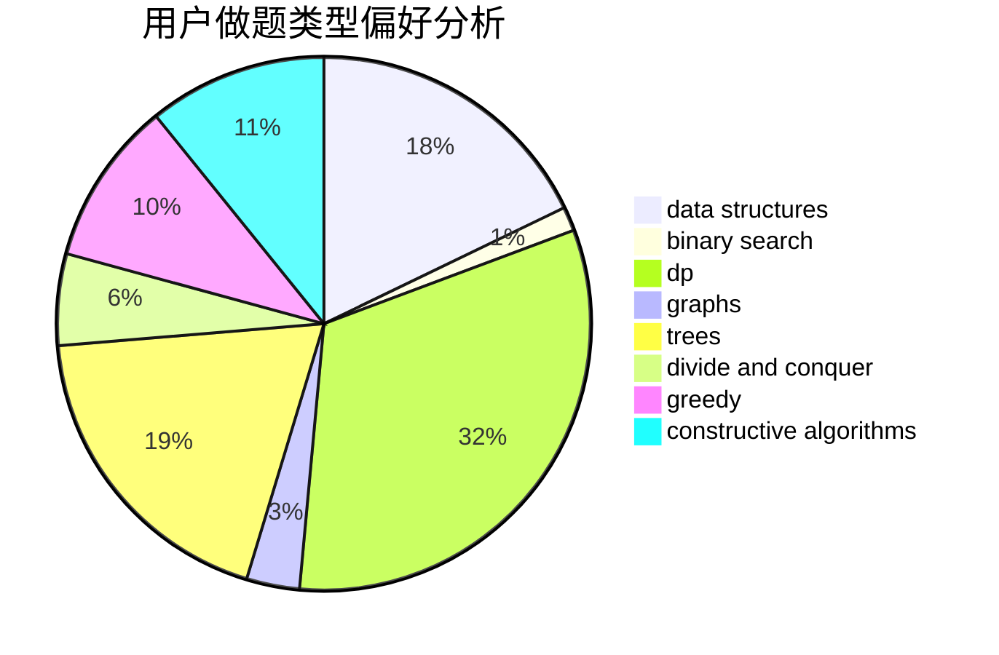
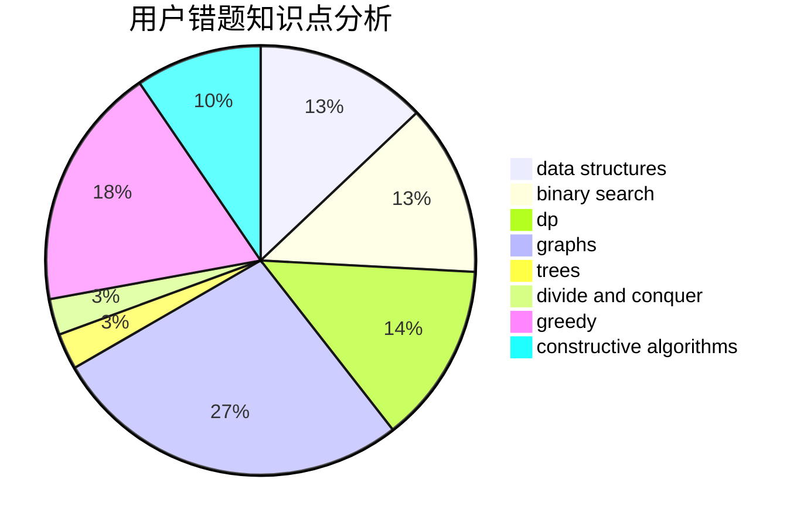

# flowerQ

<!-- tabs:start -->

#### **用户提交结果分析**

#### **用户做题类型偏好分析**

#### **用户错题知识点分析**

<!-- tabs:end -->
# 推荐题目
[553E](https://codeforces.com/contest/553/problem/E)		dp,
                        fft,
                        graphs,
                        math,
                        probabilities		  
[600D](https://codeforces.com/contest/600/problem/D)		geometry		  
[1115G2](https://codeforces.com/contest/1115G/problem/2)		*special problem		  
[1385G](https://codeforces.com/contest/1385/problem/G)		2-sat,
                        dfs and similar,
                        dsu,
                        graphs,
                        implementation		  
[43B](https://codeforces.com/contest/43/problem/B)		implementation,
                        strings		  
[843D](https://codeforces.com/contest/843/problem/D)		graphs,
                        shortest paths		  
[1001A](https://codeforces.com/contest/1001/problem/A)		*special problem		  
[1005C](https://codeforces.com/contest/1005/problem/C)		brute force,
                        greedy,
                        implementation		  
[1248D2](https://codeforces.com/contest/1248D/problem/2)		dsu,graphs,sortings,trees		  
[848D](https://codeforces.com/contest/848/problem/D)		combinatorics,
                        dp,
                        flows,
                        graphs		  
