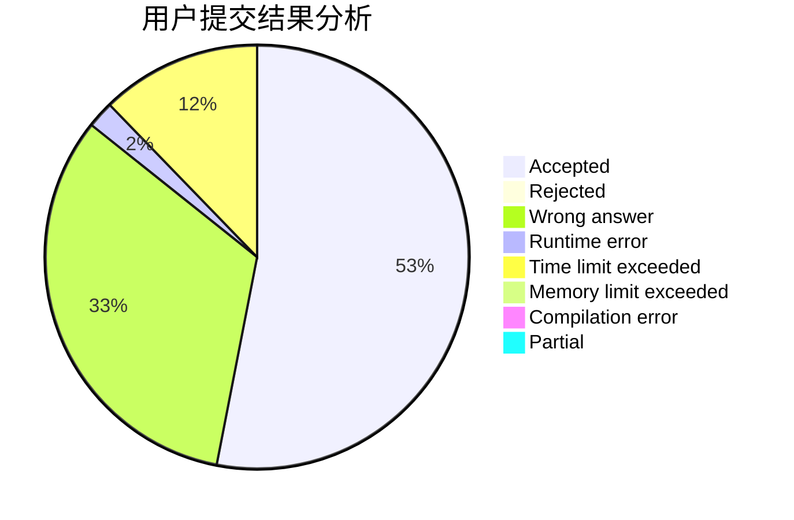
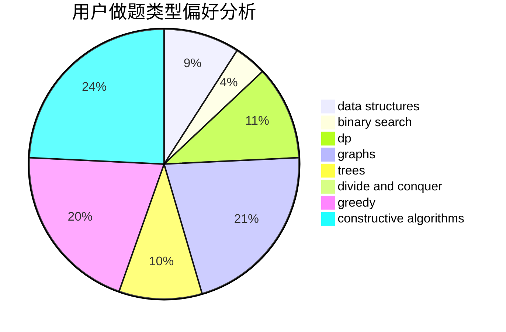
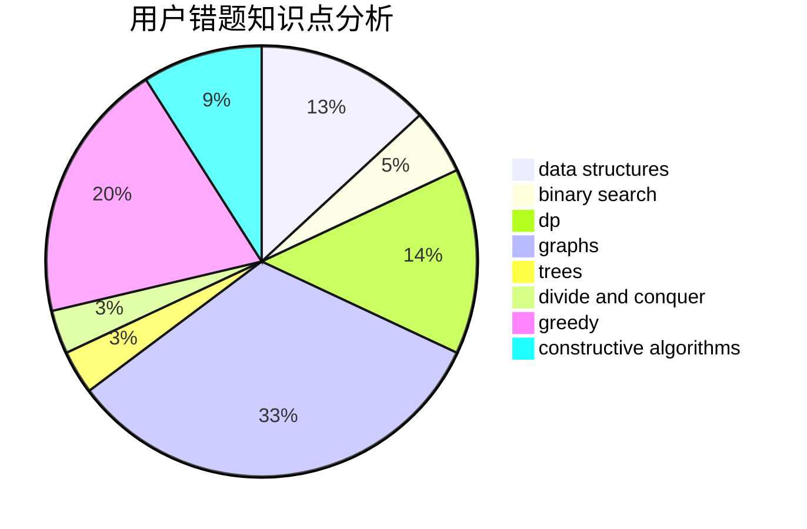

# flowerQ

<!-- tabs:start -->

#### **用户提交结果分析**

#### **用户做题类型偏好分析**

#### **用户错题知识点分析**

<!-- tabs:end -->
# 推荐题目
[579A](https://codeforces.com/contest/579/problem/A)		bitmasks		  
[61E](https://codeforces.com/contest/61/problem/E)		data structures,
                        trees		  
[11162](https://codeforces.com/contest/1116/problem/2)		dsu,graphs,sortings,trees		  
[1396A](https://codeforces.com/contest/1396/problem/A)		constructive algorithms,
                        greedy,
                        number theory		  
[461D](https://codeforces.com/contest/461/problem/D)		dsu,
                        math		  
[862E](https://codeforces.com/contest/862/problem/E)		binary search,
                        data structures,
                        sortings		  
[1001A](https://codeforces.com/contest/1001/problem/A)		*special problem		  
[1005D](https://codeforces.com/contest/1005/problem/D)		dp,
                        greedy,
                        number theory		  
[1252F](https://codeforces.com/contest/1252/problem/F)		hashing,
                        trees		  
[868A](https://codeforces.com/contest/868/problem/A)		brute force,
                        implementation,
                        strings		  
