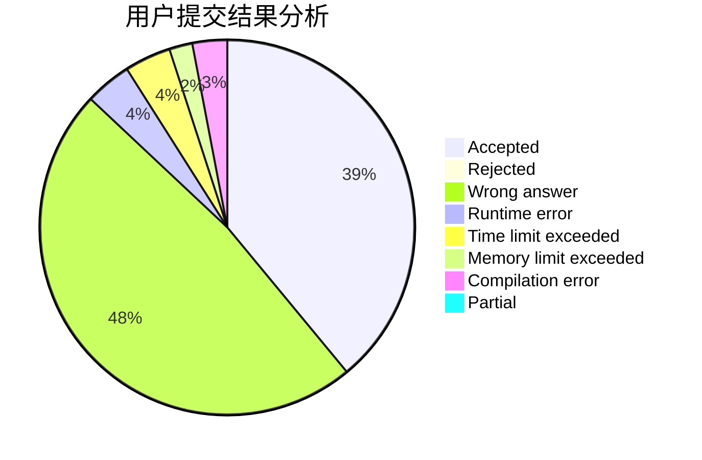
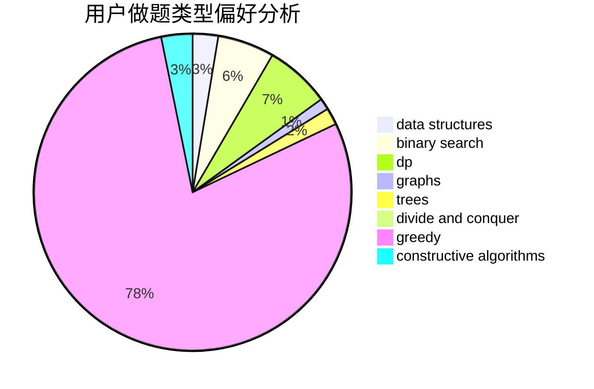
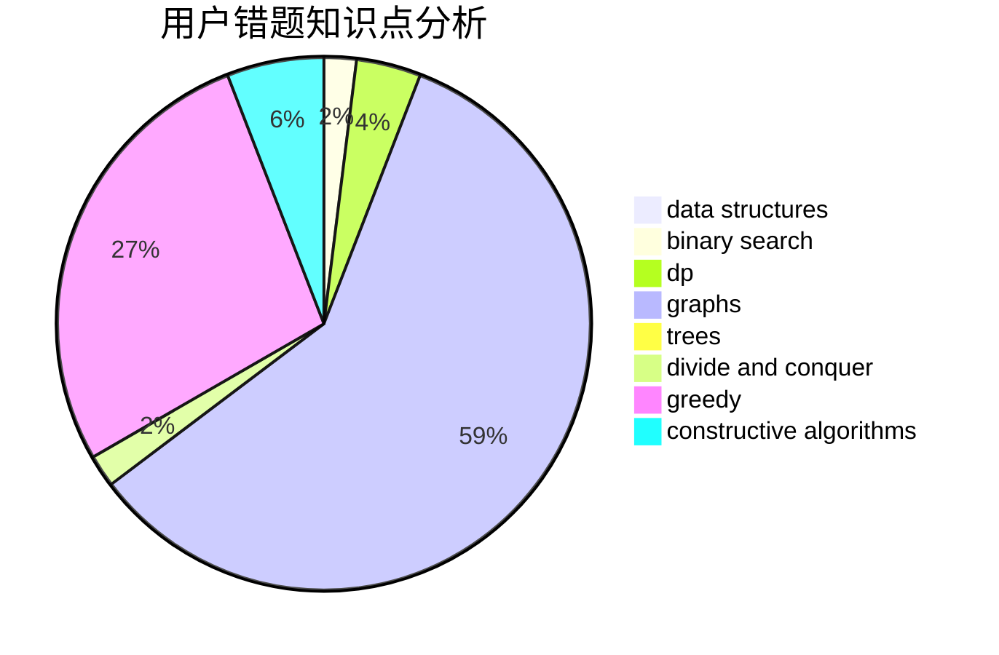

# flpt0x

<!-- tabs:start -->

#### **用户提交结果分析**

#### **用户做题类型偏好分析**

#### **用户错题知识点分析**

<!-- tabs:end -->
# 推荐题目
[1511E](https://codeforces.com/contest/1511/problem/E)		combinatorics,
                        dp,
                        greedy,
                        math		  
[1090M](https://codeforces.com/contest/1090/problem/M)		implementation		  
[804B](https://codeforces.com/contest/804/problem/B)		combinatorics,
                        greedy,
                        implementation,
                        math		  
[1090D](https://codeforces.com/contest/1090/problem/D)		constructive algorithms		  
[10922](https://codeforces.com/contest/1092/problem/2)		dsu,graphs,sortings,trees		  
[952F](https://codeforces.com/contest/952/problem/F)		nan		  
[566A](https://codeforces.com/contest/566/problem/A)		dfs and similar,
                        strings,
                        trees		  
[1032D](https://codeforces.com/contest/1032/problem/D)		geometry,
                        implementation		  
[758D](https://codeforces.com/contest/758/problem/D)		constructive algorithms,
                        dp,
                        greedy,
                        math,
                        strings		  
[289E](https://codeforces.com/contest/289/problem/E)		dsu,graphs,sortings,trees		  
