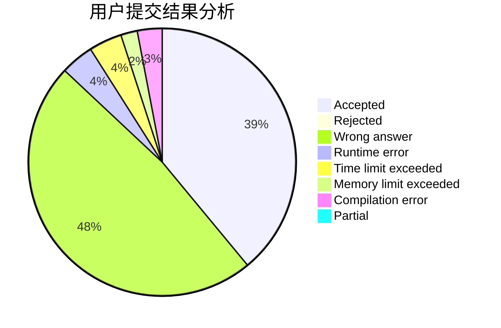
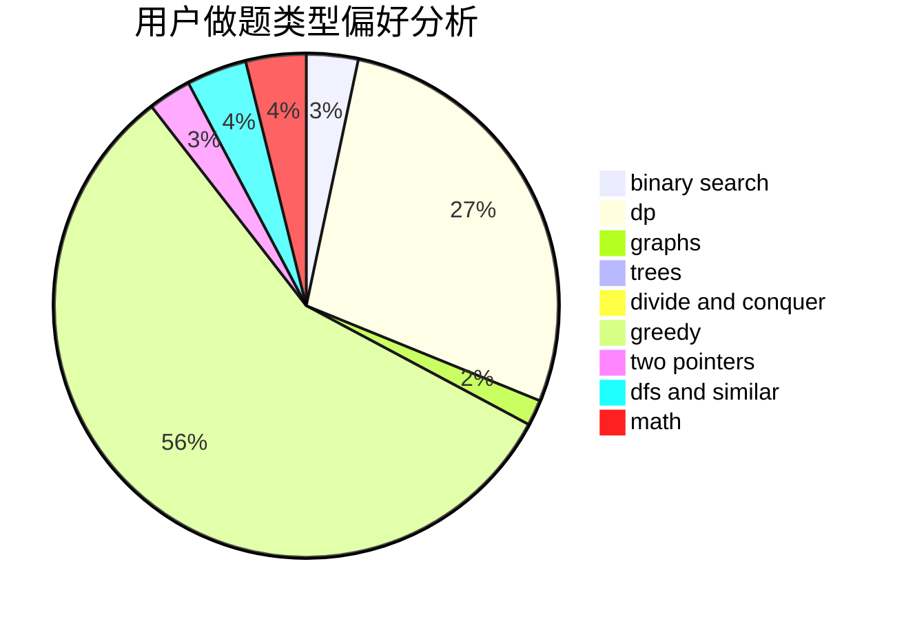

# flpt0x

<!-- tabs:start -->

#### **用户提交结果分析**

#### **用户做题类型偏好分析**

<!-- tabs:end -->
# 推荐题目
[1511E](https://codeforces.com/contest/1511/problem/E)
[1090M](https://codeforces.com/contest/1090/problem/M)
[804B](https://codeforces.com/contest/804/problem/B)
[1090D](https://codeforces.com/contest/1090/problem/D)
[10922](https://codeforces.com/contest/1092/problem/2)
[952F](https://codeforces.com/contest/952/problem/F)
[566A](https://codeforces.com/contest/566/problem/A)
[1032D](https://codeforces.com/contest/1032/problem/D)
[758D](https://codeforces.com/contest/758/problem/D)
[289E](https://codeforces.com/contest/289/problem/E)
