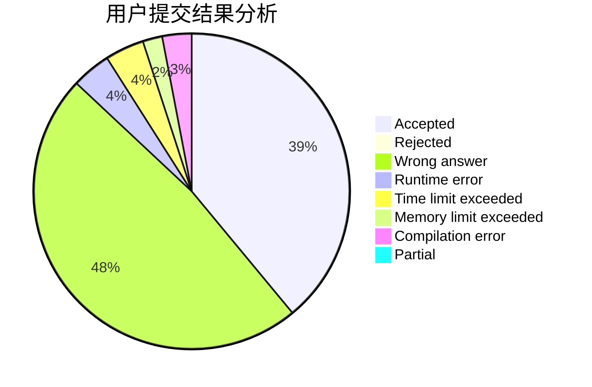
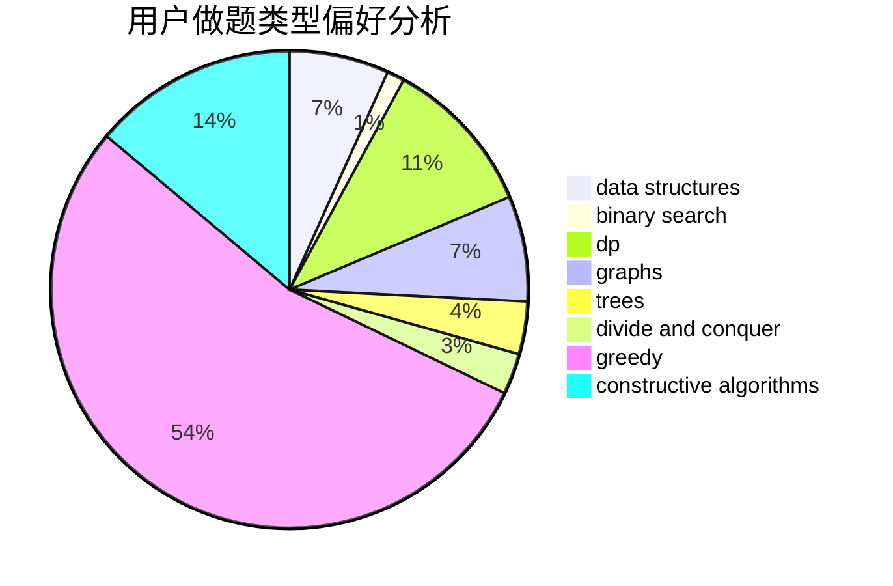
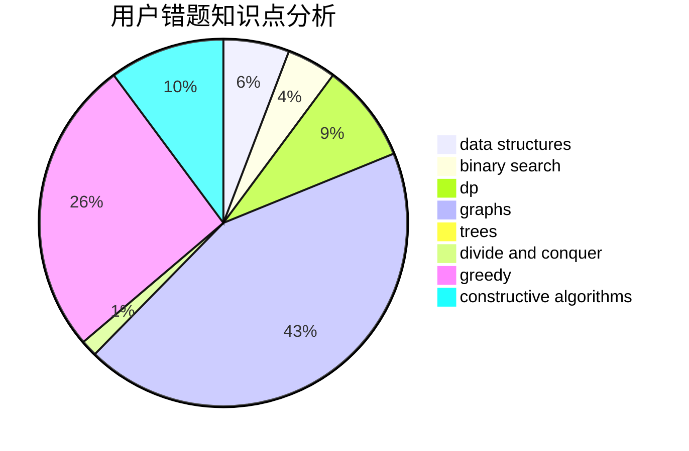

# flpt0x

<!-- tabs:start -->

#### **用户提交结果分析**

#### **用户做题类型偏好分析**

#### **用户错题知识点分析**

<!-- tabs:end -->
# 推荐题目
[1501D](https://codeforces.com/contest/1501/problem/D)		dsu,graphs,sortings,trees		  
[1090B](https://codeforces.com/contest/1090/problem/B)		nan		  
[788E](https://codeforces.com/contest/788/problem/E)		data structures		  
[108C](https://codeforces.com/contest/108/problem/C)		dsu,graphs,sortings,trees		  
[1091G](https://codeforces.com/contest/1091/problem/G)		interactive,
                        math,
                        number theory		  
[932A](https://codeforces.com/contest/932/problem/A)		constructive algorithms		  
[540A](https://codeforces.com/contest/540/problem/A)		implementation		  
[1031B](https://codeforces.com/contest/1031/problem/B)		nan		  
[736E](https://codeforces.com/contest/736/problem/E)		constructive algorithms,
                        flows,
                        greedy,
                        math		  
[274A](https://codeforces.com/contest/274/problem/A)		binary search,
                        greedy,
                        sortings		  
