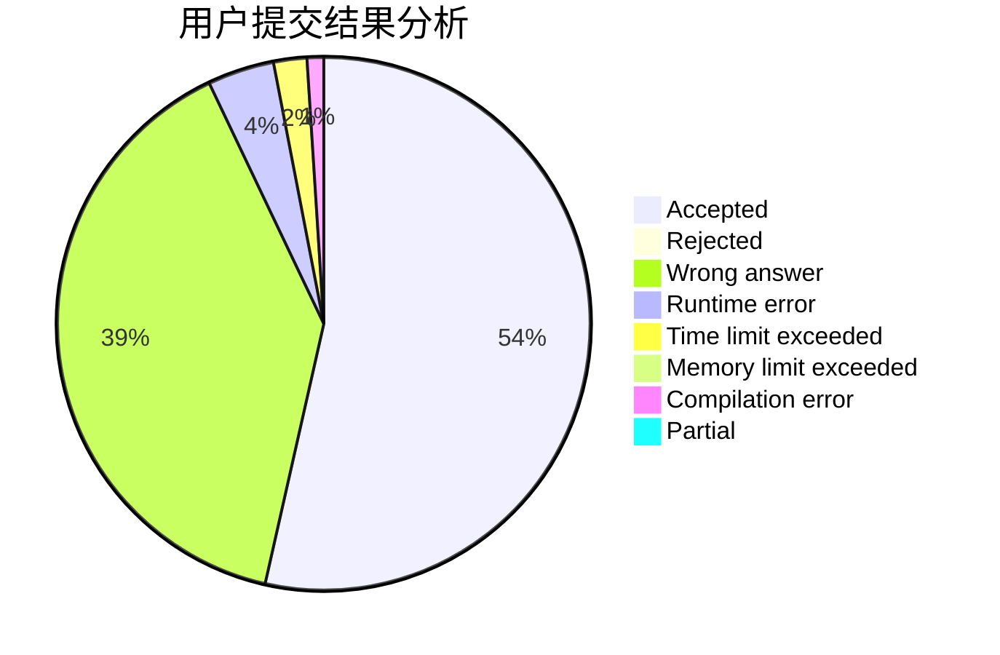
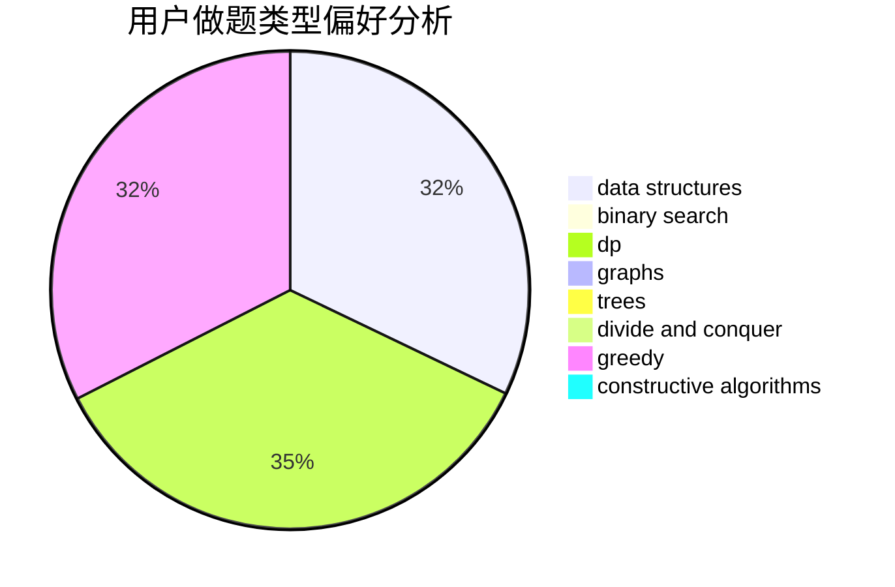
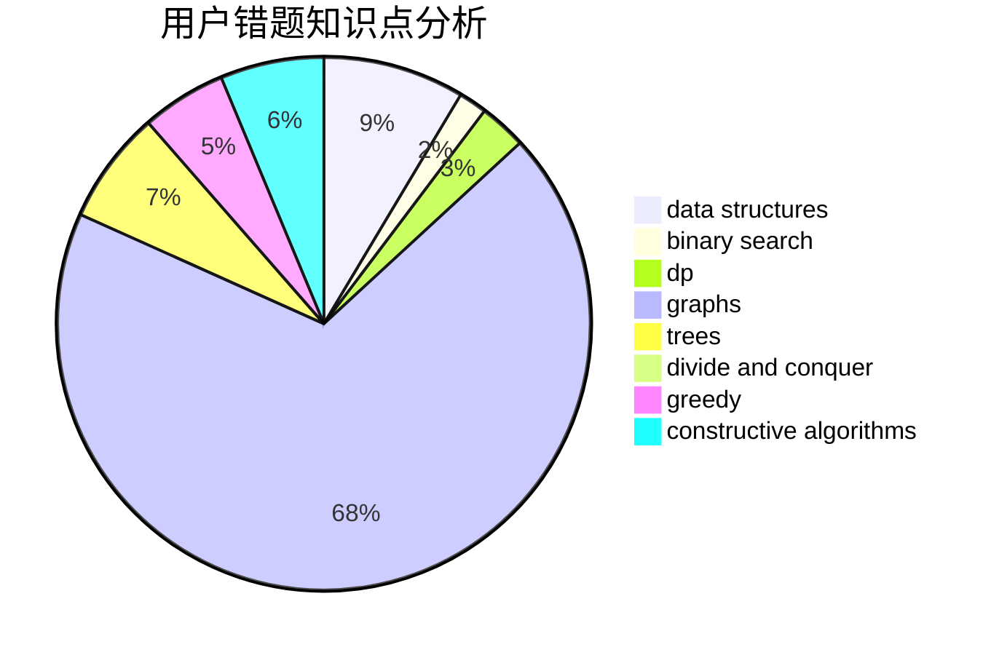

# fls233666

<!-- tabs:start -->

#### **用户提交结果分析**

#### **用户做题类型偏好分析**

#### **用户错题知识点分析**

<!-- tabs:end -->
# 推荐题目
[198B](https://codeforces.com/contest/198/problem/B)		shortest paths		  
[314C](https://codeforces.com/contest/314/problem/C)		data structures,
                        dp		  
[546D](https://codeforces.com/contest/546/problem/D)		constructive algorithms,
                        dp,
                        math,
                        number theory		  
[591A](https://codeforces.com/contest/591/problem/A)		implementation,
                        math		  
[567D](https://codeforces.com/contest/567/problem/D)		binary search,
                        data structures,
                        greedy,
                        sortings		  
[120H](https://codeforces.com/contest/120/problem/H)		graph matchings		  
[1353F](https://codeforces.com/contest/1353/problem/F)		brute force,
                        dp		  
[1091G](https://codeforces.com/contest/1091/problem/G)		interactive,
                        math,
                        number theory		  
[1055B](https://codeforces.com/contest/1055/problem/B)		dsu,
                        implementation		  
[189B](https://codeforces.com/contest/189/problem/B)		brute force,
                        math		  
