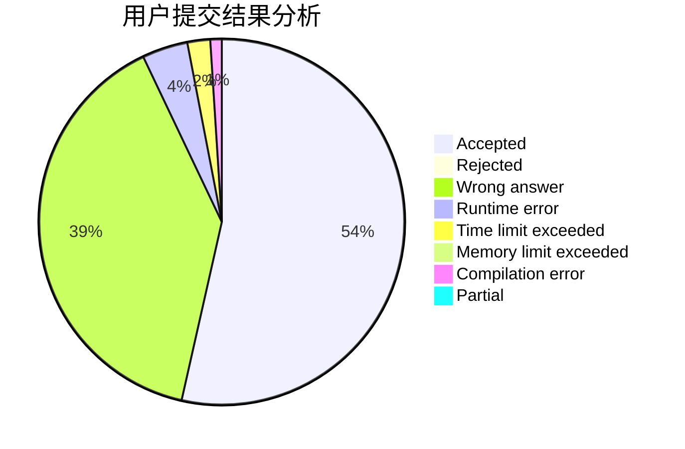
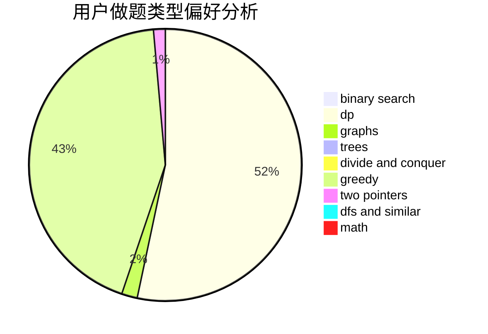

# fls233666

<!-- tabs:start -->

#### **用户提交结果分析**

#### **用户做题类型偏好分析**

<!-- tabs:end -->
# 推荐题目
[198B](https://codeforces.com/contest/198/problem/B)
[314C](https://codeforces.com/contest/314/problem/C)
[546D](https://codeforces.com/contest/546/problem/D)
[591A](https://codeforces.com/contest/591/problem/A)
[567D](https://codeforces.com/contest/567/problem/D)
[120H](https://codeforces.com/contest/120/problem/H)
[1353F](https://codeforces.com/contest/1353/problem/F)
[1091G](https://codeforces.com/contest/1091/problem/G)
[1055B](https://codeforces.com/contest/1055/problem/B)
[189B](https://codeforces.com/contest/189/problem/B)
