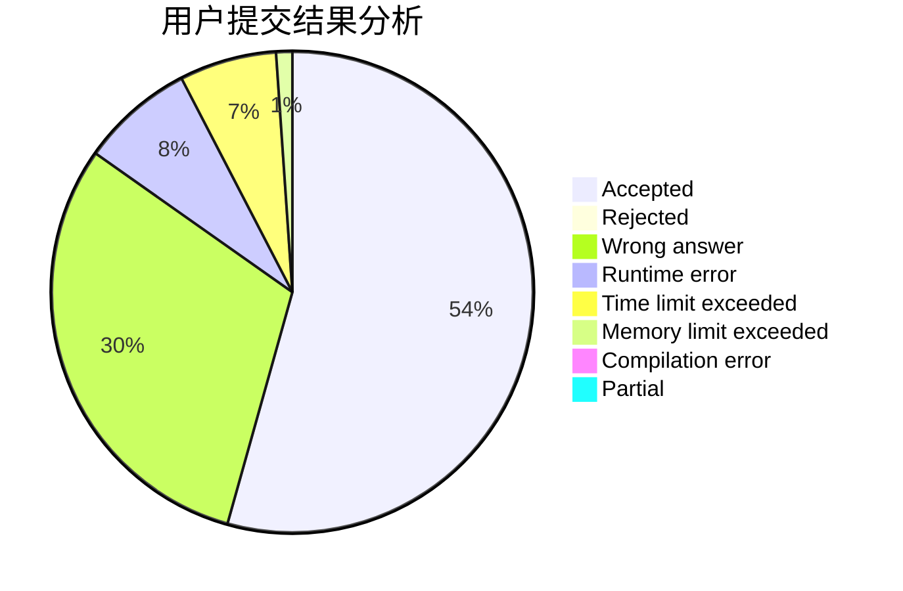
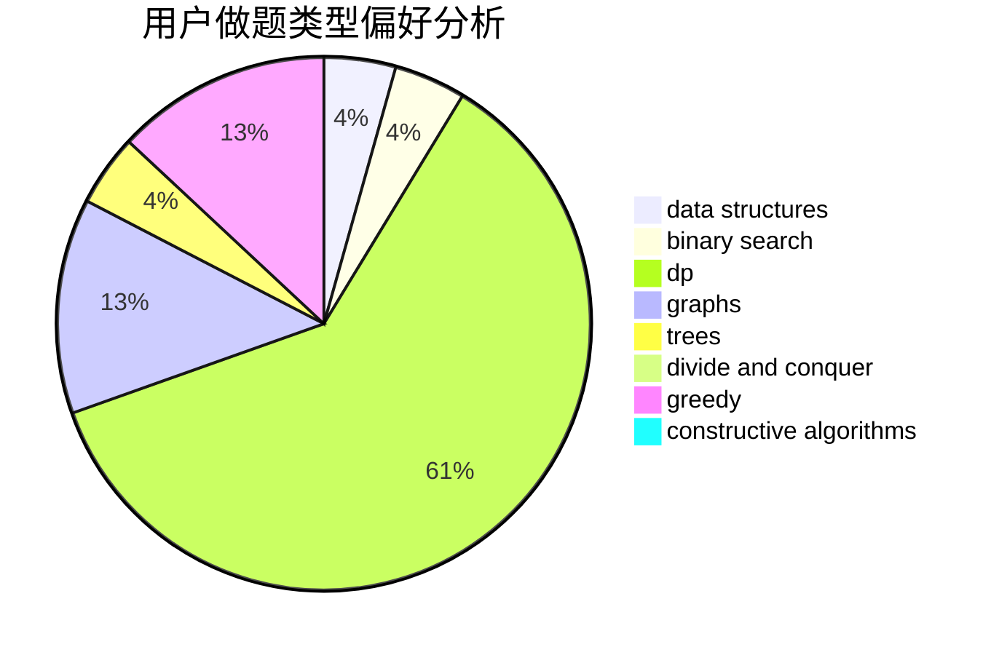

# flyFeather

<!-- tabs:start -->

#### **用户提交结果分析**

#### **用户做题类型偏好分析**

#### **用户错题知识点分析**

<!-- tabs:end -->
# 推荐题目
[1364D](https://codeforces.com/contest/1364/problem/D)		constructive algorithms,
                        dfs and similar,
                        graphs,
                        greedy,
                        implementation,
                        trees		  
[13573](https://codeforces.com/contest/1357/problem/3)		dsu,graphs,sortings,trees		  
[431D](https://codeforces.com/contest/431/problem/D)		binary search,
                        bitmasks,
                        combinatorics,
                        dp,
                        math		  
[268A](https://codeforces.com/contest/268/problem/A)		brute force		  
[67B](https://codeforces.com/contest/67/problem/B)		greedy		  
[354E](https://codeforces.com/contest/354/problem/E)		constructive algorithms,
                        dfs and similar,
                        dp		  
[1457B](https://codeforces.com/contest/1457/problem/B)		dsu,graphs,sortings,trees		  
[1398A](https://codeforces.com/contest/1398/problem/A)		geometry,
                        math		  
[1490C](https://codeforces.com/contest/1490/problem/C)		binary search,
                        brute force,
                        brute force,
                        math		  
[1497B](https://codeforces.com/contest/1497/problem/B)		constructive algorithms,
                        greedy,
                        math		  
