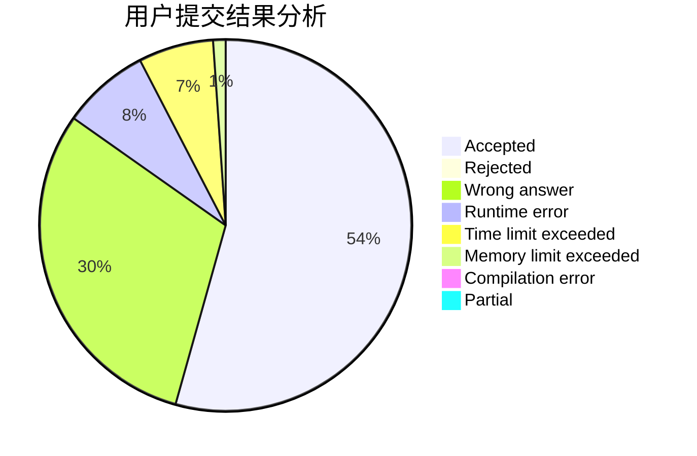
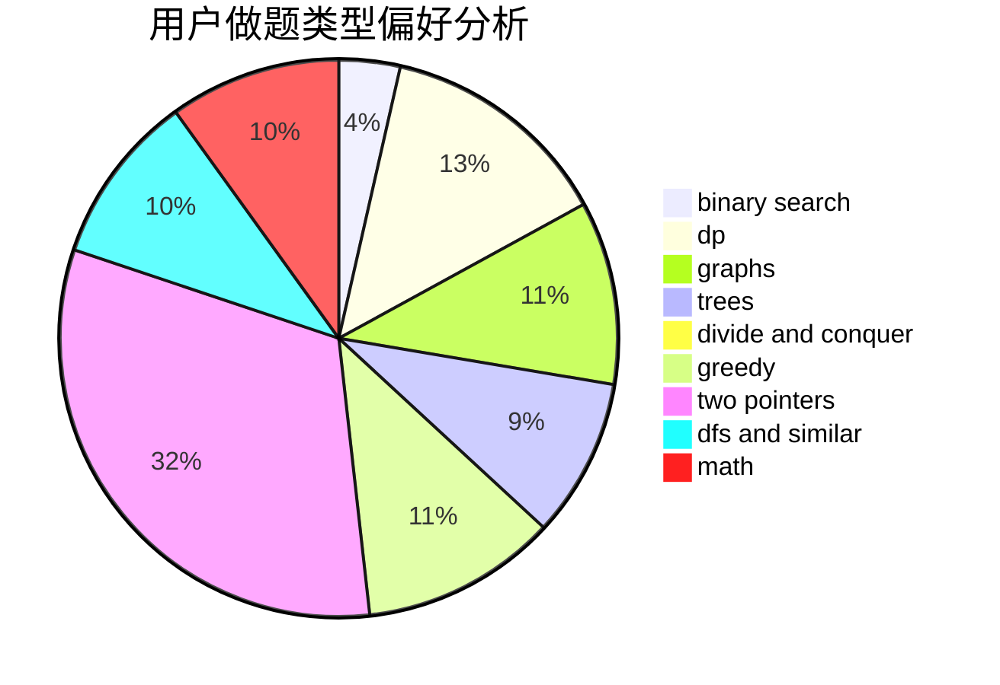

# flyFeather

<!-- tabs:start -->

#### **用户提交结果分析**

#### **用户做题类型偏好分析**

<!-- tabs:end -->
# 推荐题目
[1364D](https://codeforces.com/contest/1364/problem/D)
[13573](https://codeforces.com/contest/1357/problem/3)
[431D](https://codeforces.com/contest/431/problem/D)
[268A](https://codeforces.com/contest/268/problem/A)
[67B](https://codeforces.com/contest/67/problem/B)
[354E](https://codeforces.com/contest/354/problem/E)
[1457B](https://codeforces.com/contest/1457/problem/B)
[1398A](https://codeforces.com/contest/1398/problem/A)
[1490C](https://codeforces.com/contest/1490/problem/C)
[1497B](https://codeforces.com/contest/1497/problem/B)
