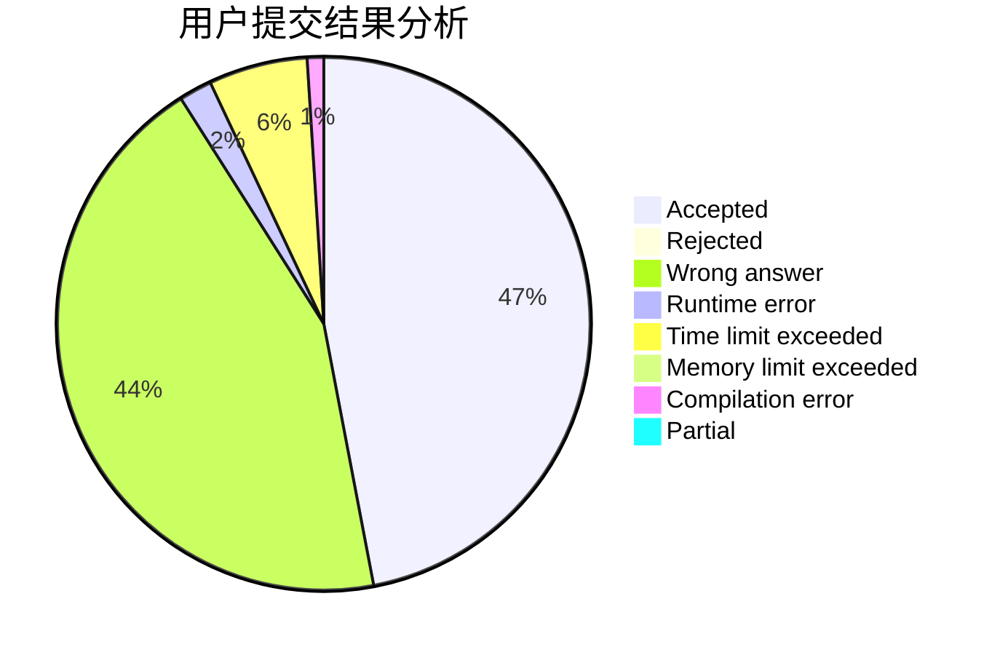
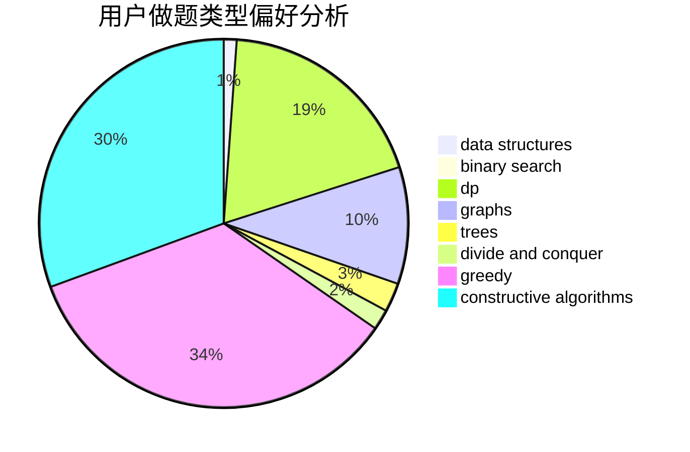
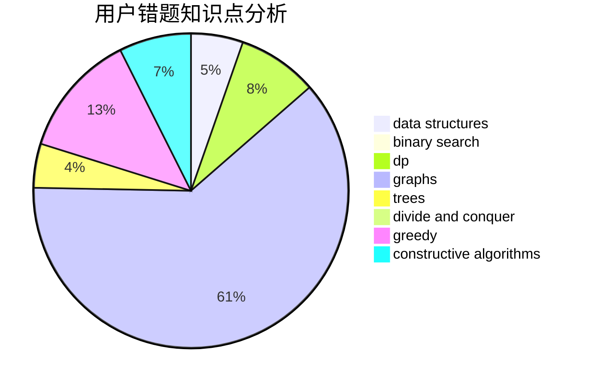

# flyasdfvcxz

<!-- tabs:start -->

#### **用户提交结果分析**

#### **用户做题类型偏好分析**

#### **用户错题知识点分析**

<!-- tabs:end -->
# 推荐题目
[1496C](https://codeforces.com/contest/1496/problem/C)		dsu,graphs,sortings,trees		  
[1166B](https://codeforces.com/contest/1166/problem/B)		constructive algorithms,
                        math,
                        number theory		  
[895C](https://codeforces.com/contest/895/problem/C)		bitmasks,
                        combinatorics,
                        dp,
                        math		  
[113B](https://codeforces.com/contest/113/problem/B)		brute force,
                        data structures,
                        hashing,
                        strings		  
[947E](https://codeforces.com/contest/947/problem/E)		dsu,graphs,sortings,trees		  
[907B](https://codeforces.com/contest/907/problem/B)		implementation		  
[733A](https://codeforces.com/contest/733/problem/A)		implementation		  
[1190B](https://codeforces.com/contest/1190/problem/B)		games		  
[1156B](https://codeforces.com/contest/1156/problem/B)		dfs and similar,
                        greedy,
                        implementation,
                        sortings,
                        strings		  
[1165C](https://codeforces.com/contest/1165/problem/C)		greedy		  
