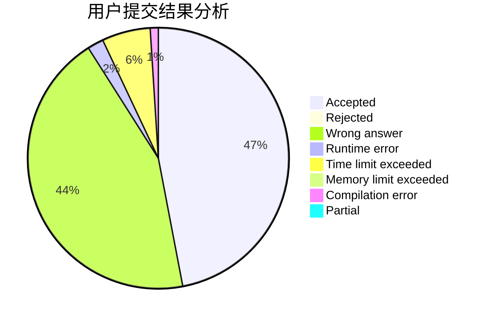
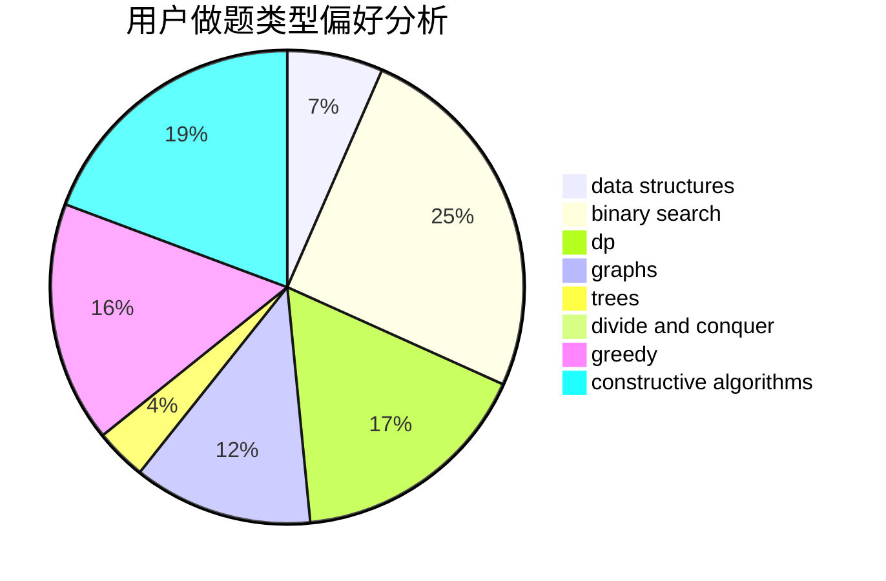
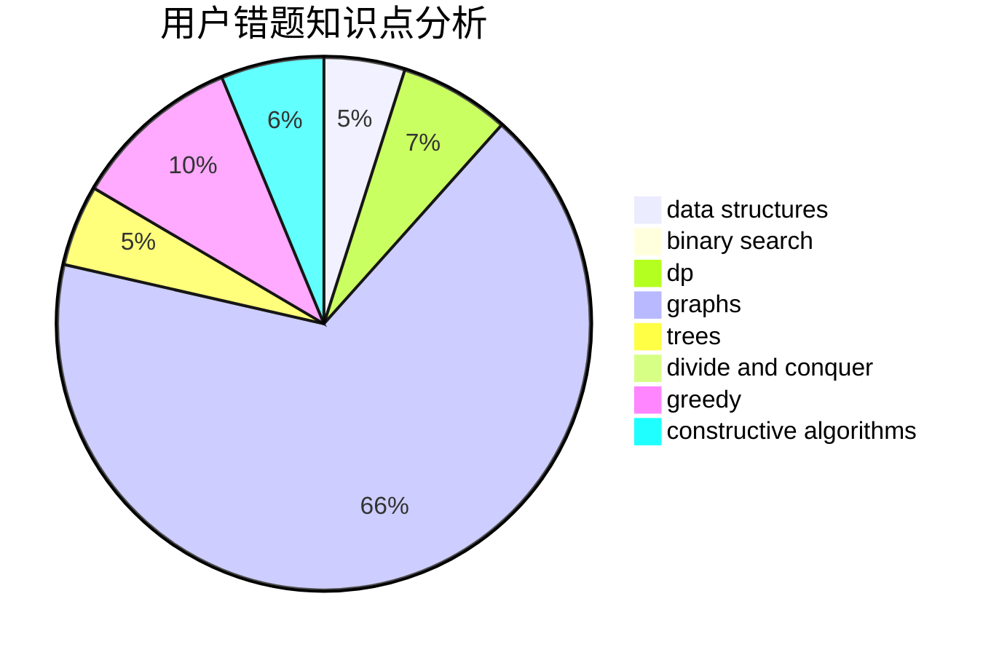

# flyasdfvcxz

<!-- tabs:start -->

#### **用户提交结果分析**

#### **用户做题类型偏好分析**

#### **用户错题知识点分析**

<!-- tabs:end -->
# 推荐题目
[1505C](https://codeforces.com/contest/1505/problem/C)		implementation		  
[1169A](https://codeforces.com/contest/1169/problem/A)		implementation,
                        math		  
[913A](https://codeforces.com/contest/913/problem/A)		implementation,
                        math		  
[1141B](https://codeforces.com/contest/1141/problem/B)		implementation		  
[965A](https://codeforces.com/contest/965/problem/A)		math		  
[920F](https://codeforces.com/contest/920/problem/F)		brute force,
                        data structures,
                        dsu,
                        number theory		  
[750F](https://codeforces.com/contest/750/problem/F)		constructive algorithms,
                        implementation,
                        interactive,
                        trees		  
[11962](https://codeforces.com/contest/1196/problem/2)		dsu,graphs,sortings,trees		  
[1157G](https://codeforces.com/contest/1157/problem/G)		brute force,
                        constructive algorithms		  
[1167E](https://codeforces.com/contest/1167/problem/E)		binary search,
                        combinatorics,
                        data structures,
                        two pointers		  
