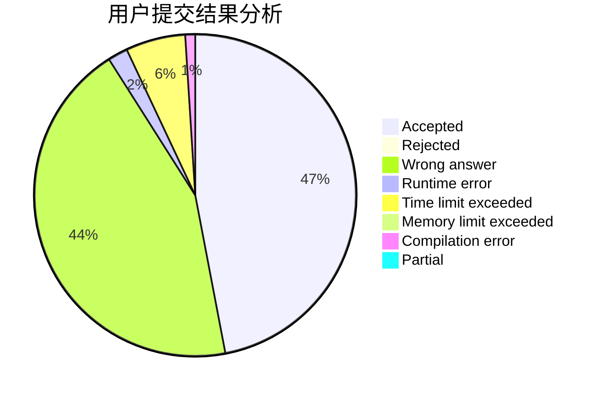
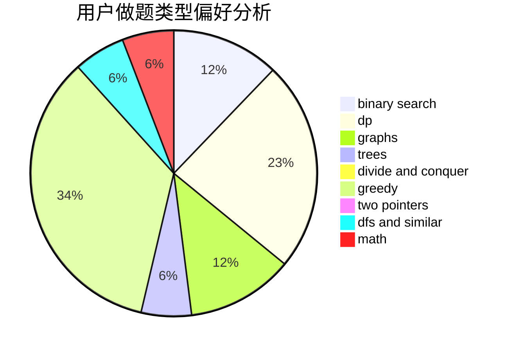

# flyasdfvcxz

<!-- tabs:start -->

#### **用户提交结果分析**

#### **用户做题类型偏好分析**

<!-- tabs:end -->
# 推荐题目
[1505C](https://codeforces.com/contest/1505/problem/C)
[1169A](https://codeforces.com/contest/1169/problem/A)
[913A](https://codeforces.com/contest/913/problem/A)
[1141B](https://codeforces.com/contest/1141/problem/B)
[965A](https://codeforces.com/contest/965/problem/A)
[920F](https://codeforces.com/contest/920/problem/F)
[750F](https://codeforces.com/contest/750/problem/F)
[11962](https://codeforces.com/contest/1196/problem/2)
[1157G](https://codeforces.com/contest/1157/problem/G)
[1167E](https://codeforces.com/contest/1167/problem/E)
