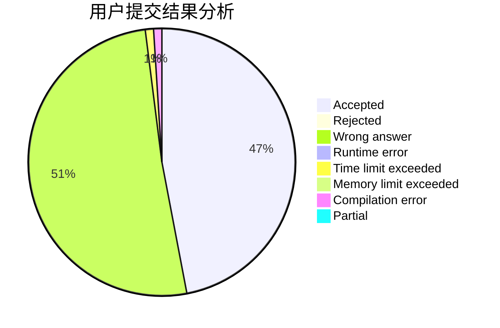
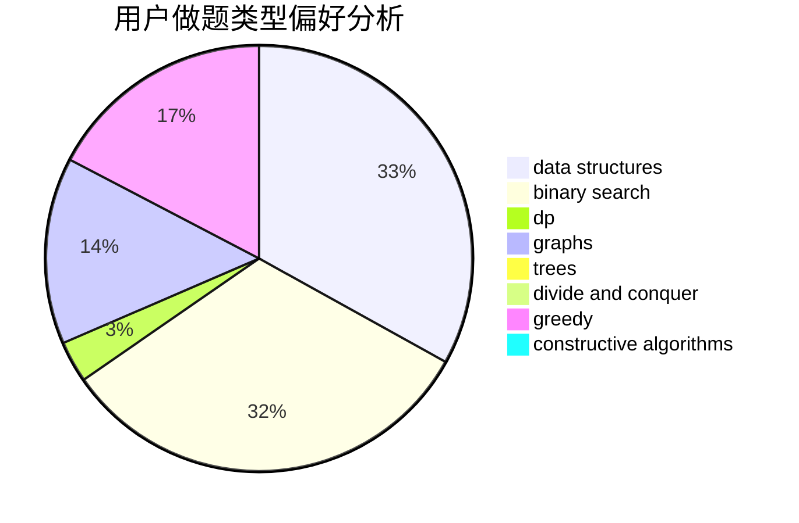
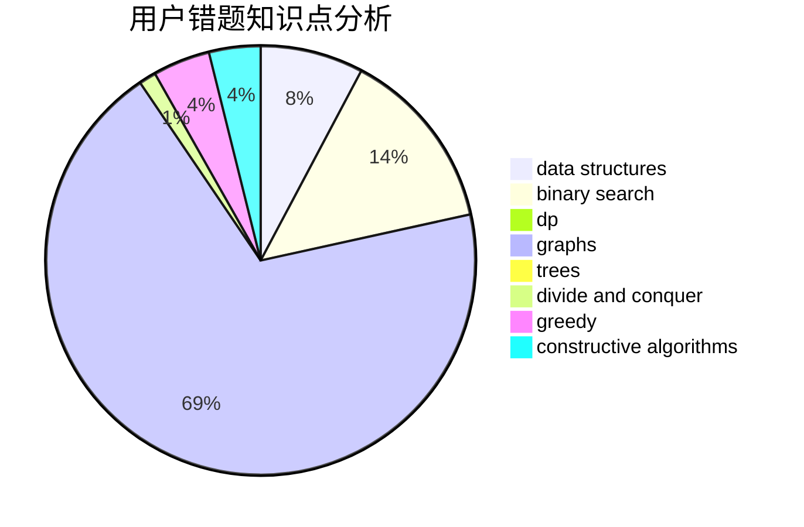

# fmj_123

<!-- tabs:start -->

#### **用户提交结果分析**

#### **用户做题类型偏好分析**

#### **用户错题知识点分析**

<!-- tabs:end -->
# 推荐题目
[475B](https://codeforces.com/contest/475/problem/B)		brute force,
                        dfs and similar,
                        graphs,
                        implementation		  
[873D](https://codeforces.com/contest/873/problem/D)		constructive algorithms,
                        divide and conquer		  
[598B](https://codeforces.com/contest/598/problem/B)		implementation,
                        strings		  
[524E](https://codeforces.com/contest/524/problem/E)		data structures,
                        sortings		  
[464C](https://codeforces.com/contest/464/problem/C)		dp		  
[575A](https://codeforces.com/contest/575/problem/A)		data structures,
                        math,
                        matrices		  
[1250B](https://codeforces.com/contest/1250/problem/B)		brute force,
                        constructive algorithms,
                        greedy,
                        math		  
[1250L](https://codeforces.com/contest/1250/problem/L)		binary search,
                        greedy,
                        math		  
[1281F](https://codeforces.com/contest/1281/problem/F)		dsu,graphs,sortings,trees		  
[799B](https://codeforces.com/contest/799/problem/B)		data structures,
                        implementation		  
