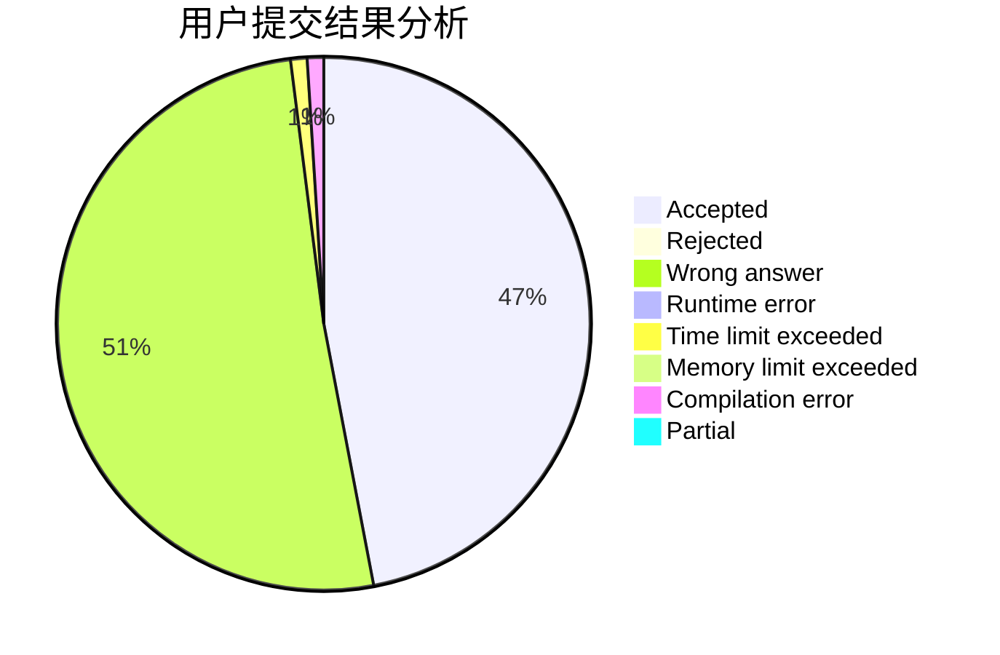
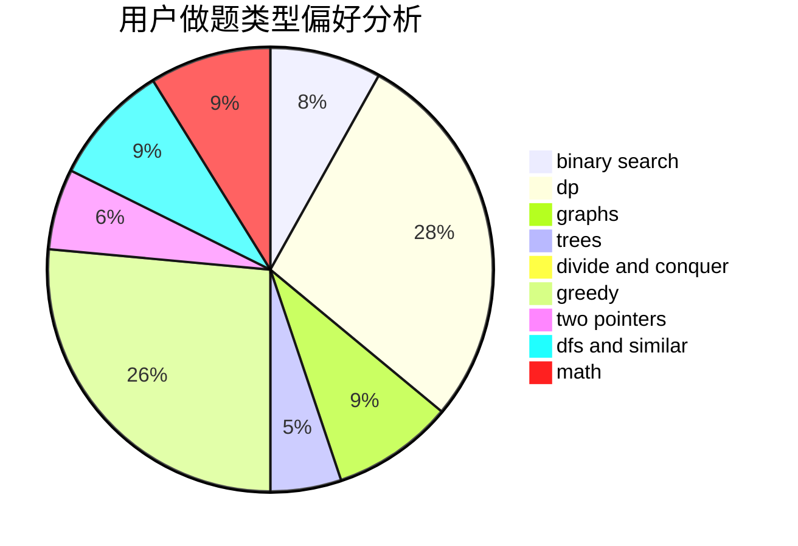

# fmj_123

<!-- tabs:start -->

#### **用户提交结果分析**

#### **用户做题类型偏好分析**

<!-- tabs:end -->
# 推荐题目
[494B](https://codeforces.com/contest/494/problem/B)
[894C](https://codeforces.com/contest/894/problem/C)
[616A](https://codeforces.com/contest/616/problem/A)
[549B](https://codeforces.com/contest/549/problem/B)
[484B](https://codeforces.com/contest/484/problem/B)
[596A](https://codeforces.com/contest/596/problem/A)
[12542](https://codeforces.com/contest/1254/problem/2)
[1255C](https://codeforces.com/contest/1255/problem/C)
[1288B](https://codeforces.com/contest/1288/problem/B)
[813C](https://codeforces.com/contest/813/problem/C)
