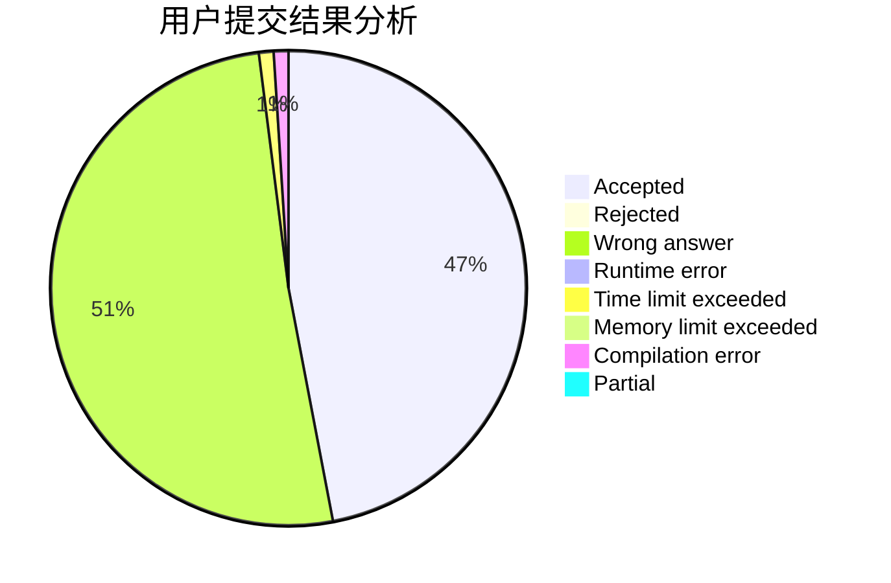
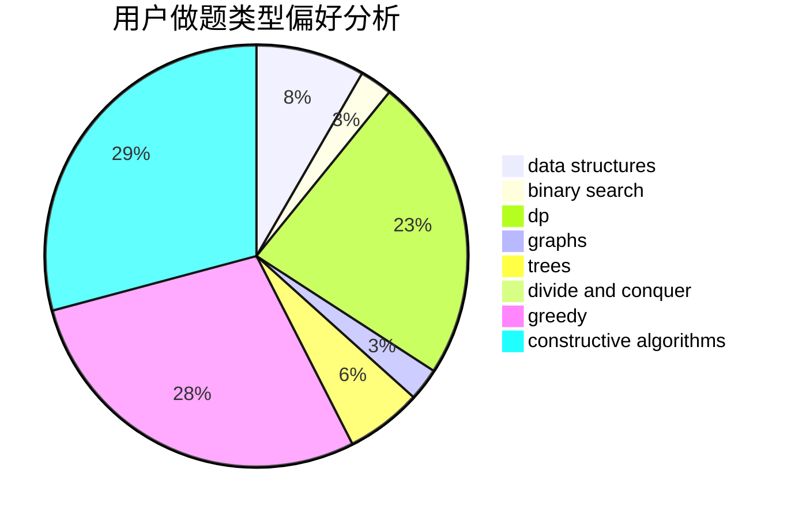
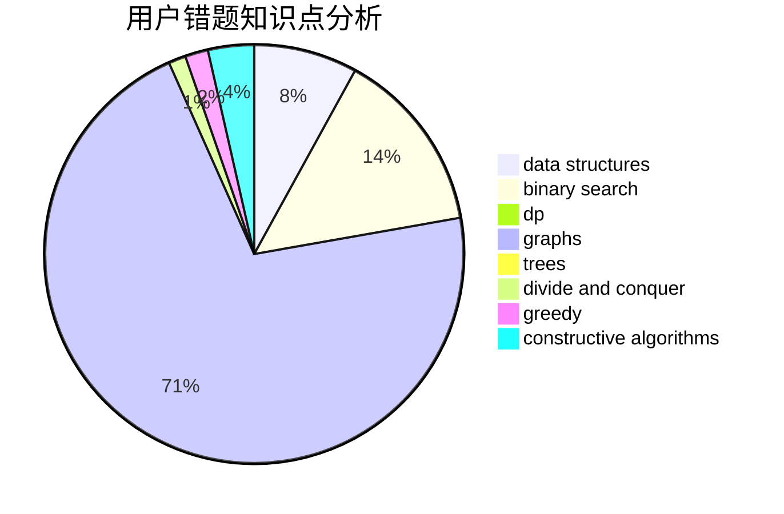

# fmj_123

<!-- tabs:start -->

#### **用户提交结果分析**

#### **用户做题类型偏好分析**

#### **用户错题知识点分析**

<!-- tabs:end -->
# 推荐题目
[494B](https://codeforces.com/contest/494/problem/B)		dp,
                        strings		  
[894C](https://codeforces.com/contest/894/problem/C)		constructive algorithms,
                        math		  
[616A](https://codeforces.com/contest/616/problem/A)		implementation,
                        strings		  
[549B](https://codeforces.com/contest/549/problem/B)		constructive algorithms,
                        dfs and similar,
                        graphs,
                        greedy		  
[484B](https://codeforces.com/contest/484/problem/B)		binary search,
                        math,
                        sortings,
                        two pointers		  
[596A](https://codeforces.com/contest/596/problem/A)		geometry,
                        implementation		  
[12542](https://codeforces.com/contest/1254/problem/2)		dsu,graphs,sortings,trees		  
[1255C](https://codeforces.com/contest/1255/problem/C)		constructive algorithms,
                        implementation		  
[1288B](https://codeforces.com/contest/1288/problem/B)		math		  
[813C](https://codeforces.com/contest/813/problem/C)		dfs and similar,
                        graphs		  
