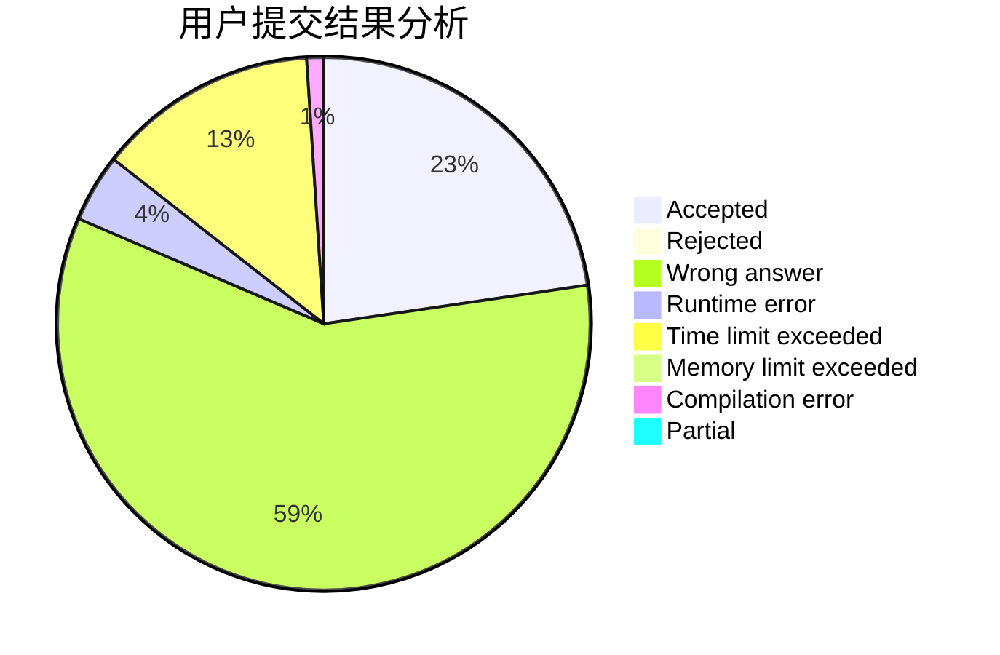
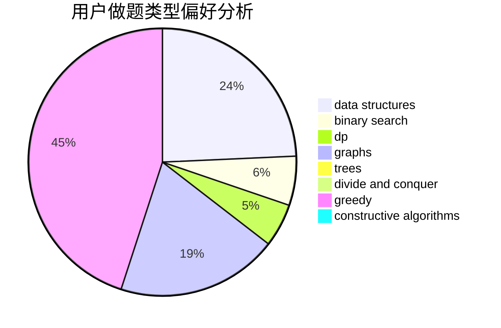
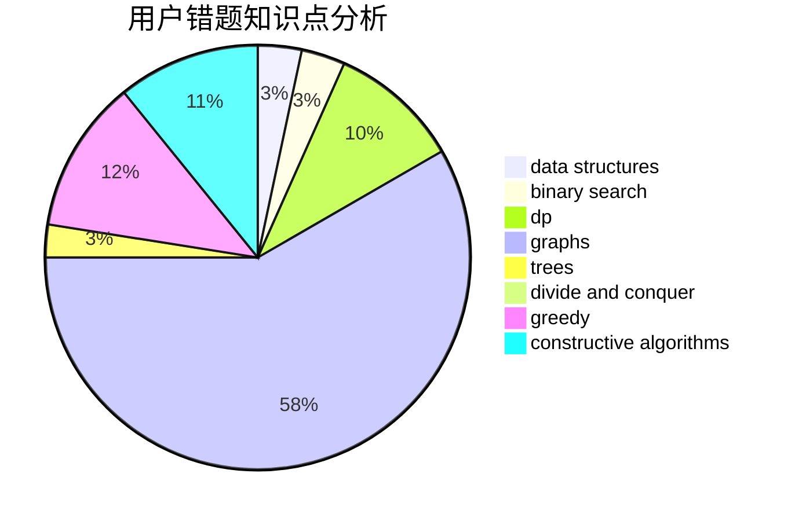

# foolish

<!-- tabs:start -->

#### **用户提交结果分析**

#### **用户做题类型偏好分析**

#### **用户错题知识点分析**

<!-- tabs:end -->
# 推荐题目
[1139F](https://codeforces.com/contest/1139/problem/F)		data structures,
                        divide and conquer		  
[731E](https://codeforces.com/contest/731/problem/E)		dp,
                        games		  
[12471](https://codeforces.com/contest/1247/problem/1)		dsu,graphs,sortings,trees		  
[652E](https://codeforces.com/contest/652/problem/E)		dfs and similar,
                        dsu,
                        graphs,
                        trees		  
[1439E](https://codeforces.com/contest/1439/problem/E)		bitmasks,
                        data structures,
                        games,
                        trees		  
[1325B](https://codeforces.com/contest/1325/problem/B)		greedy,
                        implementation		  
[1167F](https://codeforces.com/contest/1167/problem/F)		combinatorics,
                        data structures,
                        math,
                        sortings		  
[799D](https://codeforces.com/contest/799/problem/D)		brute force,
                        dp,
                        meet-in-the-middle		  
[797F](https://codeforces.com/contest/797/problem/F)		data structures,
                        dp,
                        greedy,
                        sortings		  
[1476G](https://codeforces.com/contest/1476/problem/G)		data structures,
                        hashing,
                        sortings,
                        two pointers		  
