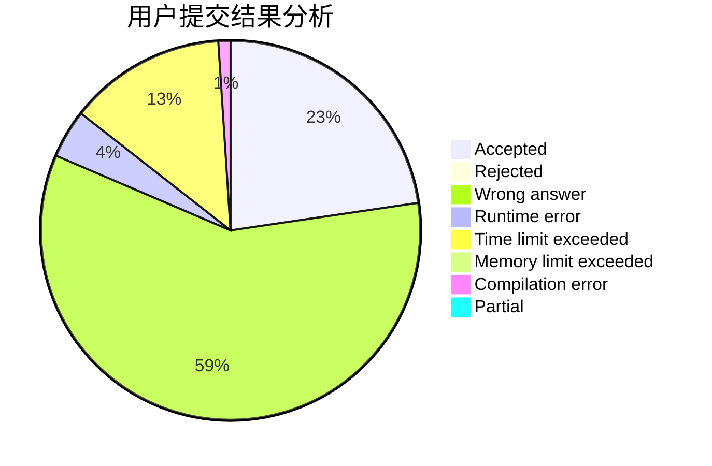
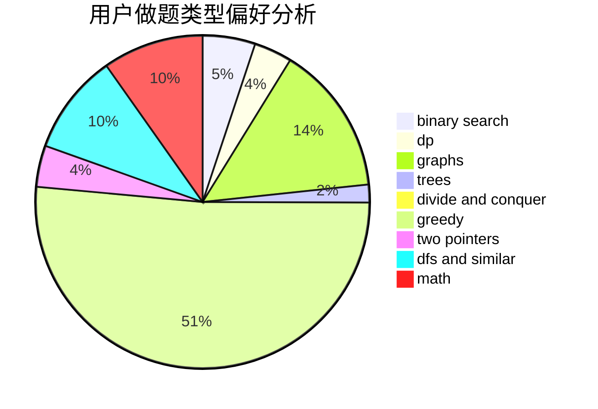

# foolish

<!-- tabs:start -->

#### **用户提交结果分析**

#### **用户做题类型偏好分析**

<!-- tabs:end -->
# 推荐题目
[1139F](https://codeforces.com/contest/1139/problem/F)
[731E](https://codeforces.com/contest/731/problem/E)
[12471](https://codeforces.com/contest/1247/problem/1)
[652E](https://codeforces.com/contest/652/problem/E)
[1439E](https://codeforces.com/contest/1439/problem/E)
[1325B](https://codeforces.com/contest/1325/problem/B)
[1167F](https://codeforces.com/contest/1167/problem/F)
[799D](https://codeforces.com/contest/799/problem/D)
[797F](https://codeforces.com/contest/797/problem/F)
[1476G](https://codeforces.com/contest/1476/problem/G)
