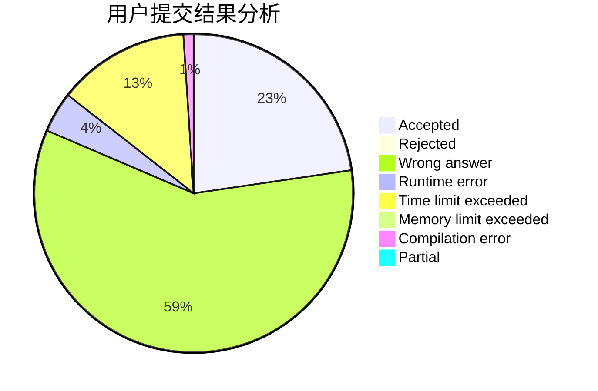
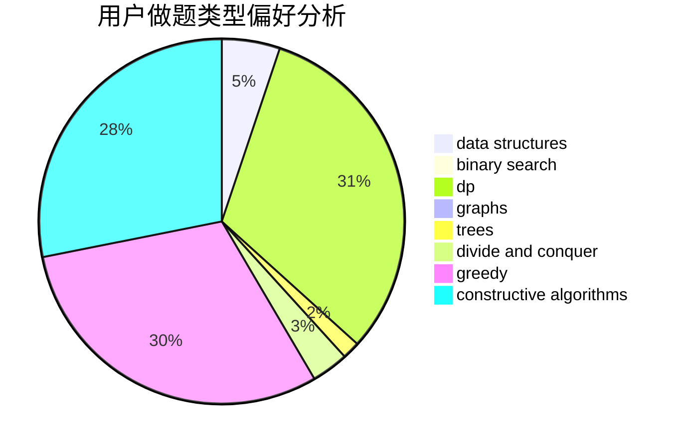
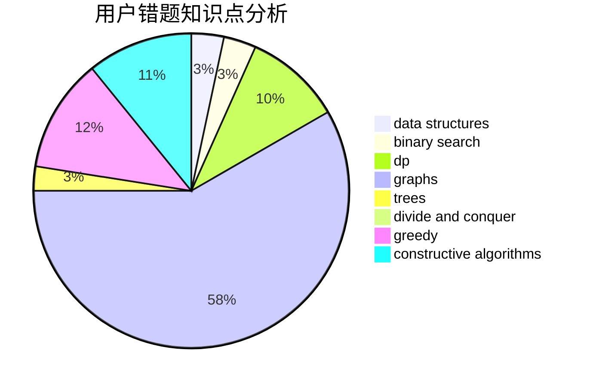

# foolish

<!-- tabs:start -->

#### **用户提交结果分析**

#### **用户做题类型偏好分析**

#### **用户错题知识点分析**

<!-- tabs:end -->
# 推荐题目
[1137E](https://codeforces.com/contest/1137/problem/E)		data structures,
                        greedy		  
[712C](https://codeforces.com/contest/712/problem/C)		greedy,
                        math		  
[1241C](https://codeforces.com/contest/1241/problem/C)		dsu,graphs,sortings,trees		  
[626D](https://codeforces.com/contest/626/problem/D)		brute force,
                        combinatorics,
                        dp,
                        probabilities		  
[1430G](https://codeforces.com/contest/1430/problem/G)		bitmasks,
                        dfs and similar,
                        dp,
                        flows,
                        graphs,
                        math		  
[1315C](https://codeforces.com/contest/1315/problem/C)		greedy		  
[1165D](https://codeforces.com/contest/1165/problem/D)		math,
                        number theory		  
[780E](https://codeforces.com/contest/780/problem/E)		constructive algorithms,
                        dfs and similar,
                        graphs		  
[779D](https://codeforces.com/contest/779/problem/D)		dsu,graphs,sortings,trees		  
[1468M](https://codeforces.com/contest/1468/problem/M)		data structures,
                        graphs,
                        implementation		  
