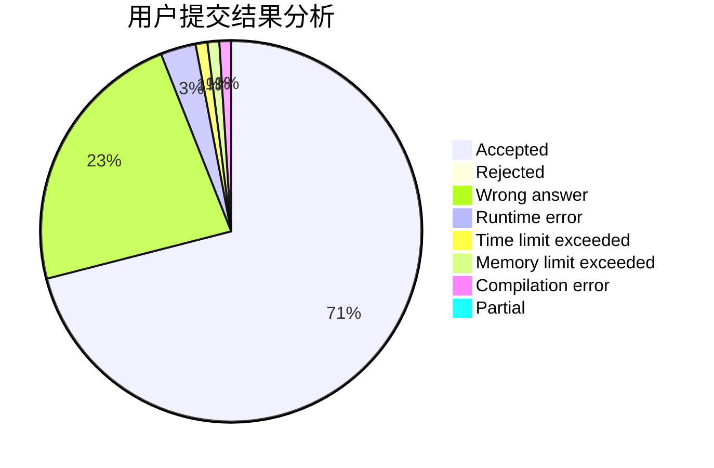
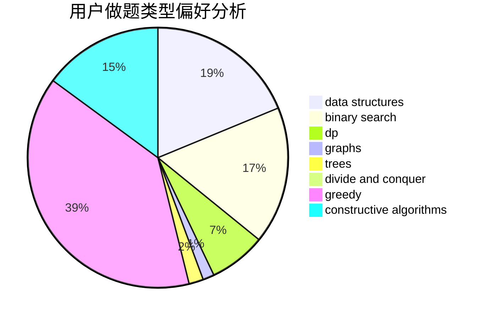
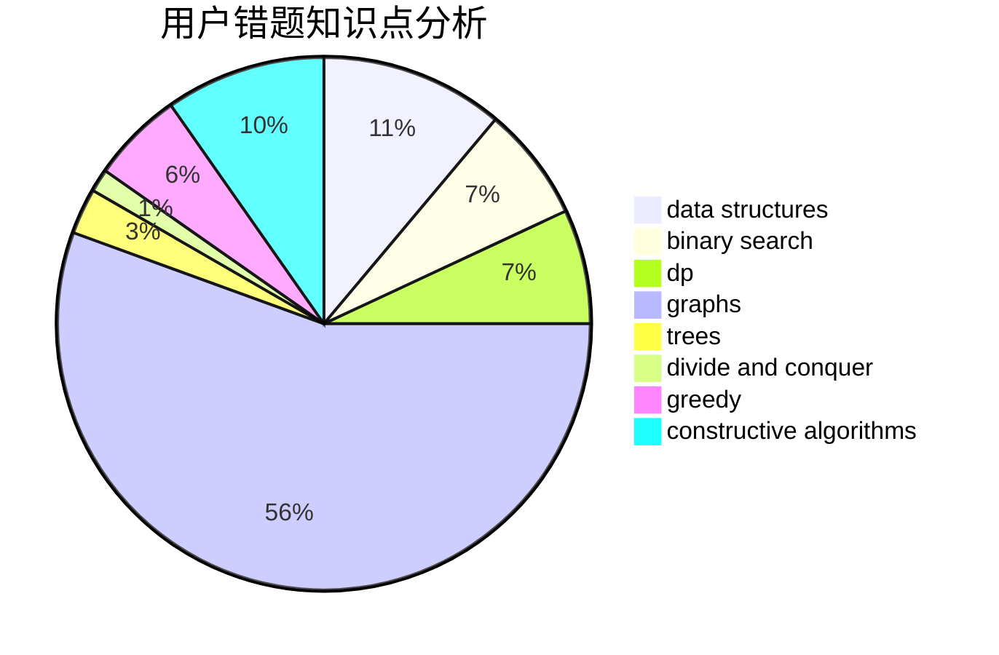

# AutumnKite

<!-- tabs:start -->

#### **用户提交结果分析**

#### **用户做题类型偏好分析**

#### **用户错题知识点分析**

<!-- tabs:end -->
# 推荐题目
[446E](https://codeforces.com/contest/446/problem/E)		math,
                        matrices		  
[1189D1](https://codeforces.com/contest/1189D/problem/1)		dsu,graphs,sortings,trees		  
[446C](https://codeforces.com/contest/446/problem/C)		data structures,
                        math,
                        number theory		  
[1360D](https://codeforces.com/contest/1360/problem/D)		math,
                        number theory		  
[446D](https://codeforces.com/contest/446/problem/D)		math,
                        matrices,
                        probabilities		  
[445A](https://codeforces.com/contest/445/problem/A)		dfs and similar,
                        implementation		  
[258A](https://codeforces.com/contest/258/problem/A)		greedy,
                        math		  
[445B](https://codeforces.com/contest/445/problem/B)		dfs and similar,
                        dsu,
                        greedy		  
[1434D](https://codeforces.com/contest/1434/problem/D)		dsu,graphs,sortings,trees		  
[445C](https://codeforces.com/contest/445/problem/C)		dsu,graphs,sortings,trees		  
