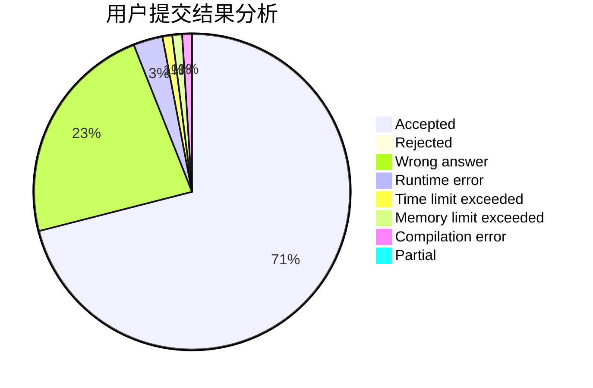
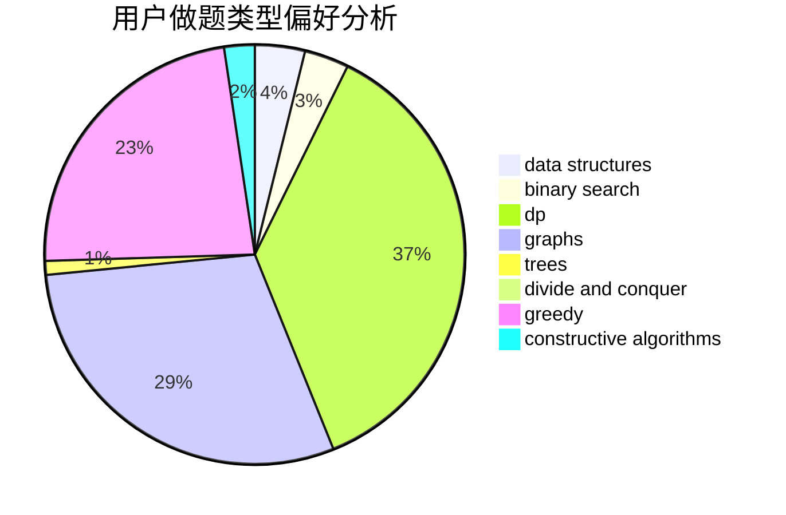
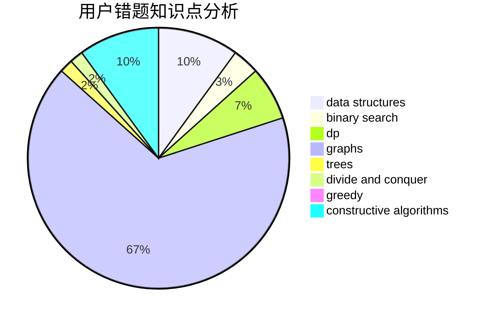

# AutumnKite

<!-- tabs:start -->

#### **用户提交结果分析**

#### **用户做题类型偏好分析**

#### **用户错题知识点分析**

<!-- tabs:end -->
# 推荐题目
[467A](https://codeforces.com/contest/467/problem/A)		implementation		  
[1194F](https://codeforces.com/contest/1194/problem/F)		combinatorics,
                        dp,
                        number theory,
                        probabilities,
                        two pointers		  
[466D](https://codeforces.com/contest/466/problem/D)		combinatorics,
                        dp		  
[1368C](https://codeforces.com/contest/1368/problem/C)		constructive algorithms		  
[466E](https://codeforces.com/contest/466/problem/E)		dfs and similar,
                        dsu,
                        graphs,
                        trees		  
[464E](https://codeforces.com/contest/464/problem/E)		data structures,
                        graphs,
                        shortest paths		  
[274E](https://codeforces.com/contest/274/problem/E)		data structures,
                        implementation		  
[465D](https://codeforces.com/contest/465/problem/D)		dsu,graphs,sortings,trees		  
[1444D](https://codeforces.com/contest/1444/problem/D)		constructive algorithms,
                        dp,
                        geometry		  
[466A](https://codeforces.com/contest/466/problem/A)		implementation		  
