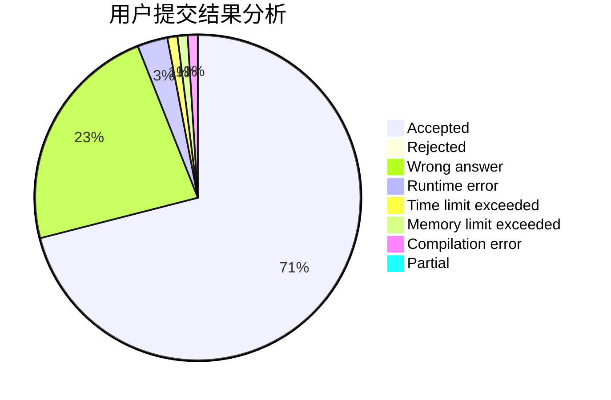
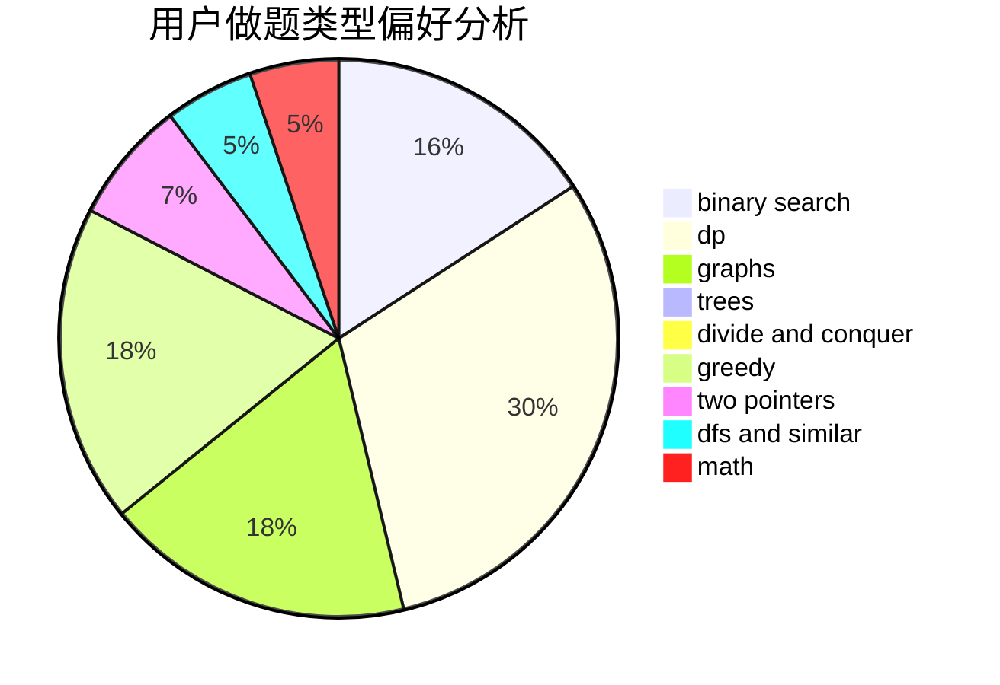

# AutumnKite

<!-- tabs:start -->

#### **用户提交结果分析**

#### **用户做题类型偏好分析**

<!-- tabs:end -->
# 推荐题目
[467A](https://codeforces.com/contest/467/problem/A)
[1194F](https://codeforces.com/contest/1194/problem/F)
[466D](https://codeforces.com/contest/466/problem/D)
[1368C](https://codeforces.com/contest/1368/problem/C)
[466E](https://codeforces.com/contest/466/problem/E)
[464E](https://codeforces.com/contest/464/problem/E)
[274E](https://codeforces.com/contest/274/problem/E)
[465D](https://codeforces.com/contest/465/problem/D)
[1444D](https://codeforces.com/contest/1444/problem/D)
[466A](https://codeforces.com/contest/466/problem/A)
